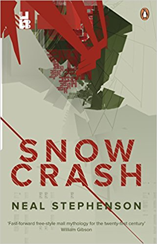

[[floatLeft]]
| 

Snow Crash is quite an old book (1992 is old now?) that I found a little underwhelimg. I've read some of Neal Stephenson's books before, Seveneves is still one of my favourite books, but this one was a little lacking.

Snow Crash is set in the not so distant future (more distant when it was written) where rampant capatalism has created loads of small countries and collapsed the federal/state arms of the US Government. Along side that there is the _Metaverse_ and VR environment that users can connect to over the fibre network.

The Metaverse is a bit of a let down, I picked the book up because of it thinking I was getting another _[Ready Player One](https://amzn.to/2RgAie4)_ but unfortunatley not. It seems like the Metaverse is secondary to the plot, It could just have easily been a standard on screen MMO and given the same results. Although I am writing this 27 years after the book was written.

Having just read some of his [latest work](/books/the-rise-and-fall-of-dodo) Snow Crash felt less polished and I suppose thats to be expected with its age.

All this aside I did enjoy the book and would reccomend reading it, Neal Stephenson has a habbit of writing very well researched and thought out books that are very intresting reads.
