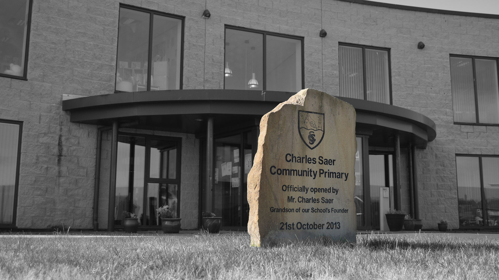

I've long held the belief that end users are much more likely to like a new system if it looks good. It doesn't matter if software X is misconfigured or missing if they had an _enjoyable_ experiance getting to that point.

I was rather happy with a photo I took at one of our schools.

The original image isn't suitable as a wallpaper. It's main issue is the volume of colour and how it would contrast with the desktop icons over the top of it.

Simply making the image black and white would have worked but it wouldn't have had the _pop_ I normally aim for.

