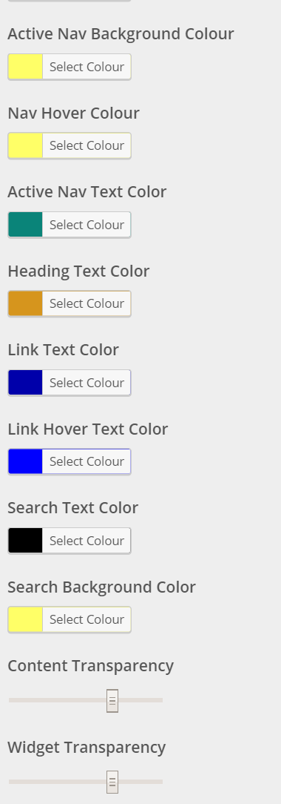

> I have made a replacement for wp-less! If you intrested in using less in your WordPress theme check it out. [wp_enqueue_less](/2018/07/wp_enqueue_less-a-replacement-for-wp-less/).

[LESS](http://lesscss.org/) is a CSS pre-processor which adds tonnes of features that extend CSS. I have been using it for a while when making my [WordPress](http://www.wordpress.org/) themes and have gotten it work pretty well with the Theme Customizer.

The first part of this setup is [WP-Less](https://wordpress.org/plugins/wp-less/) which allows WordPress to compile LESS. I dropped the plugin into my theme under `vendor/wp-less` and deleted `vendor/wp-less/.gitignore` so that my git repo contained all the required files.

With that in place I added the following to my `functions.php`

```php
function my_theme_enqueue_styles(){
    require dirname(__FILE__) . '/vendor/wp-less/bootstrap-for-theme.php';
    $less = WPLessPlugin::getInstance();
    wp_enqueue_style('theme-main', get_template_directory_uri() . '/style.less');
    $less->dispatch();
}

add_action('wp_enqueue_scripts', 'my_theme_enqueue_styles');
```

This compiles style.less and adds it to the head tag through `wp_header()`.

Great! At the moment there isn’t a huge benefit to this I could just compile the stylesheet before I publish the theme and the result would be the same. So now how do you get custom variables into this?

I then add to the theme customizer things like colour of this and width of that. I wont go into too much detail about how to add options, [Narga have a great guide on the subject](http://www.narga.net/comprehensive-guide-wordpress-theme-options-with-customization-api/) and to confuse matters I use a library of my own writing.

For this example lets assume that you have a function called `my_theme_get_or_use_default_theme_option($option)` which you use to get options set in the customizer or return a default value.

You can then pass those options to WP-Less in your `my_theme_enqueue_styles` function like so:

```php
$less->addVariable('textColor', my_theme_get_or_use_default_theme_option('text_color'));
```

and then in your stylesheet

```less
.class{
  color:@textColor;
}
```

Thats it! Now when ever a user changes anything in the theme customizer the stylesheet is generated. For example one of the themes I made has options like this:



Which means that the site can look vastly different whilst using the same theme code. There is no ThemeName-Customer1 ThemeName-Customer2 on our update server or any child themes on the sites we supplied. We publish an update and when a customer installs it if the less has changed the WP-Less generates the new stylesheet straight away.

These 3 sites use the same theme with different options set and as you can see you can produce a pretty big difference that is easy to maintain.

  - [Leck St.Peters C of E School](http://www.leck-st-peters.lancs.sch.uk/)
  - [Grimsasrgh St. Michaels C of E School](http://www.grimsargh-st-michaels.lancs.sch.uk/)
  - [Ridge Community Primary School](http://www.ridge.lancs.sch.uk/)

