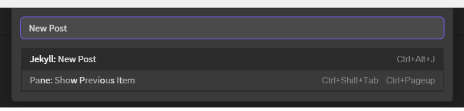
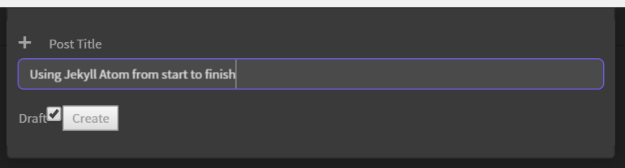
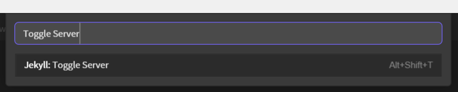
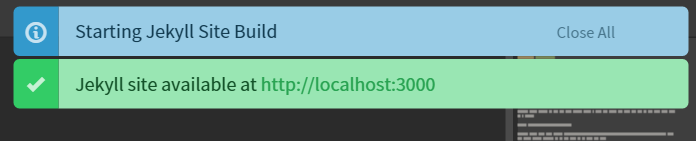
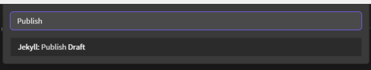

[Jekyll-Atom](https://github.com/arcath/Jekyll-Atom) is my [Atom](https://atom.io/) package for working with [Jekyll](http://jekyllrb.com/) (as the name implies).

It makes working Jekyll a breeze but I have a had a couple of questions about how some of it works, so I am going to walk though the writing of this post.

First off with Atom open in this site I bring up the command palette `Ctrl-Shift-P` and type in _New Post_

Hitting enter brings up the new post dialog which I give the title and tick the box to say this post will be a draft.

Hitting enter here will create `_dratfs/2016-02-03-using-jekyll-atom-from-start-to-finish.markdown` with the front matter already in it and open it in Atom for you.

Now I start to write this post which takes little explaining. I did how ever want to preview the post as a wrote it which I did using the preview server in Jekyll Atom. Searching for _Toggle Server_ in the command palette and hitting Enter starts it up.

A couple of notifications appear straight away telling me that the server is running and Jekyll is starting to build my site.

Jekyll-Atom is also listening for any save events in Atom and will build the site again as soon as it sees one.

This means after hitting save my site is normally built ready to preview in the time it takes to `alt-tab` into Chrome and refresh the page.

> You may need to add `show_drafts: true` to your `_config.yml` to have drafts appear.

Now that this post is written it is time to publish it, moving it from _drafts to _posts which Jekyll-Atom does through the _Publish Draft_ command.

Jekyll-Atom also updates the date/time to the current date/time as it publishes saving a bit of time updating it myself.

One last check of the preview site with the new URL for the post and everything is ready to commit!

That covers most of the features I use on a day to day basis but there are quite a few more detailed in the [Readme](https://github.com/Arcath/jekyll-atom/blob/master/README.md#functions) which I encourage you to read.
