RADIUS is a form of network security that can link into your Windows Domain. The most common use (at least in my experience) is to secure Wireless Networks. Using RADIUS has the advantage of no shared key that has to be entered on each device, you can allow all domain computers to connect with their computer account and limit users to some trusted staff who only need their domain account to connect.

Before I started I had a fully functioning Windows Domain Controller with AD setup for normal use.

## ADCS

Active Directory Certificate Services is used to generate the certificate that your RADIUS server will use to identify itself.

Open the _Add Roles and Features_ wizard from server manager, select your DC and tick _Active Directory Certificate Services_.

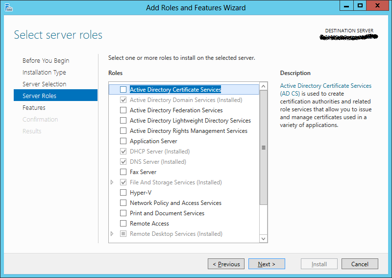

Agree to the required features and click next. Click next again on the features screen and again on the _AD CS_ screen.

On the _Role Services_ screen you only need _Certification Authority_ ticked.

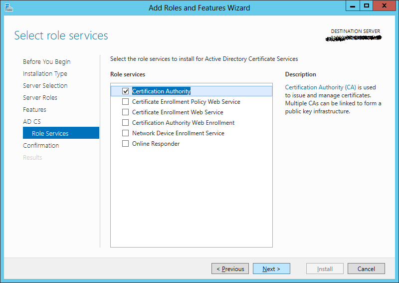

Click Next and then confirm the install.

Once the install finishes click _Configure Active Directory Certificate Services on the destination server_.

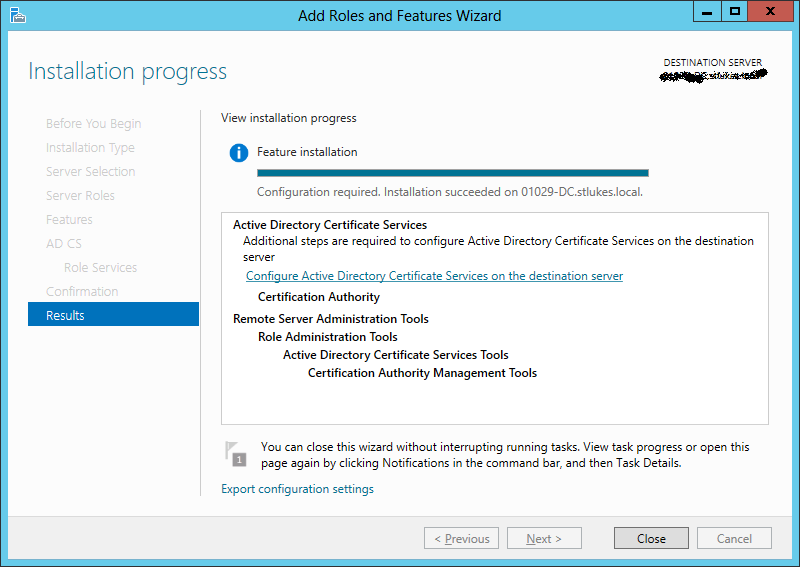

In the wizard that pops up select the user you want to install the service as (in my case it was the same as my logged in user) and hit next.

When asked to _Select Role Services_ to configure tick _Certification Authority_.

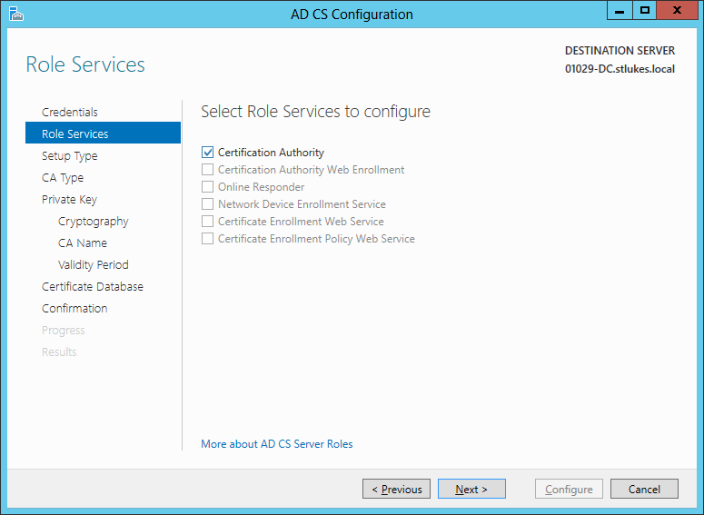

Select _Enterprise CA_ and hit next, then select _Root CA_ and hit next.

Select _Create a new private key_ and hit next. On the _Cryptographic_ screen change the hash algorithm from the [insecure sha1](https://konklone.com/post/why-google-is-hurrying-the-web-to-kill-sha-1) to sha256 and click next.

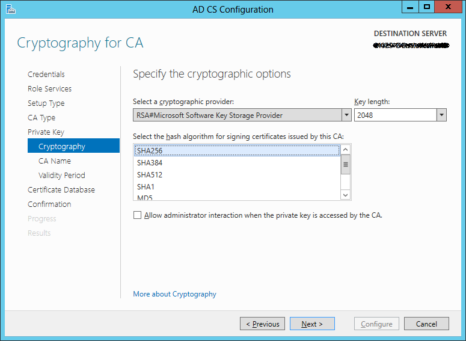

Leave the CA Name at the default and hit next, do the same with the validity period and database location.

On the _Confirmation_ screen make sure that everything is as it should be and then hit _Configure_.

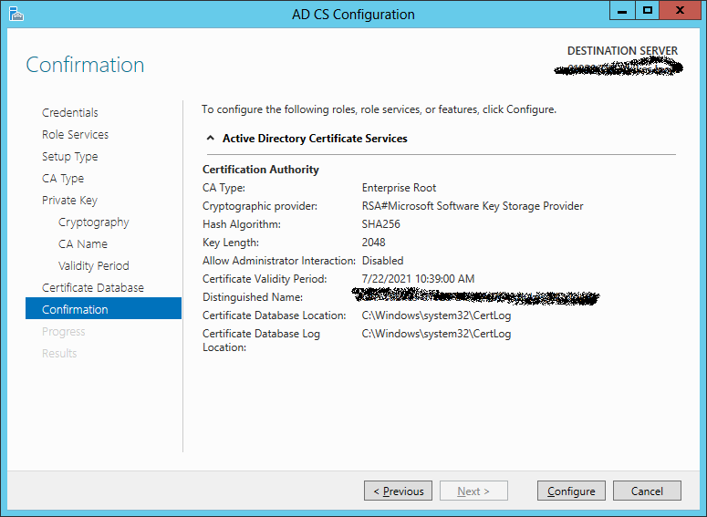

After configuration completes hit close.

## NPAS

RADIUS is part of the _Network Policy_ and _Access Services_ role in Server 2008+ and is installed like the ADSC role.

Go to the _Select Server Roles_ screen and tick _Network Policy and Access Services_, agree to the required features and hit next.

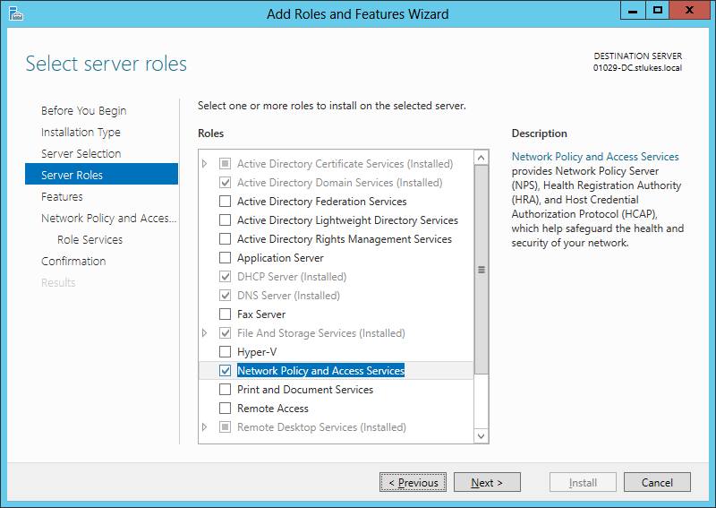

Hit next on the _Features_ screen and again on the NPAS introduction.

On the _Role Services_ screen you only need _Network Policy Server_ selected.

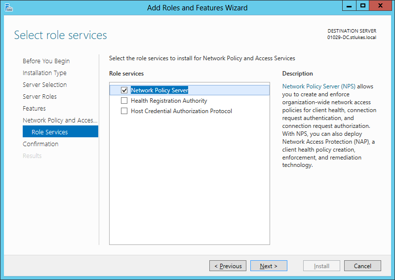

On the _Confirmation_ screen hit Install.

After the install finishes you can hit Close.

Open _Network Policy Server_ from the start menu and before you configure your RADIUS network right click _Templates Management -> Shared Secrets_ and select _New_.

Give your Key a name and either type in or generate a secret.

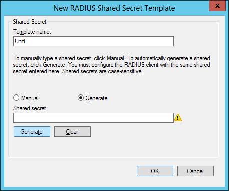

At this point I normally go into my Wireless system and create the new RADIUS network whilst I have my generated key in the clipboard.

With that template created head back to the main NPS screen and select RADIUS server for _802.1X Wireless or Wired Connections_ and click _Configure 802.1X_ under it.

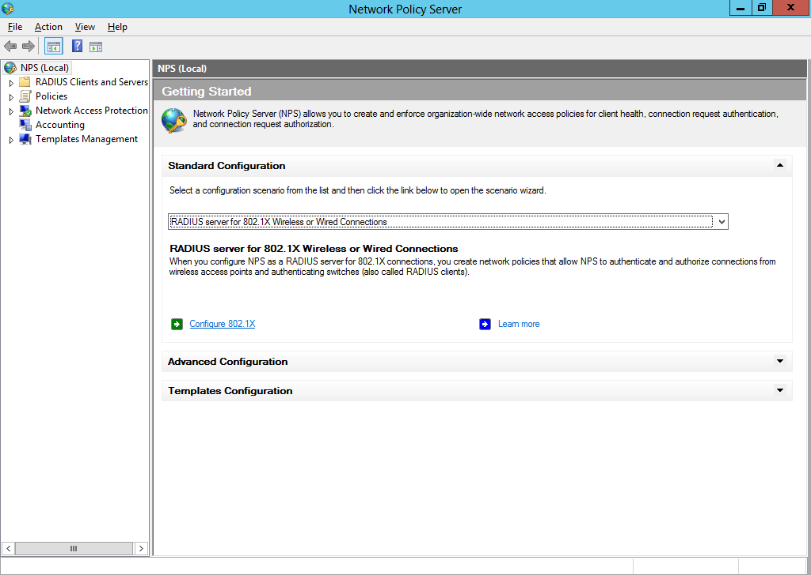

Select _Secure Wireless Connections_ and click next (you can change the name if you want to).

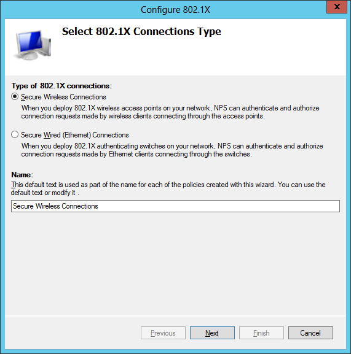

You need to add each access point to the list which can be pretty tedious.

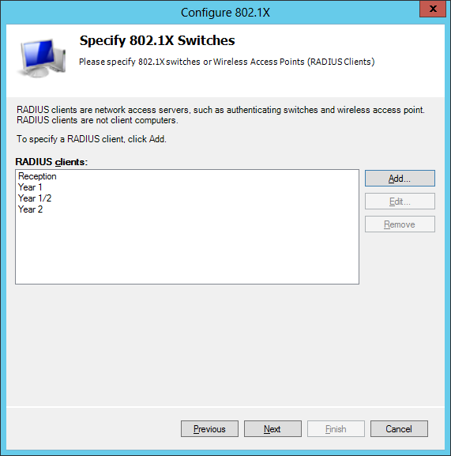

When adding an AP select the shared secret template we made earlier. Once you have added all your access points hit next.

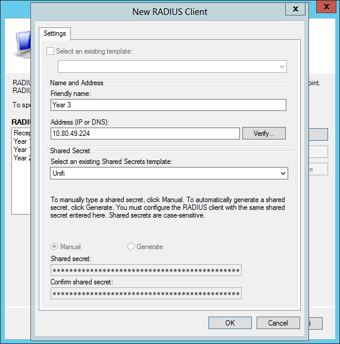

On the _Configure an Authentication Method_ screen select _Microsoft: Protected EAP (PEAP)_ and click _Configure_.

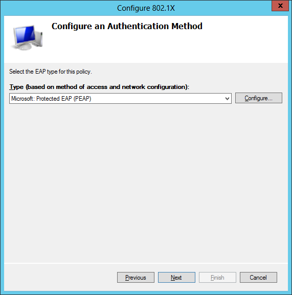

Change to the certificate for your DC, _dc.domain.local_ **NOT** _domain-dc-ca_.

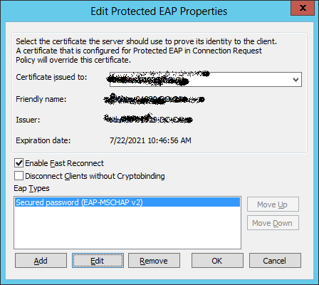

On the _Specify User Groups_ screen add your _Domain Users_ and _Domain Computers_ groups and click next.

Click next on the _Configure Traffic Controls_ screen.

On the last screen confirm all the details and then hit finish.

## Done

You now have a RADIUS a network! Domain joined computers can now connect with seemingly no password as their computer account allows them to authenticate. None domain devices can authenticate with any user account.
