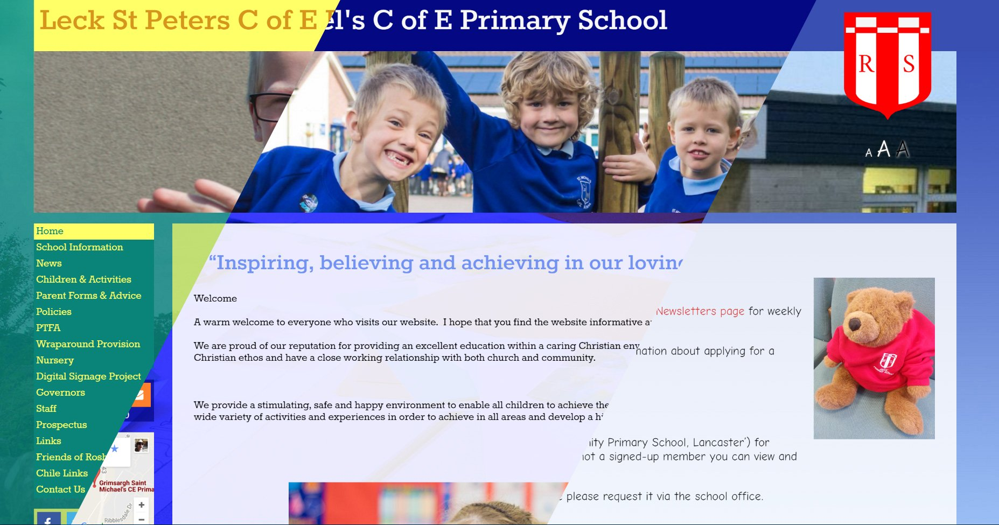

Everything an Option is my design philosophy for WordPress Themes.

With the Theme Customizer and tools like [WP-LESS](/2016/01/less-in-a-wordpress-theme) it is possible to make some very varied sites from the same theme. Take these 3 sites:

  - [Ridge Community Primary School](https://www.ridge.lancs.sch.uk/)
  - [Leck St Peters C of E Primary School](http://www.leck-st-peters.lancs.sch.uk/)
  - [Grimsargh St Michaels C of E Primary School](http://www.grimsargh-st-michaels.lancs.sch.uk/)

All 3 use exactly the same theme just with different options.

When building this theme its _defaults_ were set with the 0.1.0 release and now when ever a customer asks us to change something we add it as an option in the Theme Customizer. This means that all the customers already using the theme get the feature as well.

This has been a great asset when customers have come back after a few months and said “we love the site but can it do xxxx” 9 times out of 10 we have already added that feature and just tell them to update. In fact we encourage all our customers to update their [Ed-IT Solutions](http://www.ed-itsolutions.com/) themes and plugins whenever WordPress asks them too.

## Filter each option

Having everything an option gives a great chance to filter everything using the built in filter functionality.

Take [this site](http://www.roylesbrook.lancs.sch.uk/), if you watch the bar under the header as you move from page to page its color changes (e.g. [this page](http://www.roylesbrook.lancs.sch.uk/23-2/information/accessibility-plan/)). We added a meta box which amongst other things lets you set a _page colour_. In header.php before we call `get_header()` if the post meta contains a custom page colour we call `add_filter('theme_slug_page_color', function($color){...})`.

Where we pass the page color to WP-LESS we use the function `apply_filters('theme_slug_page_color', get_theme_option('page_color'))` which will return the custom colour if supplied or the default from the theme customizer. This is a great part of filters, if no filters are defined apply_filters just returns the original input.

This approach also lets custom page templates override the default options in a way that doesn’t involve adding variables and if statements all over the place to work out if we are showing pageX or pageY.

## Changing a default

Very occasionally we run into a new feature that wont just slot in along side the others. This happened in the theme above when we added an option to change the navigation links text hover colour. In 0.1.x the navigation links hover colour was the navigation’s background colour, giving the effect of  a colour inversion on hover. To add this option we had to set a default colour for this text which would cause all the sites using it change to this new colour.

This change caused the version number to bump to 0.2.0 which under the theme documentation informs the user that something is going to change and maybe alter the look of their site. Up till this point every update has either been a bug fix or a new feature they have to opt into, this update required work after applying. To everyone but the newest customer all they had to do was copy one colour into the new option.

In hindsight I would have liked to have spent more time getting the theme to calculate the default from the current options instead of hard setting everyone to a colour that only fit one of the schools.

## Everything an Option

This is just my way of working. It does result in a pretty big theme customizer which some people may find daunting but most people are prtty happy with the level of control they have.

There are a couple of sites out there running plugins that specifically alter the theme like Ridge who wanted to apply thier letter head colours to headings. It would have looked odd to add Ridge colour headers to every school when only they needed it. In this case I added a filter so the plugin could colour headings in theme and the functionality was there if we ever need it in the future.
