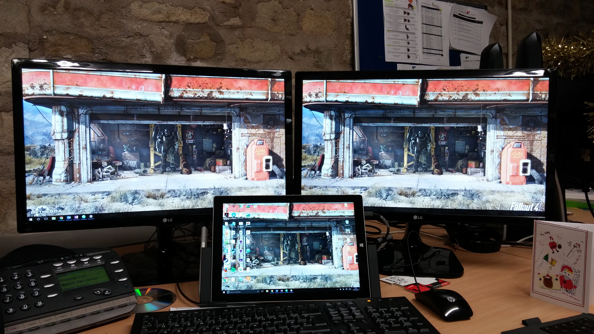

For over, a year now I have been using a [Surface Pro 3](http://amzn.to/2u3GwBd) (SP3) as my only computer at work. Before my SP3 I had a MacBook Pro which served me well for a couple of years (it wasn’t new when I got it). I elected to get an SP3 over a normal laptop wanting a lighter and more portable device. My experience at the time with ultra books hadn’t been great so I didn’t want to jump in with one.

## In the Office

I have the [SP3 Dock](http://amzn.to/2v2RpjY) in the company office connected to 2 screens, mouse, keyboard and wired network. This setup is fantastic. The dock clamps the SP3 at a fixed angle which is just right for me but I can see some people have issues with it. I did have to buy a number of adapters and cables to split the single display port on the dock in two so I could get both screens going.

The dock fits nicely in on my desk keeping all the cables to the back and out of the way. I do wish it helped with the cooling a bit. Sometimes when I’m compiling code or running some processor heavy tasks it feels like it might be about to melt its way through my desk.

A year on the dock’s connection is getting a little weak. If something knocks my desk everything disconnects for a second. Annoying but not enough to consign the dock to the bin.

## In Schools

Outside the office, I use it every day on site with our customers. It’s great having all the Windows management tools on a touch screen device I can prop up anywhere.

The [type cover](http://amzn.to/2t4Ayf6) is a good (required) addition that I snap on outside the office. I have had the misfortune to use the touch cover with a customers SP3 and it doesn’t come close. The type covers tactile feedback is great I find that I can type better on it than most normal keyboard, which I would expect for a £100+ accessory.

The SP3 decimates my old MacBook Pro when it comes to working in schools. Admittedly I could write that about any Windows computer, Mac OS is pretty but its Windows management tools leave a lot to be desired.

The battery life is very impressive usually giving me a full day without issue. Obviously, when I hammer the processor with some code the battery takes a hit.

I needed to buy a couple of adapters for my normal work in schools, mainly a USB3 network card.

In schools is where the pen gets the most use. I find I rarely use the touch pad on the type cover opting to use the pen to navigate the UI. I will say that the battery doesn’t last long at all and being an AAAA its something I have to order specially.

For the customers who have SP3s, I was very happy to learn that you can [boot to network](https://blogs.technet.microsoft.com/deploymentguys/2013/05/16/pxe-deployment-with-surface-pro/) through an official network adapter (or dock).

## At Home

The back hinge is a nice idea that comes in handy when using it as a tablet but it does make using the SP3 + type cover hard on softer surfaces. I have often given up trying to type on the sofa opting to lean forwards onto the coffee table. This also results in a rather footprint larger than one would expect.

As a tablet it works very well. I personally have tablet mode disabled in Windows 10. My fine motor control is good enough to use all the normal desktop controls especially with Windows making context menus etc… bigger if opened by a touch.

## The Surface Pro 3 Overall

The Surface Pro 3 is a fantastic device. Although the thing I love most about it applies to any laptop with a dock I still think its a valid point. My Desktop can go from a 3 screened system with a mechanical keyboard and decent mouse down to a tiny tablet I can carry around on a site survey.

Since getting my SP3 2 other people in our office have got the SP4 with the “dock” (port replicator). I have to say the SP4 does look a bit nicer but for me its not worth the update from the SP3.

Overall I thoroughly recommend the Surface Pro 3 or any Surface Pro. The price is pretty high but it is worth the money.
