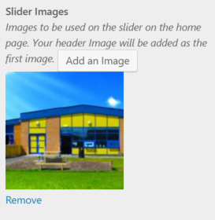
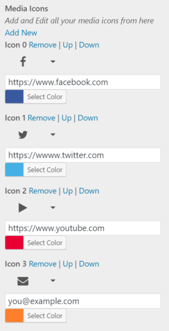

Lately I have been working on a new theme from our Designer where I needed a theme customizer control that didn’t exist. I also wanted to replicate the social media icons system from Hueman. To do this I created a repository of WP Controls. These controls are self contained and can just be included in any theme by requiring one file.

You can view this Repository over on [Git Hub](https://github.com/Arcath/wp-controls).

## Using WP Controls

Grab a copy of the repository and place it in a folder in your theme. In your `functions.php` add a call to `require_once('path/to/wp-controls/controls.php');` This then loads all the controls into your theme.

The WordPress codex has a nice article on the [theme customization api](https://codex.wordpress.org/Theme_Customization_API). To use the WP-Contols controls create a control using the provided classes.

## Multi Images Control

Control Class: `Multi_Image_Control`

Multi Images Control allows you to create an array of multiple images. It stores the attachment ID for the images.



Users can select one or more images and a time and their thumbnails all appear below the control name with a button to remove it.

Your code would look something like this:

```php
$image_ids = your_slug_get_theme_option('option_name') //Get the option from your theme functions.

foreach($image_ids as $image_id){
  echo(''); //Change to the image size you want to use.
}
```

Multi Images Control is pretty easy to use and does exactly what it says on the tin. You can use the image url in anyway you want.

## Media Icons Control

Control Class: `Media_Icons_Control`

Media Icons Control uses Font Awesome to give infinite media icons. This is similar to how the Hueman theme works and I completely admit that this is a copy of the functionality but not the design.



From here a user can select any font awesome icon, URL and colour for their icons. Icons can be moved up & down and removed entirely. There is no limit on the number of icons a user can have.

Your code for using these icons would look something like this:

```php
<?php
$icons = your_slug_get_theme_option('option_name'); //Get your themes option with the icons in.
foreach($icons as $icon):
  $url = $icon['url'];

  if(filter_var($url, FILTER_VALIDATE_EMAIL)){
    //If an email is entered make it a mail to
    $url = "mailto:" . $url;
  }
?>
  <a href="<?php echo($url); ?>" style="background-color:<?php echo($icon['color']); ?>">
    <i class="<?php echo($icon['icon']); ?>"></i>
  </a>
<?php endforeach; ?>
```

You would then style the links how ever you want but the user has control over the chose icon and the background colour.

## The Future

I plan on adding any controls I create into this repo. I’d like to build up a large library of controls that can be leveraged into any framework etc…

If anyone out there wants to add their controls or improve the ones I created feel free to open a PR on GitHub.
