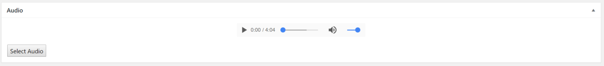
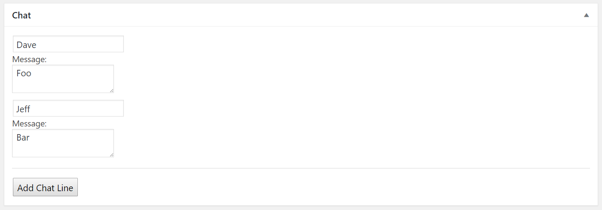
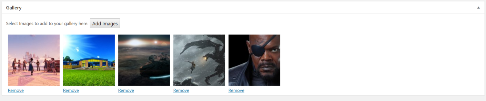
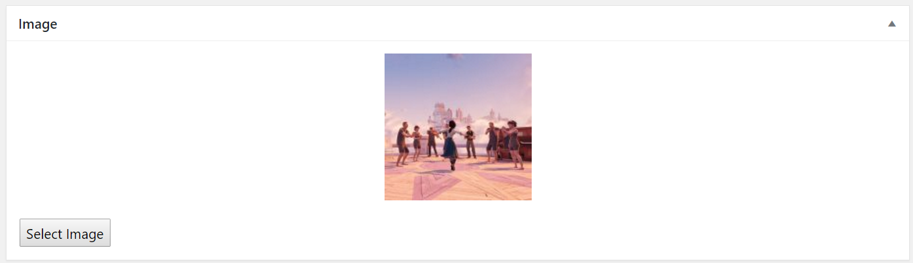
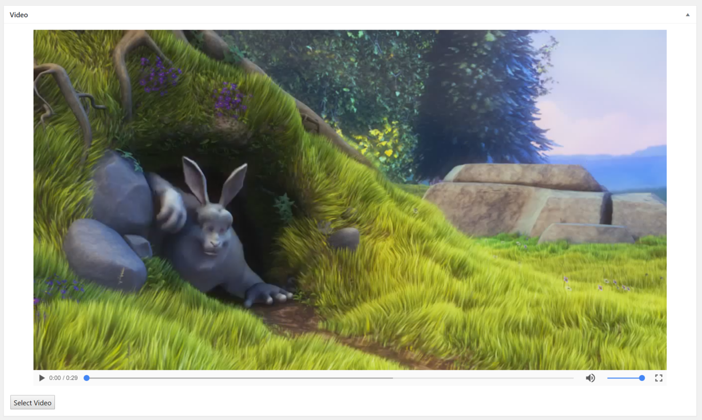

In an effort to leverage more of the in built WordPress features I’ve turned my attention to Post Formats. Post Formats allow users to select a style for their post similar to page templates. They take the place of some plugins allowing for galleries etc… using your theme.

Galleries are actually my primary use case. Too many pages on the sites we build contain a single paragraph and a shortcode to display a gallery made somewhere else in the admin panel. Whilst this method works it involves a plugin loading a whole extra set of slideshow code along side the themes own slideshows. A bit wasteful of resources.

Using a post format also puts all the editing onto the page. Select gallery and a meta box appears to let you select images.

## My Library

I have created a a repository for my [post-formats](https://github.com/Arcath/post-formats). The Idea is to have all the required meta boxes, js and css in one place that can be easily dropped into any theme without copying and renaming etc…

This is needed as WordPress doesn’t provide a standard interface. The codex actually implies for galleries that we should pickup on a shotcode in the post content.

To use it place a copy in your theme somewhere e.g. vendor/post-formats.

Then require it and create an instance of the class

```php
require_once('vendor/post-formats/post-formats.php');

$post_formats = new PostFormats(array('gallery', 'image'), array('post', 'page'));
```

Creating a new PostFormats takes 2 arguments, an array of post formats to enable and the screens to show the meta boxes on.

The post formats array can contain any of the following:

  - aside
  - gallery
  - link
  - image
  - quote
  - status
  - video
  - audio
  - chat

You can read more about the available post formats on the codex.

Adding a screen to the screens array will enable post formats for that post type and show the meta boxes on that screen. In my example above post formats will appear on posts and pages.

## Using Post Formats

My library provides meta boxes to save the required information into the posts meta data without the need for any external plugins.

This of course means that if you want to display your gallery as a slider you will need to add javascript to your theme to do it. (I recommend [slick slider](http://kenwheeler.github.io/slick/)).

### Audio

Audio allows you to upload and audio file. The attachment id is then saved into the post meta.



#### Using the Audio

To display the audio you would do something like this:

```php
<?php
$audioID = get_post_meta($post->ID, '_post_format_audio', true);
?>
<audio src="<?php echo(wp_get_attachment_url($audio)); ?>" controls="controls"></audio>
```
### Chat

The chat meta box needs to build an array of chat messages that you can then loop through on the page.



#### Displaying the Chat

You need to loop through the array of message to display them, for example:

```php
<?php
$chat = get_post_meta($post->ID, '_post_format_chat', true);
foreach($chat as $line):
?>
<p>
  <span class="author"><?php echo($line['author']); ?></span><br />
  <?php echo($line['body']); ?>
</p>
<?php endforeach; ?>
```

### Gallery

The gallery meta box needs to allow you to add infinite images and save the attachment ids into an array in the post meta. This is pretty easy with the built in media browser.



#### Displaying the Images

To display these images on your page you would do something like this:

```php
<?php
  $gallery = get_post_meta($post->ID, '_post_formats_gallery', true);

  foreach($gallery as $image){
    echo('');
  }
?>
```

### Image

The image meta box functions a lot like the gallery meta box only instead of adding to the selection it replaces the selected image.



#### Displaying the Image

```php
<?php
$image = get_post_meta($post->ID, '_post_format_image', true);
?>
" />
```

### Video

The video meta box works the same as the audio one. The box lets you select a video from your library and saves its id into the post meta.



### Aside & Status

Neither of these post formats require a special meta box. They simply need some different css applying to the page. You could also use these to filter them out of news boxes etc…

## The Future

As with WP-Controls I am going to keep updating this library as I build themes.

Everyone is welcome to open a PR on the repository with any suggestions you might have.

Long term I would love to see WordPress give us the ability to add our own post formats. I would love to be able to add a document format that takes a PDF and displays it nicely (looking at [pdf.js](https://mozilla.github.io/pdf.js/)).
