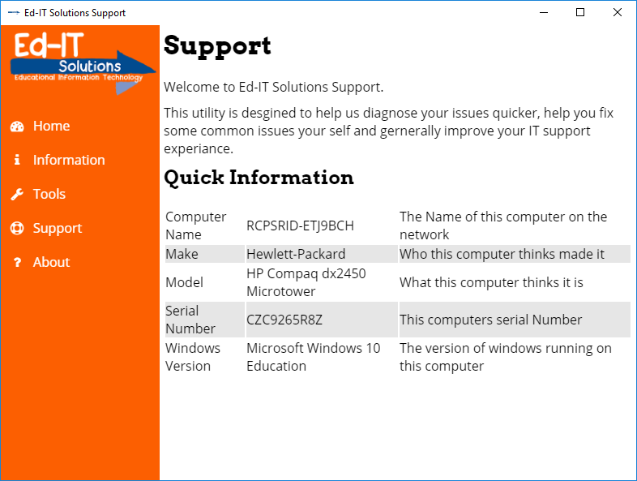
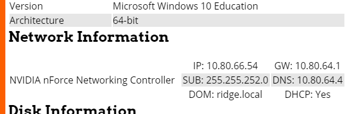
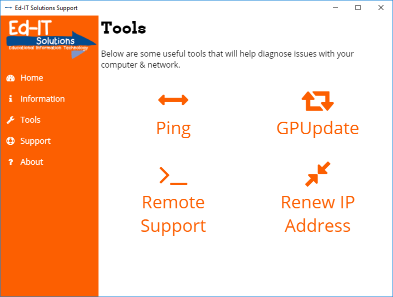
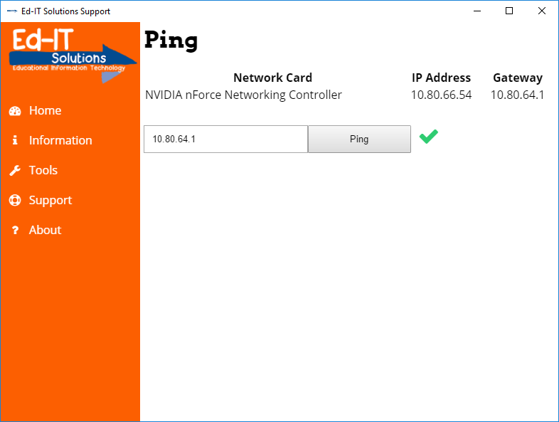

Over at [Ed-IT Solutions](https://www.ed-itsolutions.com/), we take quite a few calls that require a small fix or bit of information that it would take us 2 seconds to get if we were on the computer. To help make our phone calls easier and give our customers the tools to fix minor glitches themselves I have developed an Electron application that can be deployed to every computer.

## Ed-IT Solutions Support

Ed-IT Solutions Support opens on login and hides in the system tray. It silently gathers information on launch and then polls the network cards. This is so that it can detect changes as users move from wired to wireless and so it can warn them when they have no network for a while.

It gives the user (and us over the phone) quick access to the computers details. This saves lots of time and various permission issues that would stop a restricted user from seeing system info.

To help diagnose faults Ed-IT Solutions Support has a few built in tools. GPUpdate and Renew IP Address does exactly what you’d expect. We often get calls that are a result of a GPO change the day before that hasn’t quite applied yet. Remote support opens the bundled Team Viewer client instead of us having to ask the user to go to our website and download it. I’m sure I don’t have to explain the pain caused when a user asks what the address bar is.

Ping lets the user ping a given address. Pretty simple but very useful. Long term I am going to add more IPs to this screen, for example, the installed printers etc…

Support gives the user a link to our helpdesk, our phone number, and a form to submit a ticket directly from the app. This form has a tick box at the bottom where the user can say that this ticket relates to the computer they are at now. When checked the app appends some of the gathered information so we can get directly to that computer when we come on site. It also has a helpful warning that if you don’t use a school email our system won’t know which school to assign the ticket to and support will be delayed.

## Electron

Electron was my tool of choice for this. Using HTML & CSS on the desktop to create the UI with Javascript under the hood is perfect for me.

The UI is a react router application. React is well suited to this mainly due to the async nature of Node. Once the UI loads I have to send an IPC request to the master process asking for the gathered information. The reply is then passed into reacts state causing a DOM refresh.

The Tools are triggered by IPC from the UI, with a reply sent back over IPC and into reacts state.

This is actually the first time I have used JSX. React works perfectly fine without it and with Coffee-Script it gets in the way (in my opinion). I can see why people like JSX but its still not for me. Why abstract the Javascript away when you can write the Javascript no problem?

## Squirrel

Electron can use Squirrel as an updater which is pretty important for us. We used the MSI generated by Squirrel to install the app on every machine in the schools. MSIs require time on site to deploy the update and the users to reboot computers for the install to take place. Squirrel works brilliantly for updates with the hooks in electron our app polls for updates every 10 minutes and auto downloads, installs and restarts onto the new version. No need for reboots or any user interaction. This turnaround means we can come across a problem in the morning, develop a tool to fix it, release a new version and have all the active computers update to it straight away.

I actually wrote my own [squirrel release server](/2016/11/squirrel-release-server/) so we could make use of the extremely space efficient delta updates. As I explained in that post we didn’t want our app to tax the school internet connections too much.

## Reporting

The current release (at the time of writing) sends all the gathered data to an API using the computers SID to identify it within the database. This is in its early stages and has a huge scope for use in the long term. I see it allowing us to remotely trigger commands and other tasks. Keeping us up to date on the goings on in our schools.
