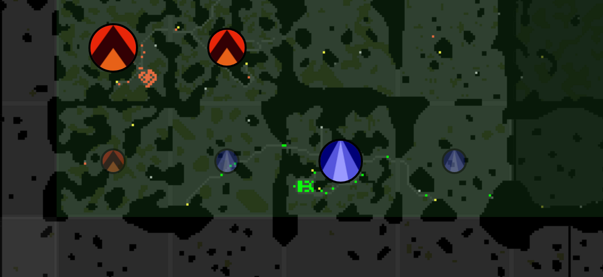
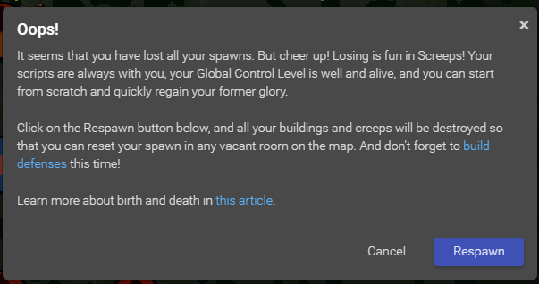

This is part 3 of my Screeps story, you can read the whole story [here](/articles/screeps).

## Format

Now that we are up to Screeps Part 3 I’m happy with the format these posts are going to take. For the next few weeks they will track with my RC level unless something big happens.

## RC4

RC4 like the other levels adds more extensions to my pool. Like before I am going to drop all of them down and build them as soon as possible.
Updating Trucking

This construction highlighted a big issue with my trucking setup. Builders could drain my supply if they wanted to leaving no energy for my haulers to put into spawn & extensions. This left me with a queue of creeps waiting to spawn. A quick patch was to limit them to containers with 5 times their carry capacity stored up so the haulers would have a chance to refill everything first.

The new extensions exposed an issue in my hauler code. They were not selecting extensions & spawn first as I intended them to. I had to update the selection code so that extensions and spawn got energy first as my main priority is maintaining the number of creeps. The last thing I need no harvesters and queue of creeps waiting to spawn.

## Harvesting Speed

I needed to address a harvesting speed issue that was beginning to hamper my growth. The plan is to haul more energy in from a neighboring room but that is going to take time to setup and won’t be a quick source of energy. I decided to further embrace my trucking and drop 2 carries from my harvesters in favor of 2 more works. Hopefully this will get my energy supply up higher.

These new harvesters can deplete the energy point before it regenerates. This is now the fastest I can gather energy for now.

## The multi-tool

At the end of RC3 I added a new creep to work in other rooms. This multi-tool had very basic code that made it function like the tutorials builders. It was nearly done with its road and storage container and was going to need to be able to dump its collected resources into that storage container.

With a road and container in this other room and no tower to provide repairs the multi-tool is going to have to repair structures for now.

## The Ranger

The other room I have quick access to is being reserved by another player. But they haven’t built up a supply of reservation ticks on the room controller. This gives me a chance to unreserve the room by stopping their claimers. To do this I need a new kind of creep, a Ranger.

Rangers are just `MOVE` and `RANGED_ATTACK` parts. They move to a room flagged as attack and once there move to engage any hostile creep. I now have the reservation on the room, with a large buffer built up.

Shortly after I attacked this players creep they sent a large creep into my main room. It was all HEAL and MOVE and it just sat in tower range trying to out heal the damage my tower was throwing at it, it lost. It does concern me, I didn’t destroy it quickly a few at once with attack parts might be able to lay down some damage before I could destroy them or even get my tower before it kills them all. Here in lies the scary & amazing part of Screeps. It runs 24/7 this could all happen whilst I was asleep and my AI could heal everything back up, replace my creeps and get everything up again before I checked in.

## The NPC menace

I had a very scary encounter with an NPC that highlighted a bug in my tower code.

An NPC spawned in the middle of my spawn area and began attacking creeps and structures. Herein lies the bug, my tower was healing everything and letting the creep live. You can queue multiple actions in a tick with only the last being executed. My tower was correctly seeing the hostile creep and queueing an attack. It was then seeing damage and queuing a repair.

The NPC severly damaged my creeps leaving haulers with no carry parts, harvesters with no work parts. I had to manually spawn a small hauler I could actually afford to begin restoring my energy supplies.

This only adds to my fear of the other player attacking.

## Inter room hauling

Now that my multi-tool is storing energy I need to bring it into my main room.

My Inter room hauler works something like this:

  - Am I hauling?
   - Yes
    - Am I in the destination room?
      - Yes: Run the normal hauler code.
      - No: Move to destination room.
   - No
    - Am I in my collection room?
      - Yes: Go to container and collect.
      - No: Move to collection Room.

Pretty simple but it has now essentially added a 3rd harvesting point to my main room.
Preparing for War

I am beginning to fear attack from the north. They have a claimed room touching my reserved one with a large exit into it.

## Defeat

So The war I wanted to prepare for came whilst I was enjoying movie night. 30 Minutes later it was over and I was out of the game.

Screeps has an article on this ([here](http://support.screeps.com/hc/en-us/articles/203390711-Birth-and-death)) which explains that it’s now my job to rebuild somewhere else. Which is exactly what I plan to do. See you in Part 4.

## Get Screeps

You can follow my progress on [my profile](https://screeps.com/a/#!/profile/Arcath). Once I reach RC4 I’m not sure how I am going to progress yet.

You can read more about Screeps on their [site](https://screeps.com/). I purchased it through steam giving me the permanent 10 CPU and the desktop client.

You can see my code as it was at the end of this post [here](https://github.com/Arcath/screeps-code/commit/f0841553f1a391a00fd42331d791c2af303978ec).
