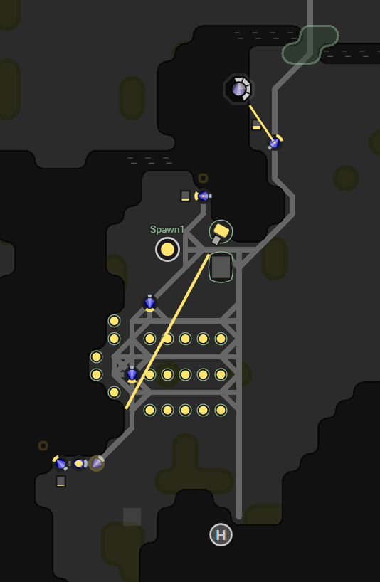

This is part 4 of my Screeps story, you can read the whole story [here](/articles/screeps).

## Picking a new Room

With the loss of my original room, I was now homeless.

I actually struggled to find a room with 2 resources points that I could take. If your thinking of getting Screeps don’t worry they are constantly adding more rooms, they just limit the world size so I can’t take a room on the far side of the map with no other players to compete with.

My new home W26N67 has 2 energy points and a hydrogen mine that I can get resources from. The surrounding area has a small number of players in (although I expect that number to go up).

When you lose all your spawns in Screeps you don’t lose your GCL and progress to the next level. So I might be back at RC1 with no infrastructure but I am just under half way to GCL2. My empire should now hit GCL2 before my main room hits RC5. I am looking forward to adding a second room to my autonomous empire.

I was climbing up the expansion ranks for November but that has stopped now. It will be a while before I’m expanding at the same rate as I was before. Reaching the top 50% in my first month feels pretty good to me

## Making the AI smarter

My AI does not do empty rooms.

  - Harvesters will only dump energy into a container within range 1.
  - Builders will only withdraw from containers.
  - Upgraders will only withdraw from containers.
  - Haulers are the only units that can refill spawn & extensions.
  - My Creep designs are hard coded and way too expensive for an empty room.

I quickly changed my creep designs to be cheaper letting my lone spawn create them. Harvesters, Builders, and Upgraders then needed updating to function with fewer structures.

Builders and Upgraders now become harvesters if there are no containers to draw from. This allowed me begin building my containers and reach RC2 very quickly. Once the containers are built they go back to the original code and only pull from containers.

Harvesters become haulers when there are no containers in range 1. This way they still follow the priority rules and any hauling updates will also apply to them. That being said once the containers are up it will only be if I loose this room that they should ever become haulers again.

## Creep Designer

To keep my creep designs up to date with my available supply I wrote a new function to come up with a design for a creep that uses as much energy as it can.

I define the basic 300 energy creep and an array of parts to extend with (if not supplied the base creep is used). The function then works out how much it can spend on a creep and keeps adding parts from extend until it can’t afford to. The great thing here is that as soon as a new extension is built all my creeps can get bigger (assuming the next part cost is only 50).

## Plans for the Future.

I had put army creeps to one side up to this point. I will not be losing this Spawn. If I have to take out other players spawns to do that I will do so.

I’m not normally a player that uses violence when there is another option. Take the new Deus EX, I’m putting a lot of time into finding ways around enemies and subduing them without killing them. I hoped with the last room that I would be able to defend against some poking and ultimately the other player would see that it was a waste of energy attacking me.

I have some ideas for defensive systems that should protect me from another defeat.

## How was I defeated?

I’ve been watching the room history back to see where I went wrong and I am pretty sure this defeat was avoidable.

  1. One of my reserved rooms was attacked and all the creeps in there killed.
  1. Replacement creeps were spawned.
  1. New creeps killed very quickly.
  1. More creeps spawned.
  1. After a few cycles, I could no longer provide enough energy to spawn the queue of creeps.
  1. All my creeps dead and unable to respawn my tower ran out of energy.
  1. he other player came in unopposed and destroyed my tower and spawn.

I could have put up a pretty good defense with just my tower if I had stopped spawning creeps to march into a room that was not safe. I essentially handed my room over to the other player.

## RC4 Again.

A testament to code efficiency is how quickly I have got back to RC4. I started playing on the 11th November, on the 15th I hit RC3, on the 17th I hit RC4. That’s 6 days to reach RC4. This time round I started the room on the morning of the 20th and reached RC4 in the morning on the 22nd. Technically under 48 hours.

I dropped the sites for the RC4 buildings that I had before and watched my builders get to work.

Now I am back to where I was before I can return to my original plans.

## Get Screeps

You can follow my progress on [my profile](https://screeps.com/a/#!/profile/Arcath). Once I reach RC4 I’m not sure how I am going to progress yet.

You can read more about Screeps on their [site](https://screeps.com/). I purchased it through steam giving me the permanent 10 CPU and the desktop client.

You can see my code as it was at the end of this post [here](https://github.com/Arcath/screeps-code/commit/9e9732b57a94d5c7338072656850eac2d5f8e442).
