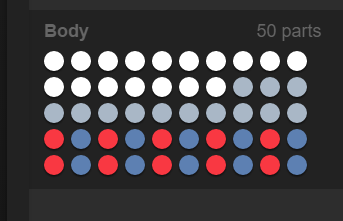

This is part 6 of my Screeps story, you can read the whole story [here](/articles/screeps).

## Danger Harvesters

[W26N66](https://screeps.com/a/#!/room/W26N66) is the room directly below my main room. It has 3 energy sources and a utrium mine with extractor already in place.

It also has NPC creeps that guard the room.

To beat these creeps and take the resources is going to require a new kind of creep.

At RC5 I have 1,800 energy to play with when spawning a creep. Before I design my new creep lets analyse the enemy.

|Part|Cost|Effect|Quatity|
|----|:--:|------|:-----:|
|Tough|10|Extra HP|17|
|Move|50 |Decreases Fatigue by 2 per tick|13|
|Attack|80|Deal 30 damage at range 1 per tick|10|
|Ranged Attack|150|Deal Damage, dependent on range|10|

That creep comes out at a cost of 3,120 energy. Which is nearly double what I can spend on a creep. My initial idea of a single creep is not going to work. I’m going to need a small army to take this room.

The first step is a unit to bring the pain. I need to be able to kill them before their friends come and join the fight.

## The Thug

|Part|Cost|Effect|Quatity|
|----|:--:|------|:-----:|
|Tough|10|Extra HP|14|
|Move|50|Decreases Fatigue by 2 per tick|9|
|Attack|80|Deal 30 damage at range 1 per tick|12|
|Heal|250|Heals 12 damage per tick|1|

That’s exactly 1,800 energy in a handy little package.

One on one these creeps will most likely loose, but I can code the to hunt in packs. The heal part is there so they can go on longer deployments and hopefully a single pack will kill more than 1 creep.

My only fear is one of cost. Building these creeps is going to affect my energy supply quite a bit especially with my second room not contributing anymore. I don’t want a repeat of the near miss from last time.

The first part of the code for these is to go to the desired exit and wait for the rest of the pack.

The opening battle went ok…

One of my creeps died. Its fate was sealed before the second creep made it to the battle. Pathing seemed to get a little messed up with them bouncing off each other trying to get to the same spot.

Pathing definitely needs improving before I send another wave in. On the plus side, the single heal part was able to fully repair the surviving creep before the NPC respawned.

## Reaching the Limit

I’m hitting the limits of my code at the moment. My growth rate is down, my creeps make silly decisions and my CPU spikes very high.

I’ve narrowed my problems down a bit but they are at the heart of how my AI works.

  - Creeps go for the same bit of work.
    - Take Harvesters for example both harvesters will walk through fire to get to the same container only to have which ever got there first taking its load and the other then heading off to another source.
    - When building all the creeps would walk to the other side of the room with a full energy supply for the first one to drop the last 50 energy into the site. Everyone then decides to upgrade and walk back again.
    - This all comes from a lack of direction, every creep runs the same function and comes up with the same answer.
  - My do it all creeps are the embodiment of Jack of all trades master of none.
    - Upgraders & Harvesters can work more carry less.
    - They do make good builders.
  - Creeps change target mid walk.
    - Haulers could be 2 moves away from their destination only to have a higher priority target jump the queue and have them turn around and head to another destination. Great when a tower needs energy to keep the room safe, a pain when the upgraders don’t get their energy supply because a tower healed something.
  - I never did implement that defcon system.

The core of the issue is I have no directors. A director would decide on a job for a creep, record it and send it off to do it. When a new job appears the director will either reassign a creep or leave the job in a pile until a creep is free to do it.

There is also very little automation at the higher level. I still manually place buildings, lay the roads, decide which rooms to use. My AI should be able to take this on itself.

Part 7 is going to detail a complete rewrite of my AI.

## Get Screeps

You can follow my progress on [my profile](https://screeps.com/a/#!/profile/Arcath). Once I reach RC4 I’m not sure how I am going to progress yet.

You can read more about Screeps on their [site](https://screeps.com/). I purchased it through steam giving me the permanent 10 CPU and the desktop client.

You can see my code as it was at the end of this post [here](https://github.com/Arcath/screeps-code/tree/09fb0457a6575056f70e282aff8cc70ecfebce4a).
