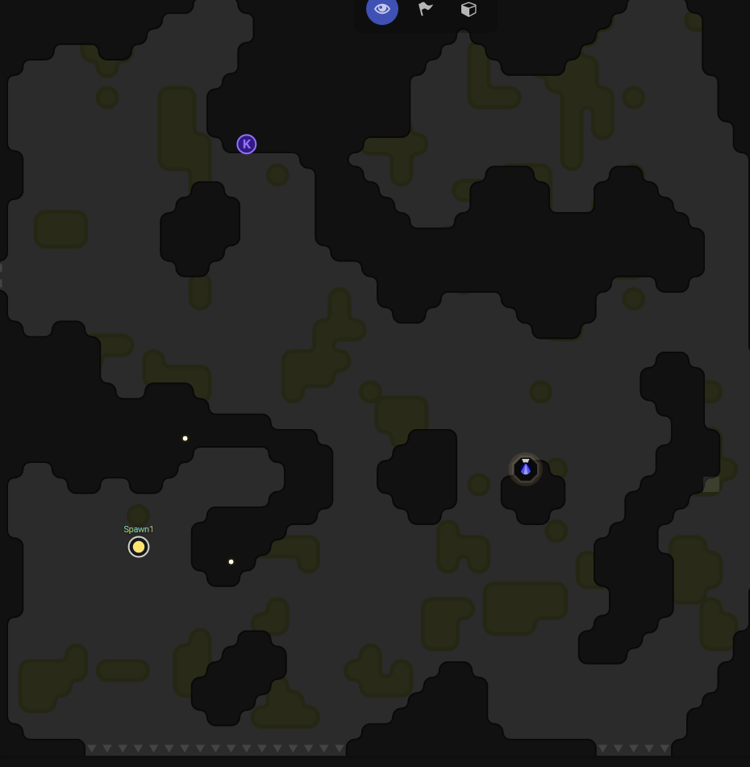
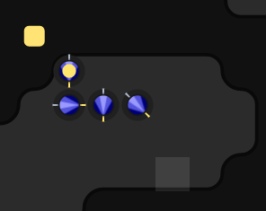
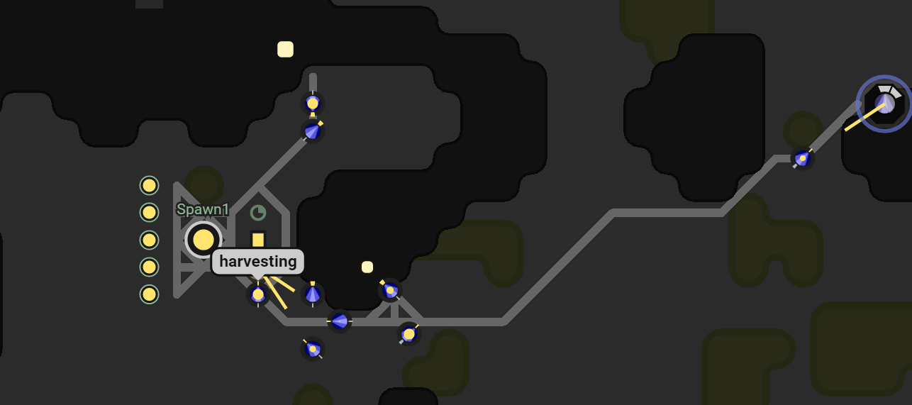

Screeps is an MMO RTS aimed at programmers. Unlike traditional games you don’t have direct control over your units. You instead write a program to govern their movements and actions.

The target market for Screeps is very narrow but to someone like myself it is an amazing game. Over the past few days, I have fallen for this game. I like having it open just to watch my creeps go about their business. _If anyone from screeps is reading this, a screeps screensaver that shows a given room would be awesome._

When you select your first room and place your first spawn you start with an empty loop function. It is your job to write the code for this.

## RC1

For the first Room Control Level, I ran the tutorial code with a couple of minor changes. At this point, I was still reading [the docs](http://support.screeps.com/hc/en-us/categories/200506391-Documentation) and had run into an issue that needed addressing straight away.

The tutorial code didn’t handle what to do if there were no jobs to complete. My builders and harvesters were waiting in the only spot I can gather resources from for something to do. This usually meant waiting until the unit in that square died and I had to spawn a new one.

## RC2

Arriving at RC2 happened without me thinking it would. I hadn’t fixed the earlier problem and it was dumb luck that the upgrader ended up at the front of the queue enough times to upgrade the Room Controller.

The short term solution was to give everyone something to do. This meant building extensions. Extensions would allow me to store more energy and give the builder something to do.

I quickly realised that I needed to change tactic. The harvesters still blocked everything up when spawn was full of resources and until the first extension finished being built they had nowhere else to go. At this point, I decided to change to only having the harvesters go to the energy points. I changed the builder & upgrader code so that they would withdraw energy from spawn instead of harvesting it. I needed a safety check so they didn’t empty spawn and prevent me creating new creeps but after that everything went a lot smoother.

After I had 4 extensions up and running I changed the upgrader/builder code again to withdraw from extensions only. This ran very well overnight with all my construction projects finishing.

I was now 25% of the way to RC3 which takes a huge (to me) amount of energy.

I added some containers and changed all my creeps over to withdrawing from them. This saved all the energy in my spawn & extensions for building creeps which let me build bigger harvesters that could carry more and work faster.

## RC2 Efficiency

I now had a few efficiency issues. Mainly:

  - Harvesters only looked for drop off locations if they were full. This meant they would travel to my extensions and drop off 50 units and then carried 50 units back to the source.
  - Builders would sit around when there was no building to do.
  - Re-Building roads when they died was slowing things down.
  - Harvesters preferred containers. This meant I could end up with not enough energy to spawn a new creep.

Solving number 1 required the addition of a drop off mode. Once in drop off mode a harvester will search for all drop offs that need filling until it is empty at which point it returns to the source to refill.

3 needed a new type of creep. A healer that could repair any structure. They fill up from a container and then find the nearest structure that needs repairing. Of course when there are no buildings to repair healers have the same issue as builders (2).

To fix 2 I chained the roles. If a builder is able to build but has nothing to build it runs the healer function becoming a healer. Healers in the same situation then run the upgrader code. So assuming everything is repaired and built I end up with a whole fleet on upgraders.

To get 4 sorted I added a sort to the targets list in harvesters. They would now fill spawns, then extensions and finally containers.

## Get Screeps

You can follow my progress on [my profile](https://screeps.com/a/#!/profile/Arcath). Once I reach RC3 I will be throwing down some more extensions and building bigger creeps.

You can read more about Screeps on their [site](https://screeps.com/). I purchased it through steam giving me the permanent 10 CPU and the desktop client (which I don’t really use).

You can see my code as it was at the end of this post [here](https://github.com/Arcath/screeps-code/tree/7d6170e4f51ae6751d3dac0db55f5f11c099fe31).

## What is Next?

For RC3 I am going to focus on speed. I can’t claim more rooms until I raise my GCL (Global Control Level) which takes a ton of energy. More Energy, Faster.
