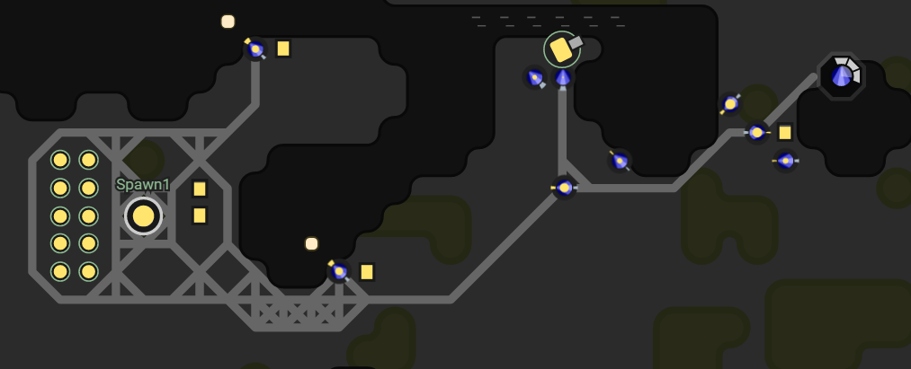
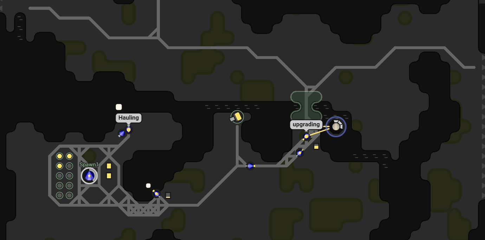

This is part 2 of my Screeps story.  You can read more about Screeps and part 1 [here](/2016/11/screeps-part-1-rc1-rc2/).

## RC3

After hitting RC3 I immediately dropped 5 more extensions and a tower. This lead to an issue of energy supply. My builders pulled energy so fast building everything at once and I had no time to recover. I just left them to it and eventually they finished building the new extensions. The tower took longer to build as the builders needed to move across the map to and from the construction site which did give my harvesters time to build up a bit of a surplus.

Once the extensions were complete it was time to roll out a new design of harvester. More extensions means bigger creeps. My new harvesters were made up of 4 WORKs, 4 CARRYs, and 2 MOVEs. These harvesters pulled 8 energy per tick, carried 200 at a time and could move along the roads rather fast.

I added a wall as I came out of RC2 and am now realising how they work. It takes 1 energy to build and then they take 300 million to reach full strength! Once the tower was up I excluded walls from my healer creeps and made the tower heal walls up to 200K which I hope is enough for now.

The tower also serves a defensive purpose. One of my neighbors was sending creeps through my room to claim the ones around it. This has now stopped. My tower blasts their un armoured creeps in one hit as soon as they come into range.

## Trucking

A couple of Reddit users gave me some advice in the comments on part 1 which sounded pretty good to me.

The core of the idea is a creep called a hauler. Haulers are entirely CARRY & MOVE parts, all they do is shift energy around my road network. They can’t enter the chain like the other creeps as they don’t have a WORK part, they just have to sit about when they have no energy to haul.

Harvesters now harvest and deposit directly into a container right next to them. Haulers then come along and withdraw from those containers and take the energy to spawn, extensions, towers, and other containers. Upgraders now have a container they can draw from without moving from the Room Controller, no more back and forth.

Not only does this mean my harvesters spend 100% of their time at the energy point, the traffic on my roads is way down.

My creep design has shifted to mostly WORK parts. Harvesters & upgraders don’t need a large capacity or a high speed, once they are in place they don’t move and I save no time by having them carry a lot.

## Improving my Scripts

RC3 feels quite big to me. 135K energy to upgrade to RC4 puts a huge amount of work to get to the next level. Given the time it took to get through RC2 I was expecting this to take even longer. I suspect this is the point. It has encouraged me to improve my code instead of just throwing out bigger creeps and hoping my code will still work. Trucking is a major shift in the way I work which has improved speed throughout my room which I might not have done if RC4 was a quick journey.

My dedicated healer creeps are now gone. The tower can maintain most things remotely without the need for a whole creep moving around the map.

## Going Multiroom

Although my GCL is only 1 I can still use the rooms around me I just can’t claim them. First off I want to reserve a room. Reserving greatly increases the cost of claiming a room for another player and makes it easier for me when I can.

I decided not to let my scripts decide which rooms to target and how to target them. For now, at least, I have an object defined with a list of rooms and for each room a task to complete. If a room is flagged as hold I spawn a new kind of creep, a claimer.

Claimers are given a target room when they spawn and then make their way to it. Once in the room they move to the controller and reserve it. To prevent me losing my reservation whilst a new claimer is spawned and dispatched claimers keep a count of how many ticks it took to get to the room controller with some padding for the spawn timer and some overlap. Once their ticks to live gets below this time a new claimer is spawned. The new claimer arrives to take over around 15 ticks before the old one dies giving some overlap to build up some reservation ticks on the controller.

The next step in multi-room is to harvest resources from another room. To do this I created a new creep I’m calling the multi tool. It can be assigned another room which it will move to if it is not already in it. Once in that room it functions like the tutorials builders harvesting resources and building. I will improve it shortly to drop resources into a container if it has nothing to build.

This is where it happened, I hit RC4.

## Get Screeps

You can follow my progress on [my profile](https://screeps.com/a/#!/profile/Arcath). Once I reach RC4 I’m not sure how I am going to progress yet.

You can read more about Screeps on their [site](https://screeps.com/). I purchased it through steam giving me the permanent 10 CPU and the desktop client.

You can see my code as it was at the end of this post [here](https://github.com/Arcath/screeps-code/tree/607a841ce24ab274e11f46bbcceae9114d4741ad).
