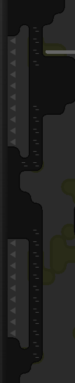
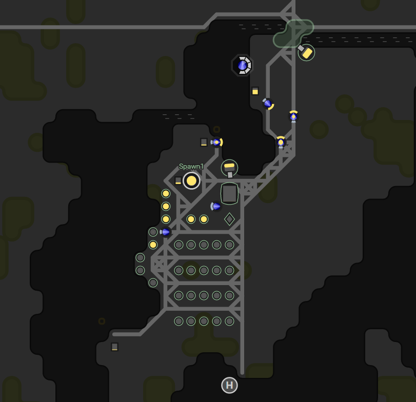

This is part 5 of my Screeps story, you can read the whole story [here](/articles/screeps).

## Rewriting the Creeps.

I am not happy with my creeps anymore.

With any code I maintain, there comes a point where I stop sticking bits to the side and overhaul the whole block.I manually define how many of each creep type I need and they only perform the job they are told to and won’t change during their life.

I manually define how many of each creep type I need and they only perform the job they are told to and won’t change during their life. This isn’t multi-room/spawn friendly and it means I could have a full load of upgraders but no harvesters and no energy to spawn any.

It was also hard coded that my spawn was called Spawn1. This was going to be an issue once my GCL increases and I have 2 spawns.

My new creep class works something like this:

  - Is my energy at 100%?
    - Yes: Start working.
  - Is my energy at 0%?
    - Yes: Stop working.
  - Does the number of creeps with the job harvester equal the number of sources?
    - Yes: Are there any construction sites?
      - Yes: Become a builder
      - No: Become an Upgrader
    - No: Become a harvester
  - Am I working?
    - Yes:
      - harvesters drop off into nearest container.
      - builders build.
      - upgraders upgrade.
    - No:
      - harvesters harvest.
      - builders & upgraders collect energy from a container or if no containers exist begin harvesting.

This code has one major advantage. Creeps can change job. When a harvester dies another creep will now immediately fill the gap. No waiting for another to spawn. I now deplete my energy with 100 ticks left on the refresh counter.

This also has a new spawning code which makes sure the room for the supplied spawn has at least number of sources + 2 creeps at any one time.

## The Near Miss.

The new creeps caused a situation where nothing happened all night.

Using my creep builder my creeps always cost as much as they can which means if there isn’t enough energy it waits until all the extensions are full before spawning. This ensures the most productive creeps are produced for whichever level the room is. This means that if all the extensions aren’t full A new creep can’t be spawned. So my creeps were taking from the containers at a lower energy level than the haulers which meant my haulers never got a chance to refill the extensions.

Two improvements need to be made to fix this bug.

  - If the number of living creeps is below the number of sources use the creep builders `canAffordOnly` mode which limits the cost of a creep to available energy not the maximum.
  - Only collect from a container if its current energy level is greater than the carry capacity of the haulers + the capacity of the current creep.

After adding these improvements the room became pretty self-sufficient again.

## Recycling

Thanks to the Slack users for some clarification on this.

When my creeps die its 1300 energy that just gets thrown away. Spawns have a way of dealing with this called recycling.

When you recycle a creep it drops some energy used to create it to the floor. A handy trick (thanks mmmd) is to have your creeps recycle on top of a container, this way the energy is instantly stored.

So for my new creeps when they reach a TTL (Time to Live) of 350 ticks I get them to move to the container next to spawn. Once there Spawn recycles them, dropping the energy straight into the container.

## Under Attack

My neighbour to the left has begun attack me. They started sending the odd unit to test my defenses giving me flashbacks to the loss of my old room. Fortunately, I am prepared. Towers now jump the energy queue getting first dibs from the haulers if a hostile creep is in the room.

After a rather large incursion, I decided to contain the situation by going all Trump on them.

I’ve not seen an attack in a while after building the wall. I believe they have stopped trying as they can’t beat my turrets.

## A new Room.

I am now GCL2. This means I can have a second room with its own spawn and RC level.

My new creeps were already pretty much ready for multiple spawns, haulers needed a couple of changes making in the `ai.numbers` function so that the hauler count only included haulers in the same room as the spawn.

To get the room up and running faster I added an inter-room hauler taking energy to the new room from the old one.

My new creeps don’t seem to be that great in low-level rooms. I needed to add an exception to the builder job that meant they become upgraders if there are less than 500 ticks on the room controller downgrade.

Despite the above condition it still dropped back to level 1 on Sunday morning. The container by the harvester died and it turns out my code for making them harvest if there are no containers was broken. Essentially if a harvester was alive no creep can harvest from that point. I ended up having to change the code so that it did the same point limiting but per creep job. So a single harvester, builder & upgrader per point.

This all happened because my creeps didn’t ever become healers. A small oversight on my part that has caused a pretty big setback. Adding healing code was a pretty simple thing, in the new creep class its just a builder that runs repair instead of build.

## What is Next?

My code will most likely stay the same for now. I need my new room to level up and I can’t start working on mineral extraction or market trading until I reach RC6 in my main room.

At RC5 I got another tower and links. Links are a nice structure that lets you send energy within a room from one to the other. I actually plan to use them more with another expansion idea I have.

## Get Screeps

You can follow my progress on [my profile](https://screeps.com/a/#!/profile/Arcath). Once I reach RC4 I’m not sure how I am going to progress yet.

You can read more about Screeps on their [site](https://screeps.com/). I purchased it through steam giving me the permanent 10 CPU and the desktop client.

You can see my code as it was at the end of this post [here](https://github.com/Arcath/screeps-code/tree/daf0c012a7820b7293c229afea01d8456d4d3b6a).
