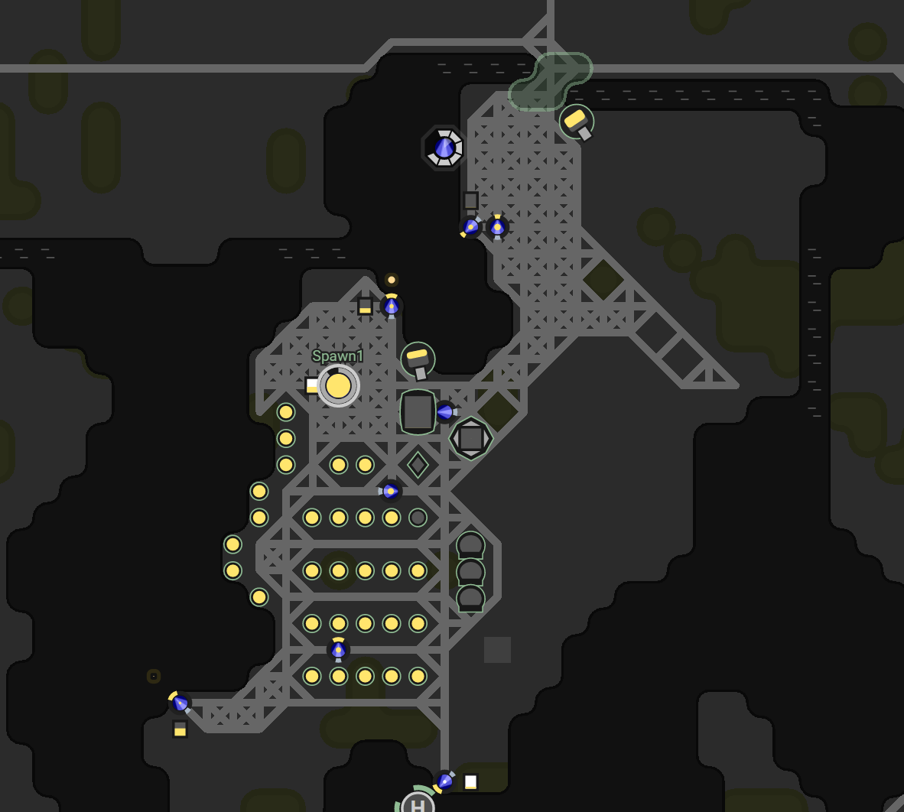
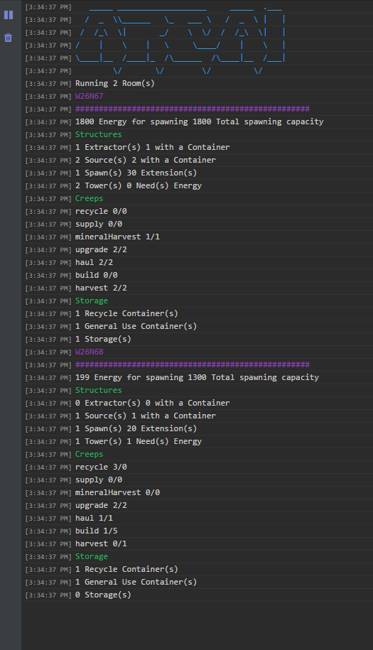

For Screeps Part 7 I have something a little different planned, a complete re-write of my code from the ground up.

  > I Apologise for the length of this post. I normally aim for 1000 words and cut off when I reach it. This post has smashed that but its worth it.

The basic principle of my re-write is to introduce my own objects to contain rooms, creeps, structures and sources. These objects would store a fair bit of data in memory removing the need to find everything every tick.

So to re-iterate the end of part 6 let us list the problems with my current AI and give the solution.

|Situation|Why is this Bad|Solution|
|---------|---------------|--------|
|2+ haulers see an empty extension on the far side of the map and both go to fill it.|1 Hauler contains more than enough energy to refill an extension. Having 2 haulers race to it is a waste. They will both do a u-turn once the extension is full and head back to some container somewhere else.|When the Creep Director assigns a delivery it checks that the the hauler’s energy will be needed to finish filling it. Even if it won’t take all the energy the hauler has it still sends it.|
|Same as above for builders|Same problem, no need to walk all that way only to turn back after doing nothing.|This doesn’t have the same catch. Instead, I only spawn enough builders for the sites. Should reduce the number of overlaps.|
|Creeps change target mid-journey|A creep could be right there ready to finish a job only for something they consider more important to pop up. This could mean the upgraders not getting their delivery just to re-supply spawn slightly faster.|Once the Creep Director has given a creep a job they stick with it until its finished.|
|Hard coded number of creeps|Creeps are spawned to meet numbers not needs.|The creep director spawns a new creep to satisfy the number of jobs. There is now a formula to decide how many creeps are needed.|

## How it all Works

The core of this new AI is the new room object. Every find (aside from range based finds) are now done by the room object with most being cached. The AI is now no longer running a find for each creep but instead is using the provided data from the room object. It then filters the lists again to produce smaller lists of objects that meet a certain condition (for example needing an energy delivery).

Having these lists in a room object means I can use them for working out the requirements of a room. The new AI will ensure that each source has a harvester and each source container has a hauler. It will spawn 1 builder for every 10 construction sites and none if there is nothing to build.

## New Features

Whilst most of the work on this AI has gone into replacing the old one with something better it has some new features that were not possible before.

## Any RC Ready

Thanks to the simulator the new AI is able to change the creeps behaviour and its needs to suit a room of any RC level. This will come in handy once I hit GCL3 and need to bring another room into the fold.

## Minerals

I hit RC6 during the rewrite so this new AI supports the harvesting of minerals with extractors. The minerals are extracted by a new creep, the _mineral harvester_ (very creative name I know).

It works the same as a normal harvester except it makes sure that the extractor is not on cooldown before harvesting.  I’m not sure if it is worth polling and not just hammering harvest until I get something but it feels cleaner to check it.

## The Market

With RC6 comes access to the terminal and the ability to use the market. For now, my market code simply sells everything placed in the terminal. There is a limit imposed on the max energy it can use to send, but it is allowed to reduce the amount to send until it meets that limit. This has turned a nice hydrogen surplus into 9k credits. Now I have some credits I will look at buying some supplies for my labs, but that’s a little way down the line at the moment.

## Supply Creep

Whilst my haulers are focused on moving energy from sources to anything that needs it, supply creeps are focused on minerals. The room queues up jobs of mineral shipments and the supply creep comes along and moves the minerals around. It is a very simple creep with the complex code being in the job creator.

## Auto Road Building

If my creeps are on a tile that doesn’t have a road they drop a construction site. This is resulting in some pretty big road coverage and a lot of builders being produced to build them but once its finished my creeps can glide around the map.

## Cool Functions

Some parts of my new AI make me especially happy.

### Utils#inflate(room, key, create, force)

This function takes the room object, a memory key, the function to create the data, and a boolean flag for whether to force the creation of data.

It stores the IDs of the returned game objects in an array at the given memory key. When called on the next tick with the memory key existing it uses `Game.getObjectById()` to recreate the array without running the create function. This saves CPU by not running loads of finds on each tick.

Take sources, for example, my old code would run `room.find(FIND_SOURCES)` every tick even though the answer never changes. Now I run it once for each room and store the ids of spawns in memory and inflate the ids back to the full object each tick instead.

### Report()

Every 20 ticks a function is run to provide me with a summary in the console. It gives all the counts for each room and the amount of energy available.

It also features a some ASCII Art to make it look cool.

The Screeps console supports most HTML elements so in my report I’ve just used spans with a text colour.

## Still to Write

There is some stuff that still needs writing. Getting this much working has taken quite a while and I like to run it for a bit before I expand it again. I’m happy with the rooms I have for now.

My second room didn’t swap to the AI very well. The sheer number of roads It tried to create along with a single energy source has meant that room has slowed to stand still. I need to think of a limit on builders so I don’t get it trying to create 6 in a room that can’t handle it. I’m thinking of linking it to energy production rate.

I need a system, to send energy from one room to another when they need it. Better to slow the upgrade rate in one room to help another get on its feet.

## Useful Parts of the API

There are tonnes of things in the Screeps API that I only found by accident whilst reading another part of the docs.

|API|What it does|Where I used it|
|---|------------|---------------|
|[Room.energyAvailable](http://support.screeps.com/hc/en-us/articles/203079011-Room#energyAvailable)|The amount of energy available to spawn a creep right now.|In the re-written creep builder instead of doing the math on the number of extensions.|
|[Room.energyCapacityAvailable](http://support.screeps.com/hc/en-us/articles/203079011-Room#energyCapacityAvailable)|The energy capacity of all spawns & extensions in the room|In the re-written creep builder.|
|[Game.getObjectById(id)](http://support.screeps.com/hc/en-us/articles/203016382-Game#getObjectById)|Returns the game entity with the given ID (assuming you can see it)|Jobs store the ID of the targeted object, this lets me turn the memory ID into the actual object.|

I can’t stress enough that you need to read the documentation for the API. I’ve found so many time-saving things in there that have made my code cleaner and my CPU usage lower.

## Get Screeps

You can follow my progress on [my profile](https://screeps.com/a/#!/profile/Arcath). Once I reach RC4 I’m not sure how I am going to progress yet.

You can read more about Screeps on their [site](https://screeps.com/). I purchased it through steam giving me the permanent 10 CPU and the desktop client.

You can see my code as it was at the end of this post [here](https://github.com/Arcath/screeps-code/tree/089517067942a892ed96a70c195b300335b79b60).
