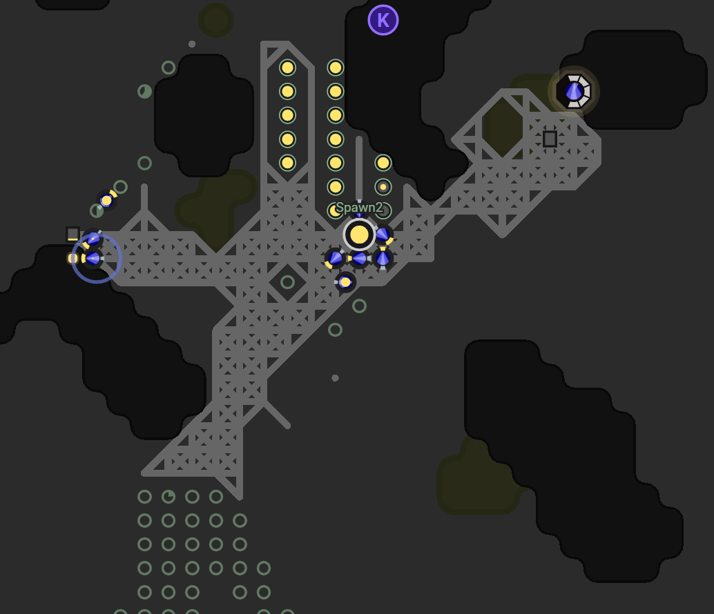
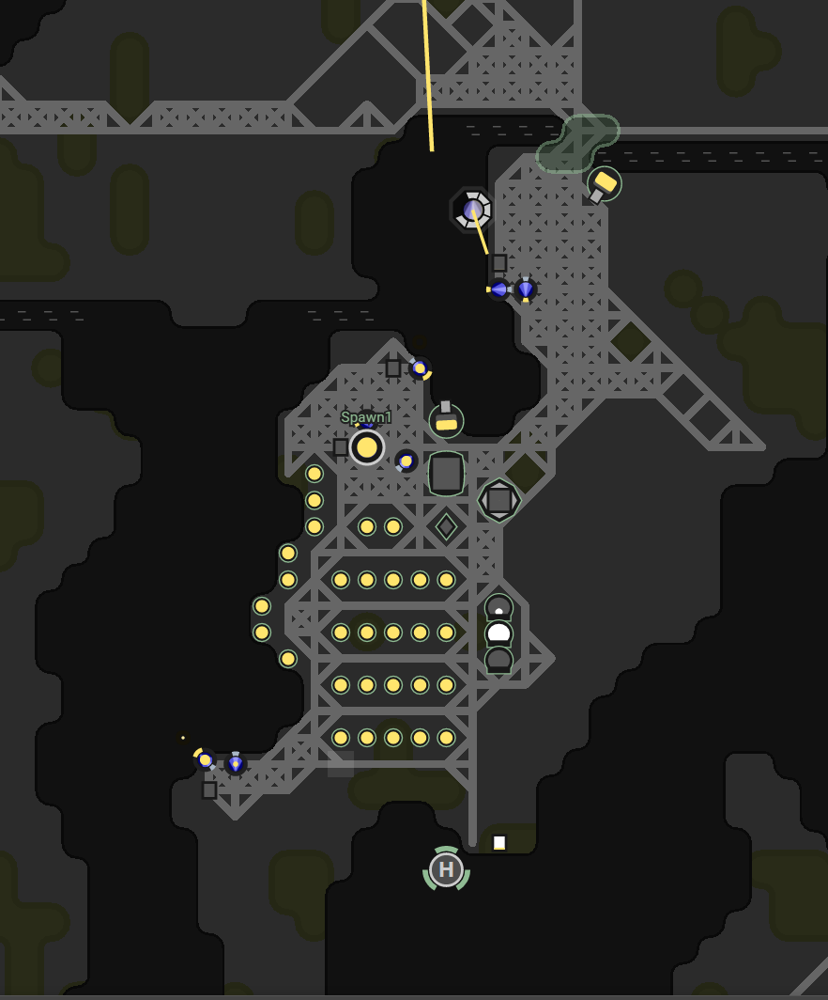

This is part 8 of my Screeps story, you can read the whole story [here](/articles/screeps).

## W26N68

So, that room I said needed some help now really needs some help.

Another player has wiped it clean. It is now an empty room with a level 5 controller. I don’t feel any resentment to the player that wiped the room. They did send an apology message with some advice, mainly use safe modes.

I need to focus now on getting this room working again as quickly as possible.

To get it back on its feet it needs a spawn. To build one it needs help from another room. The new AI now needs a system that allows a room to call for aid. Currently, a room needs aid if it has no spawn. If it needs aid and another room can provide that aid the other room will try and spawn some creeps for it and send them over.

Sending a builder would be pretty useless. It would arrive in the room and look for a container to draw energy from. To do this I need a harvester that can build, upgrade and haul. These creeps have no place in a functioning room so I again added a _contructorMode_ flag to a room. If its energy is below 300 it spawns constructors instead of anything else.

This meant that my main room built constructors and sent them up to the failing room. The constructors then built the spawn and most of the road network before the room swapped onto its own supplies.

Progress in the room was painfully slow. Over the weekend I left it to it. It was time to put up the Christmas decorations and other festive things. I was hoping to come back and find that this room was back up and running at 100%. I was wrong. It had built a few extensions which had triggered the end of its need for support. At the same time, it had laid loads of roads which meant loads of builders.

According to the government, the best way out of a huge deficit is to borrow and spend. That is my plan entirely.

_Inter Haulers_ are the solution here. I had them before to bring resources in from another room and that is exactly what they need to do here. My main room has 172K energy sat in storage. Stored energy is unused energy. It makes no sense to have 172K of energy sat doing nothing when the room next door is struggling to even spawn creeps.

To decide if a room needs energy to be sent to it I calculate the average energy for spawning in the room  over the last 50 ticks. If it is below 500 the room needs energy to sent over.

With the addition of inter haulers, it was finally time to use the links I have been building. Links allow you transfer energy from one link to another in the same room. The perfect use case for them here is to allow my haulers to put energy into a link in the middle of the room and for it to transfer it to links by the exits. Inter Haulers only then need to move a few steps into the room to pick up energy and can turn around ASAP and go back with it.

## DEFCON

It’s time to make that defensive system I said I would but never did.

|DEFCON|Trigger|Actions|
|:----:|-------|-------|
|0|No hostile creeps in the room|Normal operations.|
|1|1-4 hostile creeps in the room|Towers jump to the top of the energy list getting it before anything else.|
|2|Defcon 1 has lasted more than 50 ticks or 4+ creeps in the room|Defcon 1 + 2 defender creeps.|
|3|4+ creeps|Defcon 2 + 2 more defenders and the room calls for aid.|
|4|10+ creeps|Defcon 3 + Every worker creep moves to repair the walls.|

With this in place, my rooms should  be okay…

## Safe Modes

Each room has a limited number of safe modes. When in safe mode hostile creeps can’t attack anything. Each room has a limited number of these safe modes so using one is a pretty big thing. The conditions for using one need to be early enough in an attack that I can still fight back but late enough that I don’t waste them on the first 5 easy to defeat creeps.

I decided that the conditions for a safe mode to be used should be:

  - 51 ticks at current DEFCON level (notice that this would take 101 ticks from entering DEFCON 1).
  - OR
  - Structure count decreases whilst at DEFCON 1 or above

This code should work. It’s hard to test without being attacked but I’m hopeful that this going to work. I’ll keep my fingers crossed and hope that I’m not going to get wiped out when the newbie wall drops.

## What Next?

Now that the new AI is pretty stable I want to focus on bringing back the claim & harvest creeps from the first jaunt into multi-room. With this, I should be able to increase the energy supply like before.

## Get Screeps

You can follow my progress on [my profile](https://screeps.com/a/#!/profile/Arcath). Once I reach RC4 I’m not sure how I am going to progress yet.

You can read more about Screeps on their [site](https://screeps.com/). I purchased it through steam giving me the permanent 10 CPU and the desktop client.

You can see my code as it was at the end of this post [here](https://github.com/Arcath/screeps-code/tree/ca873557daf0cf6cfc3da58dc55d653d55f04d97).
