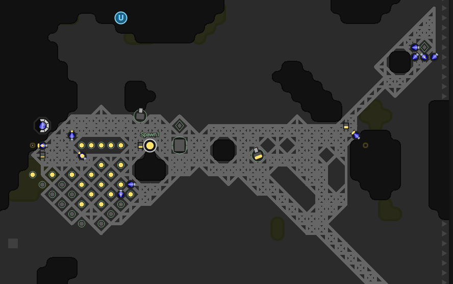

This is part 9 of my Screeps story, you can read the whole story [here](/articles/screeps).

## GCL3

I’ve hit GCL 3 and its time to take on a third room. I want a room with 2 sources and there is only one near me. [W24N68](https://screeps.com/a/#!/room/W24N68). Its placement near another player is not ideal but I can live with it.

After claiming it the other player set creeps to attack it. I expected this and they went straight to my construction sites. A hostile creep need only touch a construction site to destroy it.

I was getting nowhere fast. The other player was destroying my spawn before I could build it, and ever after I build it there is no guarantee that they won’t come and wipe it out straight away. That’s when I had an idea. I altered the constructor code so that they would rush level 2 on the controller (it takes 200 energy,  1 constructor can do it in one sitting). This gave me a safe mode which I activated straight away.

Progress was good, having 2 sources and the support of my main room this room was flying along until the safe mode ran out. I was hoping to hit RC3 before the safe mode ran out so I could get a tower up but that didn’t happen.

A single creep was all they needed to take out my spawn and then it was clean sailing to wipe the structures from the room.

To defend my room without a tower or walls I added a _defendRoom_ directive to my code. My AI will now keep 2 defenders alive in the given room at all times. I await the next attack.

This plan worked against the single creeps. I needed to rebuild the spawn a couple of times but I was pushing on to RC3 hoping that another safe mode would solve my problems.

The other player decided to step up their attacks and hit all of my rooms hard. I did login midway through and wanted to try and rebuild but with Christmas there was no time to look at it.

## Respawning

I respawned and left my code to it checking in to place some buildings.

This highlighted an issue with my AI, it can’t do new rooms. The number of construction sites for the roads was getting in the way and slowing things down. Once I got to RC3 things had stabilised and my room began to steamroller its way up.

My new room has a 2 source room right next to it. My AI is pretty good at getting new rooms off the ground using the energy from a stable neighbour.

Everything is going quite well with nothing new to report code wise.

Part 9 is quite short as the respawn has set me back quite a bit. I hope to get a bit more aggressive shortly.

## Get Screeps

You can follow my progress on [my profile](https://screeps.com/a/#!/profile/Arcath). Once I reach RC4 I’m not sure how I am going to progress yet.

You can read more about Screeps on their [site](https://screeps.com/). I purchased it through steam giving me the permanent 10 CPU and the desktop client.
