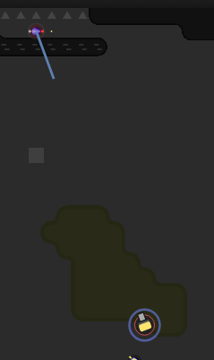

This is part 10 of my Screeps story, you can read the whole story [here](/articles/screeps).

## RC6 Twice

After the respawn in the [last post](/2017/01/gcl3-another-respawn/), my rooms have been plodding along nicely. I now have 2 rooms at RC6. This means 2 rooms extracting and selling minerals.

My AI doesn’t make full use of labs yet so instead of leaving minerals alone I extract and sell as much as I can. This is leading to a pretty healthy credits balance which I will be putting to use in the future.

Having 2 high-level rooms is great. My economy is performing pretty well and when I add a third room to the mix it should be lifted to a self-sustaining level quickly.

## Mining another room

Way back in [part 2](/2016/11/screeps-part-2-rc3/) I made some creeps to mine from other rooms I didn’t own. It wasn’t hard with my new AI to re-implement them.

The workflow is something like this:

  - Am I full?
    - Yes:
      - Am I in the drop off room?
        - Yes: Run normal hauler code
        - No: Move to drop off room
    - No:
      - Am I in the harvest room?
        - Yes: Run normal harvester code
        - No: Move to harvest room

My AI has all the code I need to do this already.

My creep director checks for a few things in a creeps memory before it runs the normal functions. In this case, the `goToRoom` memory entry is used to specify a room to go to. If this key exists the director runs a separate function instead of the usual function for that creeps action. Once it is in the room it needs to be in _normal_ operations resume and the creep performs its intended job.

## Attack!

It’s time to give my AI some teeth.

It’s time to stop being passive and instead take what I need.

[E63S74](https://screeps.com/a/#!/room/E63S74)

A 2 source room held by a player who’s AI seems very basic.

The only barrier for me is their tower. It can destroy one of my creeps before I can reach it. So I need to feed infantry into it until it runs out of energy.

Half of the battle in screeps is observing the way the other players AI is working. My opponents AI has some exploitable flaws.

  - It tries to pick up any dropped energy.
    - When my creeps die to the tower they send creeps to pick up the energy.
    - This puts his creeps in striking distance of mine.
    - Killing all his creeps means no resupply of that tower.
    - All his creeps come to the energy. This is the problem I solved in part 7.
  - If their creeps stray too close to the room exit they pass into mine and make no attempt to flee.
    - My 2 towers destroy them very quickly.
  - They are at RC5 but only have 5 extensions.
    - Their creeps are underpowered, it’s like attacking someone at RC2.

After sending 2 creeps to their death I had caused a pretty big disruption to their room. They are down to 2 surviving creeps which is affecting their supply situation. No deliveries to spawn or the tower will be a great help to my war effort.

## Get Screeps

You can follow my progress on [my profile](https://screeps.com/a/#!/profile/Arcath). Once I reach RC4 I’m not sure how I am going to progress yet.

You can read more about Screeps on their [site](https://screeps.com/). I purchased it through steam giving me the permanent 10 CPU and the desktop client.

You can see my code as it was at the end of this post [here](https://github.com/Arcath/screeps-code/tree/569b694ebaf313439c244ffa6bf09e6a3217e081).
