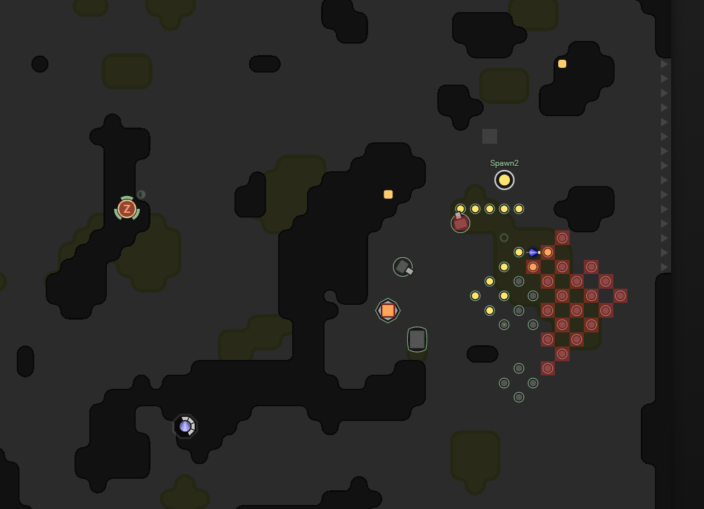

This is part 11 of my Screeps story, you can read the whole story [here](/articles/screeps).

## The Great Depression.

At the end of the last post I was waiting for a room I had attacked to become claimable. It did after downgrading through every level from 6. This is where my problems started.

As intended my two level 6 rooms began sending constructors to get the new rooms spawn up. This was a rather quick build. Throwing down the construction sites for the containers I normally use caused no issues that I could see and my rooms continued to send constructors and haulers to help out.

Little did I know that my code had a bug. Simply put Harvesters were not at the beginning of the build queue.

This lead to a problem I had no time to fix as my level 6 rooms nearly depleted their own energy supply trying to help the third room. My second room hit a block and was stuck with no harvesters. This put a huge strain on my first room trying to supply energy to them both.

Fortunately, my second room got stuck with enough energy not to call for aid but with not enough to spawn the first creep in the queue.

Buildings began to decay with no energy in the tower to repair them. The roads disappeared and that was it. A ruined room.

This all got compounded by me not having time to look at the problems.

## Recovery

Getting out of this will take quite a long time, which is a core part of Screeps. Once I fix my code to get the harvesters out as soon as possible it will take a long time for those harvesters to build up a supply of energy in the room. Even longer for other creeps to appear and begin using it. Once all that is working again the creeps have to start upgrading the room again.

All this has to happen in the second room whilst the third room tries to get on its feet as well.

This is great practice for if (when) I have to respawn again. I will be at RC3 and may want to grab 2 extra rooms at the same time.

It took a few days to get everything up and running again, I was hitting issues with my auto road building using up all my allowed construction sites which stopped me placing my containers. As with everything in Screeps patience was required.

## AI Needs Improvements

My AI is plateauing due to some inefficiencies in its decision making. The root cause of the problem is a lack of priority outside of hauling.

Take builders. All construction sites are considered equal and they will try to work on the closet. This means building roads instead of vital bits of infrastructure which is really killing the development speed of my low-level rooms.

My ideas are going to involve a pretty big rewrite. It may be time for ArcAI2. More automation and better decision making will be the aim of this work. I’m not sure when I will get time to do it but I’m hoping it won’t be long.

Part 12 might end up being similar to [part 7](/2016/12/screeps-part-7-a-complete-re-write) but constant improvement is the name of the game.

## Get Screeps

You can follow my progress on [my profile](https://screeps.com/a/#!/profile/Arcath). Once I reach RC4 I’m not sure how I am going to progress yet.

You can read more about Screeps on their [site](https://screeps.com/). I purchased it through steam giving me the permanent 10 CPU and the desktop client.

You can see my code as it was at the end of this post [here](https://github.com/Arcath/screeps-code/tree/f8435962e8dc42d23f83e6d01ed7bf2afc38b222).
