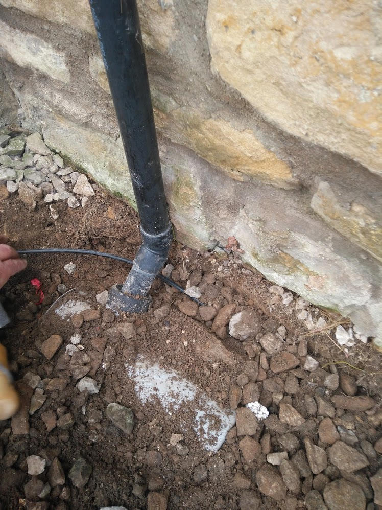
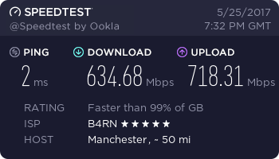

B4RN is a rural broadband project started in 2011. Through community funding, volunteers and hard work they have built an FTTP (Fibre To The Property) network in the North West of England.

BT, the UKs provider of copper phone lines, has always struggled to provide decent broadband to rural areas. With some farms being miles from the exchange they could barely get 1Mb/s and BT were only able to give excuses.

B4RN was set up to provide the missing service. Volunteers have been out with ploughs, spades and any other digging equipment required to run fibre ducting all over the Lune Valley. These ducts go from cabinets in the centre of each village out to the homes and businesses. Bigger ducts run from cabinet to cabinet and off to the internet backbone.

## Running the Duct

From the central point in the village, the duct for my house travels in a large group towards my nearest inspection pit. From here a 4 core duct comes into the shared area behind the houses. This duct then splits off into 4 individual ducts, one for each house. I’ve taken my duct along the wall a few inches under the drive around inlet pipes and through old cobbles. Near my front window, it travels up the wall and into a small box that covers the hole into my house.

The other 3 ducts are currently empty. Poking out of the ground near the other houses and neatly coiled up ready for if/when they choose to take up the connections.

Once I drilled through the wall and mounted the backplate over the hole it was time to blow the fibre. At this point, all I have is an empty duct running from inside my living room to the village hall. Connecting into a join outside my house B4RN blew a fibre strand into the ducting heading at a few miles per hour towards the village hall. Unfortunately in the year or so since the duct was laid to the properly line a bit of water had got in it which needed removing before we could continue.

Once the fibre was blown all the way it gets spliced to a factory terminated cable. This process is very quick. With that, I then have a backplate on the wall with a fibre connection protruding out of it.

The router then slots up onto this backplate connecting into the fibre connection and sealing it off.

[[fullWidthImage]]
| 

So what does all this give me in the end?

1Gb/s Down, 1Gb/S Up.

For my house, for 11 devices, a connection that most businesses dream of having.

You might be thinking the cost of this is really high, but it’s not. £30 a month with no limits on usage (there is a fair use policy, but no one I know has run into it).

## Using 1Gb/S

I’ve had the pleasure of using 1Gb/S internet at some of the schools in the B4RN area as well as houses including my own and I have to say 1Gb/S is insanely fast but you don’t notice it all the time.

With the big push towards the mobile web, websites have made themselves as efficient as possible, this means that the actual transmission time for the data was already pretty low so for normal web browsing, 1Gb/S doesn’t appear to make a large difference.

Streaming hits limits at the supplier’s end. Take BBC iPlayer, you can only pull content from them at 300Mb/S which is just slow.

Downloads are where it shines. Steam seems to be capable of sending content at close to 1Gb/S which means an AAA game at 50GB+ is now only a 5-10 minute download (same maths puts 70Mb/S FTTC at an hour and a half).

The other barrier to usage is WiFi. The routers built in Wifi Is pretty good when you have line-of-sight but once you put a wall in the way it is rather poor. I had an old Unifi AP (2.4GHz only) that I’ve setup instead which gives the range and wall penetration that I need but only gives around 80Mb/s. Not a massive improvement but that’s only down to my AP and the cards in my devices.

There are only 4 devices in the house that get 1GB/S all the time. My PC, the home server, the Xbox One, and the Tado Bridge. I do have network cables around for laptops when at a desk but we have problems with gigabit network cards being on shared buses on the motherboard which slows them down.

So if I am not able to use all 1Gb/S what’s the point?

 - I never have to deal with Openreach again. Never. My phone line is dead never to be used by me again.
 - When 16K content becomes the norm and I need 250Mb/S to stream it I won’t have to wait for BT to notice that England has a North and actually upgrade the exchanges.
 - I don’t have to wait 2 weeks for Openreach to actually do a job.
 - Although each device may not be able to use 1Gb/S itself I can be streaming at 300Mb/S on the Xbox, streaming music on a phone (3Mb/S), and downloading a game at 697Mb/S at the same time.
 - When I have a fault I won’t have to wait for Openreach to pick up the ticket, I can call/email/walk up the road to the B4RN office and get it sorted ASAP.
 - I can host things! This blog is hosted on a server on a B4RN connection. OwnCloud? SubSonic? Game Servers? All hostable in my house with a connection that won’t notice.
 - When Openreach install my neighbour’s internet and break my phone line, I won’t have to wait 2 weeks to get the internet again. (Not me personally but someone I know).
 - I can backup my home server to my parents home server at LAN speeds.
 - When the next tenant moves into my house they will call B4RN and get the Internet the same day (if not hour). I had to wait nearly 3 weeks for Openreach to come and enable FTTC on my line. This in an area with no mobile internet.

## Phones

You might have noticed that B4RNs connection is entirely an internet connection. This means that to use a traditional landline phone you have 2 options.

 1. Keep paying BT line rental for your copper phone line.
 1. Get a VOIP system.

I went for option 2 as have most B4RN customers I know. Vonage for £8.50 a month provide a pretty good deal that has all the fancy extras like caller line ID, call waiting, and call blocking.

## In Summary

B4RN is amazing. The future of rural internet in the UK seems better than the cities. Now that this fibre network exists it can be upgraded easily without the need to replace the cables. I have heard from B4RN staff that they tested a 10Gb/S connection with no issues.

B4RN is a community project, the way they are funded and operate means that they can never be brought by another company. Which alleviates the concern of BT buying them, adding a couple of 0s to the price and killing it off so we have to go back to paying them for copper.

Its taken a few years to get to this this point and I read loads of articles from BT fans (yes they do exist) saying that there was no way this would work but it’s here and getting bigger all the time. Other B4RN like projects popping up all over the country now with B4RN providing the knowledge and expertise to help them get going.

BT have good reason to be concerned. It’s no accident that they rushed the FTTC upgrade in the B4RN area and I have no doubt why I got offered 70Mb/S VDSL for £35 including line rental if I took out a 2-year contract. Their problem is that not only is their service a lot slower they have a reputation for the worst customer experience possible. I often describe them as a beacon of inefficiency and they frequently appear to only improve service because OFCOM (the regulator) tell them to.

For now, I’m not getting the full speed as I’m using cables I terminated myself inside the house and it appears that 1Gb/S network cards have been lying, hiding behind slower HDD speeds and upstream connections. I remember running my first speed test (below) and being disappointed. Only 634Mb/S download? That’s only 63.4% of my total. 634Mb/S is still an insane speed to get in your house, and of course, this means my Xbox plugged directly into the B4RN router can use 400Mb/S without my computer noticing.

For more info head over to the [B4RN Website](https://b4rn.org.uk). We have been working with B4RN in some of the schools we support more on that [here](https://www.ed-itsolutions.com/connecting-b4rn-schools-b4rn-box).
