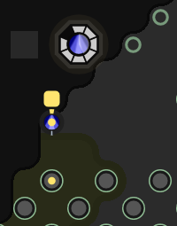

This is part 12 of my Screeps story, you can read the whole story [here](/articles/screeps).

  > Like the last time I re-wrote my AI this post has become rather long. It is well worth a read as I think I had some pretty good ideas for AI improvements.

## Disaster

So it has been a while since I seriously played Screeps. I’ve done a lot since then, moving house etc… which has stopped me playing. The one time I did dip into screeps I asked my AI to take a 4th room which has not gone well.

My AI was trying to get to RC3 and stay there and it just couldn’t. The depression hit again killing off my rooms and my AI hit the 100 construction sites limit. With roads decaying because the tower was out of energy my AI was dropping more road sites. It was adding them faster than I could remove them and I just gave up.
A New Improved AI

I had lots of ideas for this new AI. The old creep director is pretty good and I re-used a large part of it. My focus with the new AI is too abstract the job queue away from the creeps and instead build a list of jobs that creeps then get assigned to. Once a creep has a job the old creep director will resurface running much as it did before.

Roads are now built to meet my orders, not just because a creep stood on an empty tile.

## Webpack

I’m going to make use of an NPM package that I created quite a while ago called SODB. Single Object DataBase gives an ORM-like interface to an array of objects.

lodash provides some features like this but SODB can:

  - cache (in memory) its searches.
    - Will reduce the load on subsequent searches in the same loop saving CPU.
  - search syntax
    - Moves the focus to find data instead of coding a loop to search myself every time I want some information.
  - serialize to JSON.
    - Can store the JSON in screeps Memory.
    - Can restore the JSON from screeps memory saving the need to re-query the whole game.

To get SODB into screeps I need to use Webpack to build a single JS file with all my dependencies in. This highlighted an issue with SODB’s dependancy object-hash. It requires the built in node module crypto. This module is not bundled by webpack when using the node target and Screeps doesn’t give access to it. To cut a long story short SODB has been updated to make it Screeps safe with no loss of functionality.

## How does the new AI work?

Now I have everything I need to make the AI work its time to write it.

### Game State

The new AI performs a lot of serialization. To decide when to use the serialized data and when to build it all a new I decided to create a hash of the game state.

To create the hash of the game state I create an object that looks like this:

```js
// Get the total of all rcls added together (for state change on RCL up)
var rclTotal = 0
_.forEach(Game.rooms, function(room){
  if(room.controller){
    if(room.controller.my){
      rclTotal += room.controller.level
    }
  }
})
// Use a hash to check if anything in the game has changed
var hashCheck = {
  codeRevision: 1, // Increment before deploy to force a new game state
  rooms: Object.keys(Game.rooms).length,
  creeps: Object.keys(Game.creeps).length,
  spawns: Object.keys(Game.spawns).length,
  structures: Object.keys(Game.structures).length,
  sites: Object.keys(Game.constructionSites).length,
  rclTotal: rclTotal
}

var newHash = Utils.hash(hashCheck)

if(Memory.stateCheck != newHash){
  // Game state has changed!
  Memory.stateCheck = newHash
}else{
  // Game state is the same
}
```

With this whenever, a new creep, site, or building is created or a room levels up the hash will change. This is more robust than the old way of setting a flag in memory that rebuilt one part of the data. Now any change in any room causes a complete rebuild meaning that nothing gets missed.

### Flags

The old AI needed me to make a code change to give it instructions for other rooms. Claiming a new room was a case of adding its name to hash along with a room to claim it from. I was never a fan of this. It caused issues after a respawn where the AI was still pointed at rooms miles away and after it completed a task I need to change the code again so it didn’t send a new claimer.

Flags give me a way to direct my creeps without using my code. My AI can create its own flags and clear mine when it completes the job if it needs to.

Now when I want to claim a room I simply drop a flag on its controller and my AI will do what needs to be done. Same with mining other rooms and any other special tasks.

I decided to come up with a colour coding system to dictate what a given flag does.

|Primary Colour|Secondary Colour|Action|
|--------------|----------------|------|
|Orange|Orange|Build a road from spawn to this flag|
| |Any Other Colour|Build a road from this flag to the matching flag. (Not implemented yet)|
|Purple|Purple|Reserve the controller under the flag|
| |Red|Claim the controller under the flag|
|Yellow|N/A|Mine this source from another room. (Not implemented yet)|
|Green|N/A|Build this site using a creep from another room. The AI is left to make the decision of how best to achieve this.|

With this system, I can give instructions quickly without having to leave the games UI.

### Room Visualisations

This feature actually came out whilst I was writing this new AI. It exposes a canvas that only you can see over every room letting you provide more detailed information anywhere you want.

The quickest use is to add some extra options to creep.moveTo() that lets you see the path a creep intends to take. With some colour coding, this can give a very easy way to see what creeps are doing and where.
Deploying the New AI

This was a hard decision to make. On the one hand I have 3 level 7 rooms and a 4th that should start working with the new AI. The problem with simply swapping branch is that some creeps already exist and there are a tonne of roads everywhere.

I could hit the respawn button, take my new AI into a single room by itself and begin expanding from there.

Before I could make a decision I was attacked by another player with my DEFCON system jumping in at the last second to save the day. I had 1 creep, in 1 room and 3 rooms slowly decaying into nothing.

My AI was not completely ready at this point but it was better than what I was running before.



I had to manually patch the memory of the only creep alive so that it would start harvesting. This creep supplied enough energy to get another harvester out and that was the beginning of a very long journey.

I had to quickly add the green flag system so I could build spawns in my other rooms. Once those spawns came up they ran pretty well, all be it a bit slow, to begin with.

This new AI focuses on getting the Energy infrastructure working first without roads or towers. Once I can I build a tower and everything can start working as it should.

I actually lost one of my rooms in this process but the new AI was able to re-claim it pretty quickly.

So here we are, watching level 7 rooms use 5 part creeps and it’s painful. I know what these rooms can do at full whack and it’s hard seeing them trying to get basic functions working.

I’m going to be doing more work on my AI shortly and hopefully, there won’t be such a long wait for part 13.

## Get Screeps

You can follow my progress on [my profile](https://screeps.com/a/#!/profile/Arcath). Once I reach RC4 I’m not sure how I am going to progress yet.

You can read more about Screeps on their [site](https://screeps.com/). I purchased it through steam giving me the permanent 10 CPU and the desktop client.

You can see my code as it was at the end of this post [here](https://github.com/Arcath/screeps-code/tree/a7ff7fff79207df88ae8d34a0cdc7291c52bfbb7).
