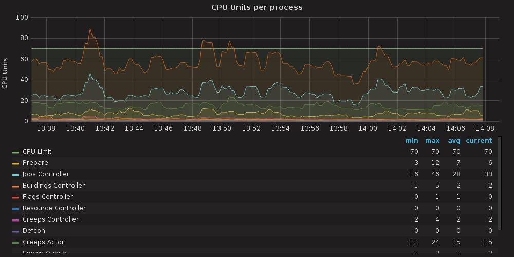
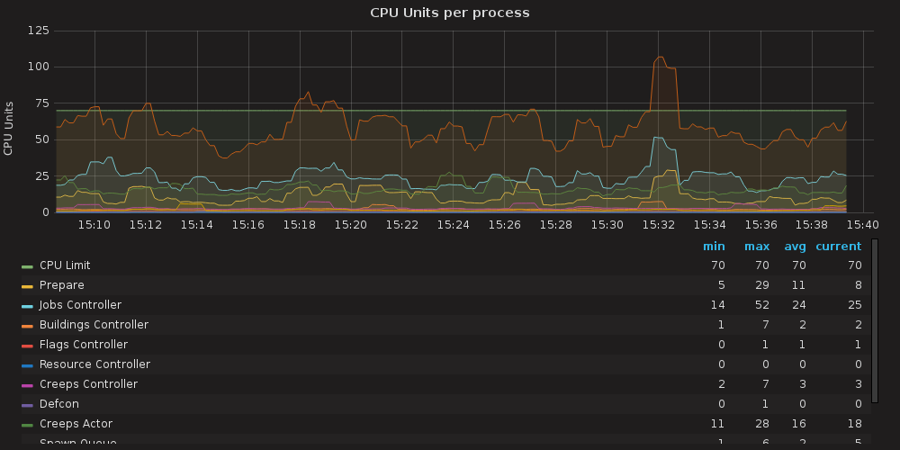

This is part 13 of my Screeps story, you can read the whole story [here](/articles/screeps).

## Building Up

The new AI from [part 12](/2017/06/screeps-part-12-start-again/) was not as complete when it was called into service. It wasn’t important at the time, my rooms were all dead and I only needed it to gather energy and build new creeps.

It took a bit of work getting the room claiming system to work. `Game.rooms` only contains rooms you control or have creeps in so I can’t just get the controller of the room the flag is in. I need to move to the target room and then aim for the controller. To get this working I get my creeps to move to the flags `RoomPosition` and then claim the rooms controller once they are `nearTo` the `RoomPosition`.

The new AI makes adding new jobs a lot easier. Adding extractors back in took a small amount of work (see [commit](https://github.com/Arcath/screeps-code/commit/2970300a5dbc96d20568a251465ce9637f03b4e3)).

I had quite a few issues with me not having healer creeps. Once you hit RC3 in a room you can drop a tower which can heal everything very quickly, my AI relies on towers to heal. Of the 2 rooms, I claimed 1 has gone really well, getting to RC3 before anything died and building up very nicely. The other has been a constant pain. The sources are so far apart that it takes a lot longer to get energy where it’s needed. When it did reach RC3 both of my _source containers_ died before the tower got built which threw a huge spanner in the works and added a few hours to wait for that room to be self-sufficient.

## More Flags

My new AI is directed by flags. If I want it to break from its norm and do another job I drop a flag of a certain colour and the AI handles it.

To get back to full functionality I need to add some flags for harvesting other rooms. Again with the jobs system, this was pretty easy. The existence of the flag adds a job to the queue that essentially a harvest job with another rooms storage as its destination.
Grafana

I’ve seen a few screenshots on the Screeps Slack group of Grafana dashboards for a players Empire which I looked at enviously.

I have an [HP microserver](http://amzn.to/2tnLEjB) at home which handles the docker setup from [screeps-grafana](https://github.com/screepers/screeps-grafana) pretty well. In a nutshell, 1 program uses the screeps API to move Memory.stats in statsd which uses Graphite to store data. Grafana then reads data from Graphite and produces graphs and another analysis tools.

It has quickly become a huge part of how I play Screeps. I have the grafana dashboard open most of the time so I can see how everything is going without opening the whole game.

The graphing and estimation lets me see how improvements to my code are doing. For example, I added links to improve the energy transfer speed in my rooms and saw my time to upgrade nearly half.

## Improving my CPU Usage

My CPU usage is pretty high. Knowing that some players I’ve spoken to on Slack run empires bigger than mine on the free 10 CPU you get from buying on Steam my CPU usage is rather high.

The first gain I made was to abuse how Screeps runs players code. Your code runs on one of four nodes. These nodes preserve the global object between runs which means anything you put in there can be used again next tick without deserializing it or processing it. Your code moves from node to node between ticks so you can’t just start using global.memory instead and leave it at that but with a little check to see if this is the same node as the previous tick you can make some savings.

```js
if(global.lastTick && global.LastMemory && Game.time === (global.lastTick + 1)){
  delete global.Memory
  global.Memory = global.LastMemory
  RawMemory._parsed = global.LastMemory
}else{
  Memory;
  global.LastMemory = RawMemory._parsed
}
global.lastTick = Game.time
```

This is the code I added at the top of my loop to make use of this.

I added some profiling to my code to monitor how much each process is using. From here I can see where my code needs improving and watch my improvements go to work.



Straight away I can see that my highest CPU user is the jobs controller (light blue). So much so that the overall CPU usage (orange) almost matches it higher up.

A quick read through of my code showed me that for every building that might receive energy I was creating a job, hashing it, and then looking for that hash in the database. Hashing the job is not a quick process hence the high usage. So seeing as memory is bit faster now I decided to put premade jobs with hashes into an object keyed on the building id. Now when creating an energy job I first check if the premade job exists.

This cache brought the job controller usage down to the level of the other processes, but the increase in memory size has increased the time spent on prepare (yellow).

Looking a the graph now I need a more general increase in performance, but overall I don’t go over my limit much anymore.



There is more to do getting my CPU down but for now, it’s low enough that I should be able to take a 6th room next week when my GCL goes up.

## Thanks for the Help!

A lot of the work for Grafana and my memory improvements came from users on the [Slack group](https://screeps.slack.com/). I forgot to add your names to my notes so I’m sorry I can’t shout you out indavidually.

## Get Screeps

You can follow my progress on [my profile](https://screeps.com/a/#!/profile/Arcath). Once I reach RC4 I’m not sure how I am going to progress yet.

You can read more about Screeps on their [site](https://screeps.com/). I purchased it through steam giving me the permanent 10 CPU and the desktop client.

You can see my code as it was at the end of this post [here](https://github.com/Arcath/screeps-code/tree/c24b0a0d42b733f4e66a6e4678b51aa0a2b85e1d).
