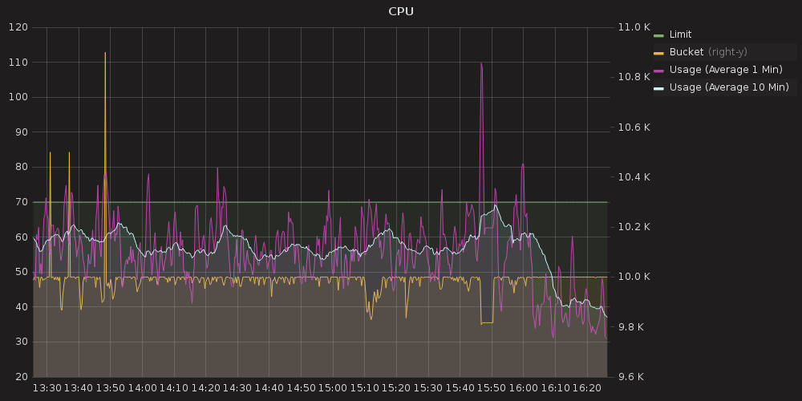

This is part 14 of my Screeps story, you can read the whole story [here](/articles/screeps).

## Remote Mining

I wanted to get to grips with remote mining. At the moment I just send the creeps and they have no roads etc… I want to change that so I can speed them up with roads and get an idea of the profit from each remote room.

I suspected for one of my remote rooms that it was actually costing me energy to mine it. Meaning that the total income from the room was less than the cost of the creep sent to mine it. So to start off let’s calculate revenue. I create a new stats key for each room I mine and set it to 0. I deduct the cost of the creep from that number once per creep and then add the energy it delivers. This is then graphed in Grafana so I can monitor it.

This number will hopefully keep going up and make the graph a bit useless but I’m in early testing so it’s useful to me now.

I updated the remote mining code to build roads it is standing on and repair roads it is standing on. This should mean that a remote room’s energy is used to maintain the roads in that room.

I added a check using my stats to double up mining creeps if a room is doing well. A single creep won’t be depleting the source so by doubling up I should be able to get some real energy gains from the room.

## Lowering CPU Usage

Now that I am doing remote mining my CPU usage is back up pretty high which needs fixing before I do more. So it’s back to my profiling graph which is showing 3 big users of CPU

  - Prepare
  - JobsController
  - CreepsActor

Prepare is so high because of the Memory parsing and I felt I needed to split _Preparing my object_ from _parsing memory_ so I’ve added another entry to the profiler.

After doing that prepare seems to only spike when a new game state occurs which isn’t too bad. Memory parsing is consistently in the middle ground now. There are a couple of things I can do to improve the way Memory works but for now, I am turning my attention to the other two.

## JobsController

The jobs controller has 2 functions that get run every tick. energyJobs and extractorJobs. I suspect the improvements need to be made in energyJobs as there are a lot more energy users to check than extractors.

Lets look at what this function does.

  - For each of my rooms:
    - For each spawn in the room create or remove an energy job
    - For each extension in the room create or remove an energy job
    - For each general use container in the room create or remove an energy job
    - For each tower in the room create or remove an energy job
    - If the room’s storage has 300K energy, create a job to share it.

The main drain here is that for each job needing entity I have to:

  1. If a premade job exists (see the last post)
    1. Use it
  1. If not create a job object and hash it
  1. Search the jobs database for the job
  1. If energy is less than capacity
    1. If the jobs database does not this job
      1. add the job
  1. If energy is at capacity
    1. If the jobs database has the job
      1. remove the job

The jobs database is an instance of SODB my database in an object module. It does cache searches but the cache is invalidated every time a record is added or removed which in this controller means that the cache may never be valid.

Going with the assumption that it has to be the lookup of the job which is causing the high CPU usage I decided the best solution would be to add an index to the database. SODB 1.2.5 supports the index option which is the name of the field to index. This creates an object with the index fields value as the key and the object id as the value. Changing my jobs.findOne calls to jobs.indexLookup has had a pretty significant impact.

The jobs controller is now down with the majority of processes. Memory parsing and the creeps actor are now the highest users which I’m happy to live with.

## Respawn

I got attacked hard. My AI doesn’t have the code for fighting a war. In a bit of Deja Vu, my problem was that I kept pumping remote miners and claimers into a room only to have them destroyed. Thi was repeated until I was running out of energy in the spawn room.

I decided to respawn instead of fight.

This has delayed my arrival at GCL6 but that’s, not a problem. I have 4 unused rooms at the moment so I won’t be needing it anytime soon. My plan this time is to be a bit more aggressive and remote mine a lot more.

I’ve tweaked my code a fair bit for its lower level room jobs. I have to do this every time as I write code for my high-level rooms with all the top tier buildings and then it causes issues in rooms that don’t have any of that stuff.

## Get Screeps

You can follow my progress on [my profile](https://screeps.com/a/#!/profile/Arcath). Once I reach RC4 I’m not sure how I am going to progress yet.

You can read more about Screeps on their [site](https://screeps.com/). I purchased it through steam giving me the permanent 10 CPU and the desktop client.

You can see my code as it was at the end of this post [here](https://github.com/Arcath/screeps-code/tree/5b10ddff314d1f3c751bf3766a71c5464567ad2f).
