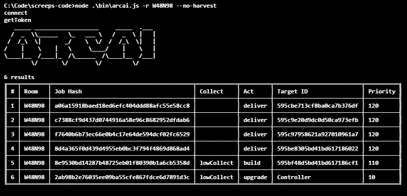
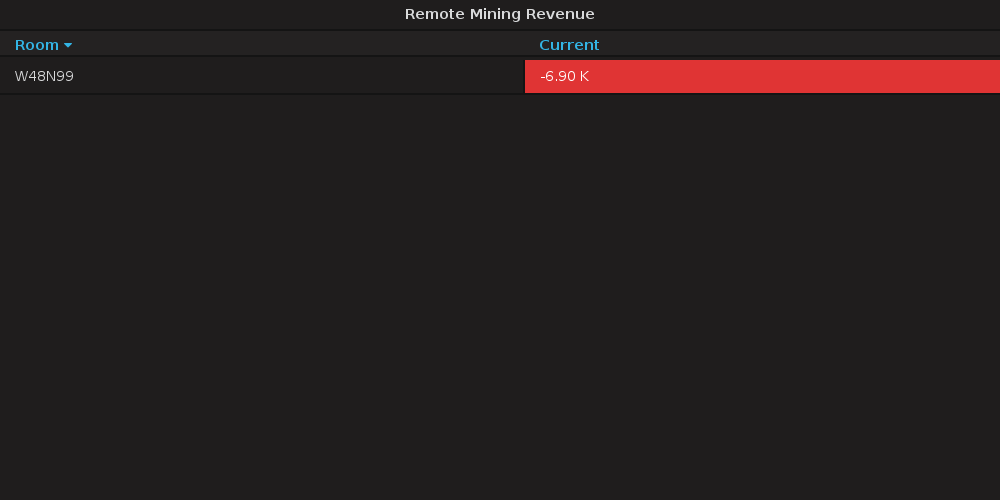

This is part 15 of my Screeps story, you can read the whole story [here](/articles/screeps).

## W48N98

My new room is pretty run of the mill but it does have a fair few rooms around it that can be mined or claimed. As I said at the end of the last post I don’t intend on rushing up to my room limit favouring remote mining to get my creeps up.

Firstly I need to get this room up and running properly. It is in a free safe mode for now and I need it to get to RCL3 with a tower before that runs out otherwise it has no chance of surviving an attack. The previous owner has left some very nice walls around which I will keep for now.

The journey to RCL3 was painful. Watching my harvesters scramble to build extensions, upgrade the controller, and keep spawn and the extensions full of energy highlighted exactly why I use specialised creeps for each job. I built one of the source containers and a general use container to speed up upgrading.

I had a typo in my code that unfortunately meant that around 3 am one morning my AI stopped working. Completely. The error was in job list creation which meant that the creeps actor was not getting run.

It did give me a chance to test my emergency spawning code. When a room has 0 creeps, well 0 harvesters, my AI will spawn the best harvester it can afford instead of a full cost one. It will then spawn a hauler if needed under the same rules. If you have less than 300 energy in spawn & extensions you will get 1 energy per tick until you reach 300. This means that it should be possible to recover any room as long as you have a spawn.

It took around an hour to get back to full capacity and resume the slow trudge to RCL3. I’m out of safe mode at this point so it is a little risky. An attacker could end my journey right now.

I built a second general use container for my upgraders so they could resupply without moving. Once I hit RC4 I will replace the original with a storage.

## RCL3

RCL3 is special. It’s the level where towers come into play and my room can settle into its functions properly. It’s when I have enough spawn energy to claim and harvest other rooms.

As soon as I get to RCL3 I build the tower. Once it’s up and doing all my repairing for me I start building the second source container and the 5 new extensions.

Once all that was built It was time to look at other rooms. I claimed W48N96 and began building a spawn. I sent reservers into W48N99 followed by a remote miner. I updated the code for revenue calculation to include the cost of the reservation creeps.

The revenue is pretty poor at the moment. Once I reach RC4 the remote mining creeps should be faster and actually turn a profit. The creep has a long walk to containers which won’t be helping. Once I reach RCL5 it can drop off into a link by the exit which will make it even faster.

## RCL4 and 3 more rooms

RCL4 didn’t have the impact on remote mining that I wanted. The creeps simply have too far to walk to make it cost effective. I added a system to spawn a hauler with a work part that could move energy from a remote container to the room doing the mining whilst repairing the roads etc… and it works pretty well. I now just about break even on the mining. RCL5 is where my hopes lie now, links should remove enough walking to turn a profit.

With RC4 I have the energy to spend on claimers and support creeps to get other rooms off the ground. I have mentioned before that a claiming a new room does not give you a free spawn. You have to construct one taking 15K energy. This is where my green flags come in. A green flag tells the nearest room to send a creep to harvest a source and build the construction site. I normally only use them to get the spawn built but they can be used for anything.

My Grafana is showing me 2-3 days on all my timers (next RCL and GCL) which is great but does mean there’s not much I can do at the moment. The missing parts of my code are the high-level stuff like the market, boosting, and warfare.

Once I reach the higher levels I will be working on all that and hopefully build an empire that can hold its own in a war.

## Get Screeps

You can follow my progress on [my profile](https://screeps.com/a/#!/profile/Arcath). Once I reach RC4 I’m not sure how I am going to progress yet.

You can read more about Screeps on their [site](https://screeps.com/). I purchased it through steam giving me the permanent 10 CPU and the desktop client.

You can see my code as it was at the end of this post [here](https://github.com/Arcath/screeps-code/tree/ef92fd6a94111e9e8322ceb117c779c013d47e48).
