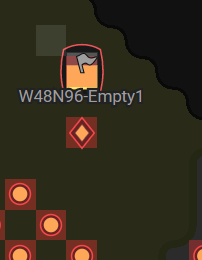
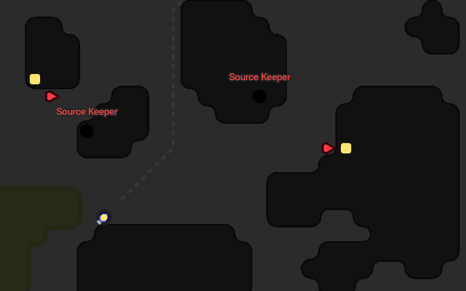
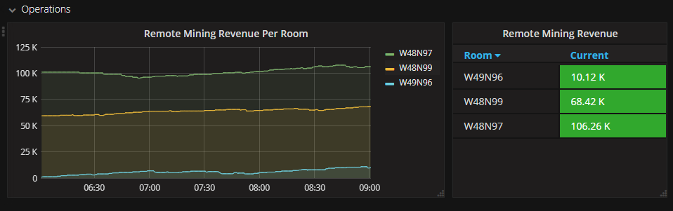
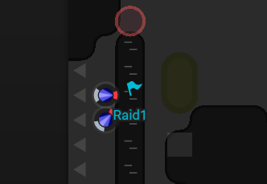
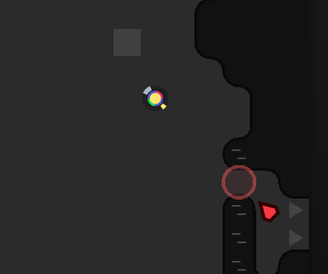
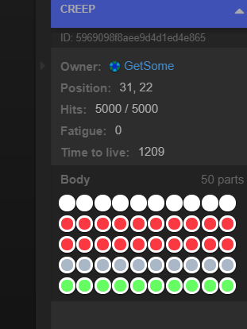

This is part 16 of my Screeps story, you can read the whole story [here](/articles/screeps).

## PathFinder.CostMatrix

To the south of my main rooms, there is a room with no spawn and a bunch of structures from a player who has not hit respawn after dying. This is great news for me.



I can withdraw from that storage and take the energy back to one of my rooms. The problem is that to do that I need to go through 2 source keeper rooms. Which when following the default path means my creeps get destroyed by the NPCs. I need to tell my creeps not to go anywhere near the source keepers but still pass through the room.

The way to do this is to create my own `CostMatrix` for the room. A cost matrix is how Screeps decides which path to take, aiming for the lowest cost path to the target. This is why a creep will go around a small swamp and through a big one.

I added an orange and white flag handler that will look for source keepers in a room and then creates a 5 tile _mega swamp_ around them.

```js
var sources = flag.room.find(FIND_SOURCES)
var minerals = flag.room.find(FIND_MINERALS)

var avoids = [].concat(sources, minerals)

_.forEach(avoids, function(avoid){
  var x = avoid.pos.x - 5
  var yStart = avoid.pos.y - 5

  while(x <= avoid.pos.x + 5){
    var y = yStart
    while(y <= avoid.pos.y + 5){
      matrix.set(x, y, 20)
      y += 1
    }
    x += 1
  }
})
```

This is double the cost of going through a swamp. This is so that creeps will go through a swamp to avoid a source keeper. I could have used 255 to make the area impassable but that might have resulted in rooms with no path through.



## Parties

Something I have only touched in the past is the idea of groups of creeps. Back in [part 6](/2016/11/screeps-part-6-poking-enemy/) I created a group of thugs that would go in and clear a source keeper, the code was not brilliant and they separated en route.

When I drop a white flag it acts as a rallying point for the party. The second colour of the flag maps to an array for that parties required creeps. Once all the creeps have made it to the rallying point they get changed into act mode heading to the flag named by the rally flag.

## Calling for Aid

I keep putting this job off. Twice now I’ve had major problems because one of my remote mined rooms gets attacked and I pump creeps into it to die and waste all my energy.

This needs fixing.

So step 1 is calling for aid from another room which with my AI is really easy. If a remote worker sees a hostile creep it drops a red flag (only if there isn’t one already). The defender code then springs into action and spawns a defender in the nearest spawn and sends it over.

Next step is to not spawn anything for that room whilst it has red flags in it. This should mean that a defender hurries along, kills the NPC invader and once it’s safe again the miners come back. Of course, this falls over when it’s another player’s hostile creeps that triggers the action. But sending defenders to fight them might save the day before my towers get involved.

## Remote Mining

I’ve been struggling to make my remote mining profitable, but I think I’ve finally cracked it.

The original miners will now look for a container at the source to drop off instead. If there is a container a hauler with a single work part is spawned which then moves energy back to the main room. If there is more than 1000 energy in the container a second hauler is spawned to drain the container faster.

Now that I have RCL5 in some of my rooms I’ve deployed links to speed up delivery even more.

The result is profit!



## Joining an Alliance

I’ve been caught in alliance wars before. I was attacked last time because of increasing pressure on the other side of the other player from an alliance.

So if you can’t beat them join them.

Spawn More Overlords are a mid-sized alliance with a few members in the northern area of the map. They are my closest alliance after this respawn and seem pretty friendly.


I’ve been very happy with Overlords. If your up in the northern area of the map look us up.

## Aggression

[user502](https://screeps.com/a/#!/profile/user502) has not taken to my new room very well. They sent a few creeps into my new room and attacked the walls (not the best target). My defenders repelled the first wave but they have a much shorter travel time to get into my room and after their forces built up a bit my DEFCON system triggered a safe mode.

They have become the test for my party system.

After rallying in my new room two of my creeps went through and attacked his wall.



They died shortly after, but its a start.

The flags still exist so my other rooms spawned 2 more creeps who will meet up and try again. They began repairing the wall which meant the second party met with a similar fate. A random NPC spawned and began helping out! The more energy they have to spend between my attacks the better.



On the third try, there was no wall to break through but they still died in transit. The energy I can see in the room is going down which means at some point his tower will run out of ammo. I would be better off trying to tank the tower with a self-healing creeps so I added the tank class.

## Under Attack

I was going to focus on clearing out user502 but that plan has changed.

Another player GetSome has been poking me through the portal in the centre of the area I’m based in. His attacks started out as an annoyance slowing my progress but he just stepped up his game.



This is going to be interesting to repel. On the outer edge of my alliance, I’m mostly alone in this fight with rooms well below GetSome’s level.

I’m going to leave the result of this fight to the next part.

## Get Screeps

You can follow my progress on [my profile](https://screeps.com/a/#!/profile/Arcath). Once I reach RC4 I’m not sure how I am going to progress yet.

You can read more about Screeps on their [site](https://screeps.com/). I purchased it through steam giving me the permanent 10 CPU and the desktop client.

You can see my code as it was at the end of this post [here](https://github.com/Arcath/screeps-code/tree/c885b670685bf99280649c78ba67668253b8bb02).
