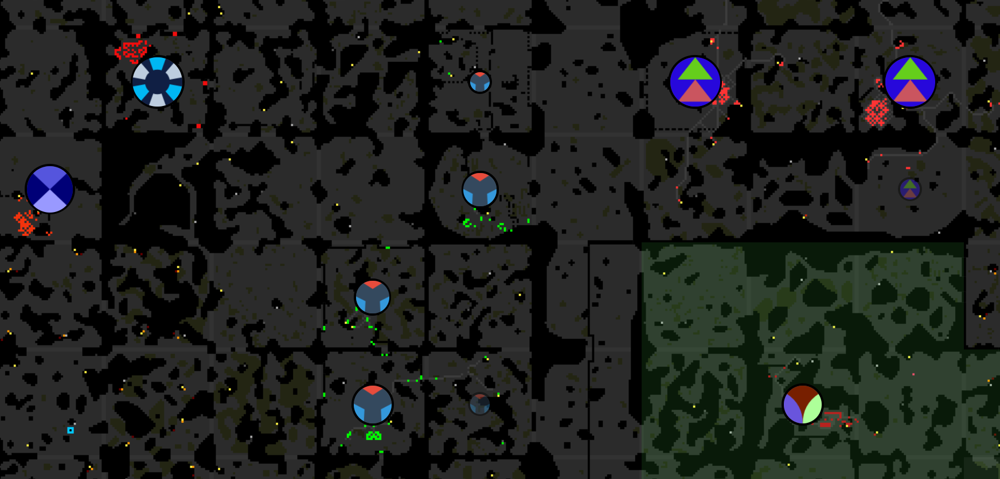

This is part 17 of my Screeps story, you can read the whole story [here](/articles/screeps).

## A Respawn

So yeah, fighting tier 3 boosted creeps did not go well. Once they downed a tower in my room that was it, a single tower could not out damage the healing of the creep and the room gets wiped.

My ramparts put up a good fight and in one of my rooms, I did defeat the invader. Of course, another one came along 10 minutes later and destroyed a tower and then the whole room.

The DEFCON system puts towers at the top of the energy supply list which after a prolonged engagement means that my spawning energy gets depleted with no refills.

I already had an active safe mode in the fifth room I had claimed which was stopping me from using another in my main room.

After being wiped in a couple of rooms I decided to respawn closer to the other Overlords. So I’m back building up my rooms again.

## New Badge

I’ve grown quite bored of my badge. It has been the same for a few months and it is a bit plain. So it’s time for a new fresher badge.

## Room Planning

Dissi has an awesome tool for creating room plans. These plans are a javascript object with all the buildings and their positions. I have a plan for each room at each control level which means that when a room levels up all the required construction sites get placed straight away and if a building gets destroyed it will be replaced automatically. With a little extra code the room planner will drop a green flag on the first spawn in a room which means that from me placing the purple flag to claim the room its completely automated.

I found getting the position for buildings right, editing the JSON to get things in the right place. Dissi was kind enough to put the source of the planner on GitHub which let me open a couple of [pull](https://github.com/ButAds/ScreepsBuildingPlanner/pull/1) [requests](https://github.com/ButAds/ScreepsBuildingPlanner/pull/2) with some new features. You can now see the coordinates of your cursor and the rooms terrain makes building plans a bit easier.

You can use the room planner over on [dissi’s screeps tools](http://screeps.dissi.me/buildingplanner/). Once you set the room name you will get that rooms terrain map loaded into the planner.

## Refactoring

My code has become a little messy. Utils contains helper functions that are not in use by all my code and for now, I’ve been updating code as and when I needed to. With this respawn things are little quite on the code front so it’s a perfect time to read through and update everything.

### Utils.moveCreep(creep, target, color)

I wrote this function so that I had 1 call to creep.moveTo which looked up my custom cost matrixes and could be modified later on with any other path finding improvements I wanted to make. It was pretty simple to go through the creeps actor looking for all moveTo calls and replace them.

### Utils.findHostileCreeps(unit)

This function does a hostile creep look up but excludes creeps from my alliance mates. This should allow their creeps to pass into my rooms without triggering the towers & defenders. This, of course, needs every hostile creep find to be replaced with calls to this function.

## Expansion

Being back at one room means pushing outwards, quickly, to regain the income I had before. This means claiming new rooms and remote mining the others.

I’ve done this a few times now, in fact, this AI has been through all this before. It’s just a case of sitting back and dropping a flag from time to time.

I’m now just waiting until a room hits RCL6. That’s when the development of new features of my AI can resume.

I’m now finally at GCL6! I was at 95% when I respawned the back in part 14 and towards the end of that empire I was only a day or so away from leveling up, then this respawn killed all progress. GCL7 is quite a while off although as I get more rooms upgrading faster it should become a closer goal.

## Wall & Rampart Repair

My towers burn a lot of my energy repairing my walls and ramparts. Most of the time they are repairing at the least efficient distance and ultimately wasting energy.

Ths solution is to limit the repair of wall/ramparts to a creep which will not waste energy doing the job and places building up walls and ramparts at the same point in the energy supply chain as building. I decided that 1 repairer per room is all I need, it should be able to plod along consistently repairing the defences.

Towers will repair walls and ramparts that are under 20k hit points just to ensure some level of protection in every room and they will repair ramparts that are 2000 above or below the target for the room. This saves me spawning a repairer every time a rampart decays.

## Get Screeps

You can follow my progress on [my profile](https://screeps.com/a/#!/profile/Arcath). Once I reach RC4 I’m not sure how I am going to progress yet.

You can read more about Screeps on their [site](https://screeps.com/). I purchased it through steam giving me the permanent 10 CPU and the desktop client.

You can see my code as it was at the end of this post [here](https://github.com/Arcath/screeps-code/tree/6c3edfa86f94fbb2ffa94b335c5564b777e00332).
