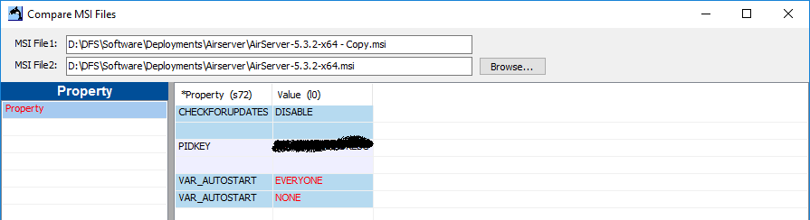
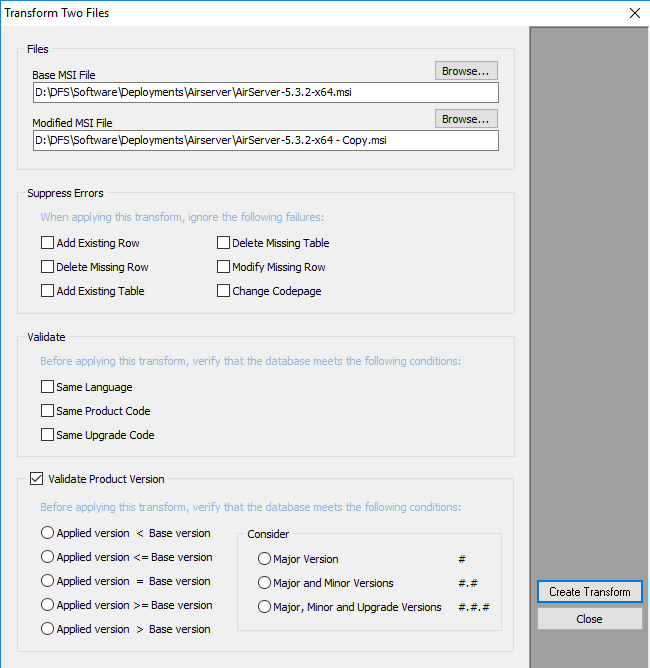
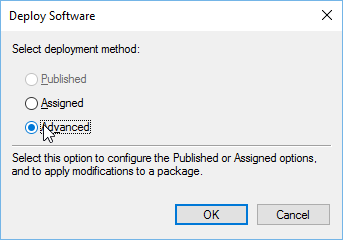

I quite frequently deploy software that needs config changes or options before it will work properly. MSI deployments can be given a transform file which modifies the options used when it is installed.

This can be very useful for adding in serial keys or changing the install folder etc… Most MSIs don’t come with a utility to create these transforms or even any documentation as to what options they support. It can be a bit hit and miss finding the options you need to change.

I have to create the transform for [AirServer](https://www.airserver.com/) that sets the product key and disables the auto updater.

## SuperOrca

Super Orca lets you edit the values in an MSI among other things. You can grab a copy of SuperOrca [here](http://www.pantaray.com/msi_super_orca.html). Once it’s installed it should appear in your start menu.

## Making your edits

> You must make a copy of your MSI to work on. SuperOrca write changes immediatley and will leave you with no un modified msi to compare to

For AirServer I need to make 3 edits

|Table|Property|Value| |
|-----|--------|-----|-|
|PROPERTY|PIDKEY|Your License Key|Sets the license key during install. If the machine can it will activate during install as well|
|PROPERTY|VAR_AUTOSTART|EVERYONE|Enables open on startup for all users|
|PROPERTY|CHECKFORUPDATES|DISABLE|Stops AirServer checking for updates. Useful if your users don’t have admin rights to the computer|

With those edits in place confirm that the MSIs are different using _Tools -> Compare MSI Files_.

Set MSI File 2 to the original MSI and you should get a list of differences.

## Creating the Transform

Go to _Tools -> Transform_ Two Files and you will get the transform generator.

Set the _Base MSI_ to the original MSI and _Modified MSI_ to your edited version.

Hit _Create Transform_ and save the MST in the same folder. Once it generates the MST it will pop up an OK box next to the MSI selector.

## Using your Transform

Now that you have your transform open up the Group Policy in which you want to deploy the MSI and go to software installations. Add the MSI to the deployment list making sure that you select **Advanced** for the deployment type.

Go to the **Modifications** tab and add your transform file. Once you’ve added your transform hit OK and your MSI will be added.

Restart the target computers and they will install your software with all the options you selected.
