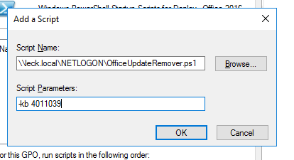

Over at [Ed-IT Solutions](https://www.ed-itsolutions.com/), we have been having a fun time with KB4011039, an Office update that can cause some pretty big problems for teachers. It makes the text inside merged table cells invisible and you can’t select the table cell at all. This is a huge pain for teachers whos planning is 90% merged table cells.

With Microsoft not releasing a fix until October 3rd we are forced to remove the defective update from the machines. If it was a normal Windows update wusa would be able to remove it rather easily but it can’t remove Office updates.

Removing an Office update involves finding the package ID for the given update and for the installed Office and then using msiexec to remove the given patch.

Obviously, before you try removing the update you need to unapprove it in WSUS or block it on the computers.

## Office Update Remover

Finding these ID’s is a pain and it can be different from machine to machine. To that end, I have written a small Powershell script to remove any Office update by KB number.

```powershell
#############################################################
#
# Office Update Remover
#
# By Adam Laycock (arcath.net)
# September 2017
#
#############################################################
Param(
    [Parameter(Mandatory=$True,Position=1)][string]$kb
)

$officePID = $False
$updatePID = $False

Get-ChildItem HKLM:\Software\WOW6432Node\Microsoft\Windows\CurrentVersion\Uninstall -rec -ea SilentlyContinue | foreach {
    $currentKey = Get-ItemProperty -Path $_.PsPath
    if($currentKey.DisplayName -like "*" + $kb + "*"){
        $parts = $currentKey.PSChildName.Split("_")
        $officePID = $parts[0]
        $updatePID = $parts[2]
    }
}

# If the patch was not in 64bit registry look in 32 bit
if($officePID -eq $False -and $updatePID -eq $False){
    Get-ChildItem HKLM:\Software\Microsoft\Windows\CurrentVersion\Uninstall -rec -ea SilentlyContinue | foreach {
        $currentKey = Get-ItemProperty -Path $_.PsPath
        if($currentKey.DisplayName -like "*" + $kb + "*"){
            $parts = $currentKey.PSChildName.Split("_")
            $officePID = $parts[0]
            $updatePID = $parts[2]
        }
    }
}

if($officePID -ne $False -and $updatePID -ne $False){
    $args = @(
        "/package"
        $officePID
        "/uninstall"
        $updatePID
        "/qn"
        "/quiet"
        "/norestart"
    )

    Write-Host "msiexec" $args

    Start-Process "msiexec.exe" -ArgumentList $args -Wait -NoNewWindow
}
```

As you can see its rather simple. It searches the uninstall registry keys for an entry containing the KB number specified in the script. If it finds the KB number it grabs the Office Package ID and the Updates patch ID and then runs the required MSI exec command to remove it.

It has a check the ensure that it found the update before trying to remove it which means it’s safe to leave this script running even after the machine is fixed.

## Deployment

Having the script is only half the battle. This needs deploying to every computer on the network. GPO startup scripts are fine for this script and being run as SYSTEM will let them uninstall the required update.

I already had an Office 2016 deployment GPO which applies to every computer in school with Office installed. In _Computer Configuration -> Policies -> Windows Settings -> Scripts (Startup/Shutdown)_ open up _Startup_ and click on the _PowerShell Scripts_ tab.

Add a new script pointed at _OfficeUpdateRemover.ps1_ and set its _arguments_ to `-kb NUMBER` e.g. `-kb 4011039`.



If there are any other updates in the future that have problems you can add the same script again with different arguments.

I hope this helps anyone having similar problems. Any questions let me know in the comments.
