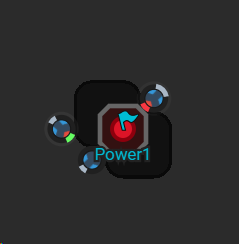

This is part 18 of my Screeps story, you can read the whole story [here](/articles/screeps).

## Typescript

I’ve been seeing a lot of good things said about Typescript on the Screeps slack. Typescript is a version of Javascript created by Microsoft that adds typing to Javascript. Bonzai has written an introduction to typescript over on Screeps World ([here](https://screepsworld.com/2017/07/typescreeps-getting-started-with-ts-in-screeps/)) which convinced me.

With typings in my code Typescript gives me warnings if I use a method or functions that don’t exist. If I try to perform logic that needs a number on a string I get a warning. This greatly reduces the errors that get pushed to screeps. I have a lot more confidence in my code now.

I had to create some types to get typescript working as well as I wanted. Take `Utils.inflate` I was manually typing the output so I wouldn’t get an error anymore which isn’t right. So I created a type for serialized lists per type of structure. With a few overloads on `Utils.inflate` I can now pass it a `SerializedContainers` array and get an array of `StructureContainer` returned.

I still have some areas where typing could be improved, anywhere I manually type the output of a function feels wrong and I’d love to get rid of it.

## Power

Power is going to be a pretty big part of screeps. For now, the only thing we can do with it is collect it. In fact, with no RCL8 rooms, I can collect it but not do anything with it at all. Once I hit RCL8 in one of my rooms I do want to be able to do get on the power wagon straight away so that means stock piling it.

Getting power isn’t easy. It only spawns in the corridor rooms that separate the player blocks. It spawns in power banks that have a lot of hit points and deal all damage back to the creeps that attack it. So to break one I need a healer to heal the attacker and an attacker that can kill it fast enough that it won’t despawn. Once it’s destroyed I need a creep on hand straight away to pick up the power and move it back to my room.

My early attempts have failed to break the power bank. I’m getting better but my main limit at the moment is the size of my creeps which will go up when I get to RCL7/8 in my main room.

## Terminals

Now I have RCL6 in more than one room I can make use of terminals to move energy and resources between them.

So far I’m focusing on using energy to help other RCL6 rooms. So if a rooms storage has more than 500K energy in it the terminal in the same room will be filled to 150k from storage. If a rooms storage has less than 300k its terminal will be sent up to 105k energy. If a terminal has more than 50k energy and storage has less than 300k a distributor is spawned to move energy from the terminal out into the room.

If a room _recovers_ and becomes self-profitable it should fill its storage (using energy from the terminal as well) and stop requesting energy.

If there is more than 10k of a mineral in storage it gets moved over to the terminal, once the terminal has more than 1k of the mineral it begins selling it to the market.

I’m getting quite excited for when my empire is mostly RCL8. Looking at my empire now I have 1 highly profitable RCL6 room which is sending energy to the others and propping up my empire. Once it reaches RCL8 it will be able to devote more energy to helping out and in turn get the other rooms to RCL8 faster. When I reach GCL7 and claim another room it should leap forward at RCL6 when there are a load of RCL8 that can send it energy.

## Shard1

Shards are the new big thing in Screeps. All player code is run for every tick which as you can imagine means a huge amount of processing every tick. On shard0 tick times were getting to nearly 5s per tick. With no way of improving the performance anymore, the developers have created shard1. An independent world which runs separately to shard0 with some portals between them.

Running your code on multiple shards isn’t possible at the moment. The only way onto shard1 is to respawn for now. I will go into more detail on running on multiple shards once I can get onto shard1 through the handy portal near me.

## Get Screeps

You can follow my progress on [my profile](https://screeps.com/a/#!/profile/Arcath). Once I reach RC4 I’m not sure how I am going to progress yet.

You can read more about Screeps on their [site](https://screeps.com/). I purchased it through steam giving me the permanent 10 CPU and the desktop client.

You can see my code as it was at the end of this post [here](https://github.com/Arcath/screeps-code/tree/1c2a4109076c632dbd88d36187f86d1fbf458e00).
