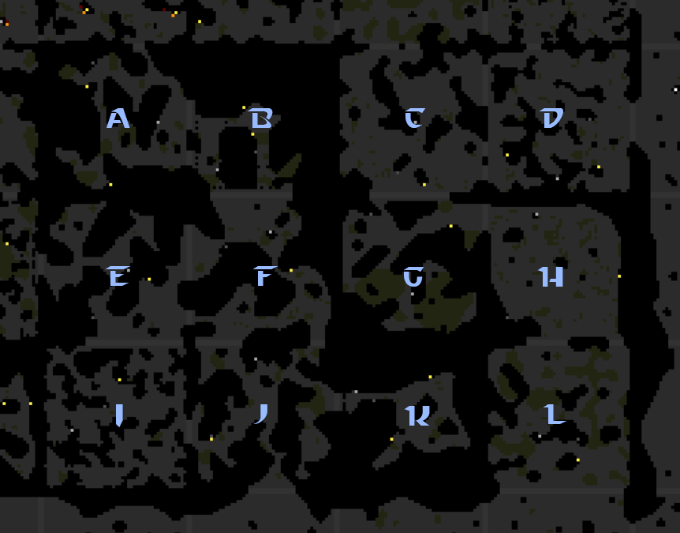
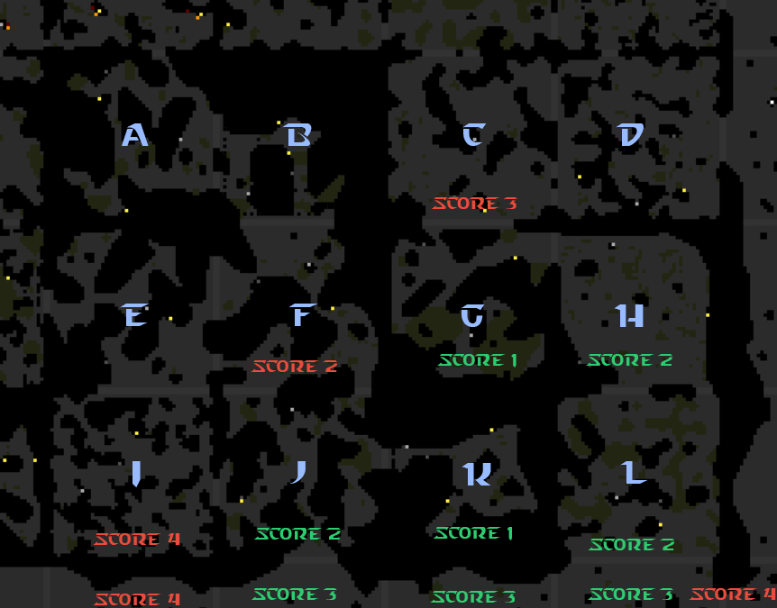
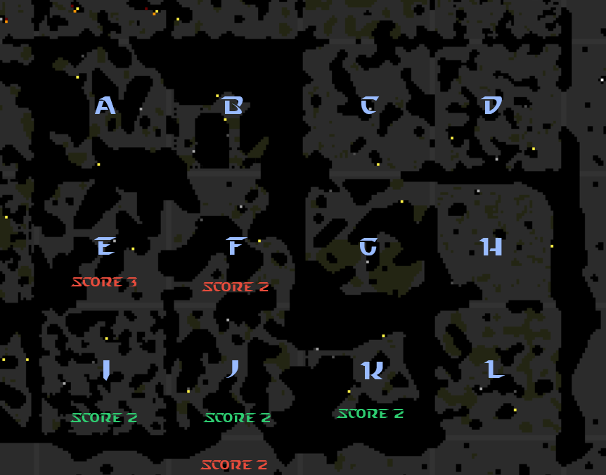

This is part 19 of my Screeps story, you can read the whole story [here](/articles/screeps).

## Building an OS

One of my big issues is CPU usage. My inbox has been flooded with notifications telling me that my bucket is empty or high CPU forced my script to end etc… which is not good.

I previously spent a lot of time improving my CPU usage and I’m not sure how my current AI can get any faster. The core of the issue is SODB. Search refinement isn’t done in a cacheable way and it only caches for the whole search not parts of it. I could make SODB do all that but it’s a fair bit of work that might not return a huge gain. This is made worse by my higher GCL. Having more rooms is adding more data to the databases which in turn is increasing the CPU cost of every action in the world.

So the solution is a re-write of my AI using another approach. Alongside the Typescript discussion from the last post I have been seeing high praise for Operating Systems for AI Structure.

## How does it work?

At the top of my main loop function, I create a new Kernel. The kernel has all my functions and objects for storing and altering the state of the os during this tick.

When creating a new Kernel the process table only has 1 entry which is the Init process. This process spawns sub processes for gathering room data and restores the process table from last tick.

The Init process has not yet been run. It is just sat alone in the process table. The next block of my main process is a while statement. While the Kernel can run a process it runs processes. The Kernel can run a process if the current CPU used this tick is below the limit and there is a process to be run.

This means that some processes might get skipped this tick if there was no CPU to run them. This isn’t a problem. The process will persist in the table until it can be run.

## Suspension

A big part of my CPU saving in my OS is process suspension.

In the old AI, a harvester creep would get this run every tick:

- Find the job
  - Is the creep empty?
      - Yes:
          - Can it harvest?
              - Yes: Harvest
              - No: is its fatigue 0?
                  - Yes: creep.moveTo()
                  - No: Do Nothing
      - No:
          - Did it transfer energy to a target?
              - Yes: Transfer
              - No: is its fatigue 0?
                  - Yes: creep.moveTo()
                  - No: Do Nothing

There is a CPU cost to all these comparisons and processing even if it results in do nothing.

My OS works like this:

- Creep is spawned. Start a harvester lifetime process for it
- Harvester LifeTime:
  - Is the creep empty:
      - Yes: Create a Harvest Process and suspend until it completes
      - No: Create a Deliver process and suspend until it completes
- Harvest Process
  - Is the creep full?
      - No: Is the creep near to the source:
          - Yes: Is the source empty?
              - Yes: Suspend for the TTR of the source
              - No: Harvest
          - No: Create a move process and suspend until it completes
      - Yes: Complete
- Move Process
  - Is the creep within the given range of the target
      - No: Is the creep’s fatigue 0?
          - Yes: moveTo()
          - No: Suspend for the number of ticks until it would be 0
      - Yes: Complete
- Delivery Process
  - Is the creep near to the target:
       - Yes:
          - Transfer Energy
          - Complete
       - No: Create a Move Process and suspend until it completes

It’s a lot more broken up than the old AI but spends a lot of time suspended. If a creep is moving to its target and it was going to take 10 ticks to reduce its fatigue to 0 the only CPU used by that creep is the init process checking if some processes have finished and its move process suspend being reduced by 1.

## Big Improvements

### Process per action not per creep

Processes are passed the creep name instead of the creep knowing which process controls it.

This means that I never loop through all the creeps. Saving the CPU that is normally used to see if this creep needs to do anything this tick.

### The Nearest Room Function

The old nearest room function was causing me some headaches. It simply sorted my rooms by their linear distance to the target room and picked the closest. It fell over when two rooms were adjacent but had no shared exit, the linear distance would be 1, but for a creep it would mean crossing 2 or more extra rooms to get there which would make another room the pathable closest.

Considering the map above if for example I controlled I and G and asked for the nearest room to K I would get the G as the result. Technically yes G is only 1 room away from K but the path is rather long. I is only 2 away from K in a pathable way.

I considered using the games path finder to path from each rooms controller and find the shortest path and call that the closest room. This, of course, requires sight in both rooms to get the controller. Other options involving the path finder might have worked but still, have pitfalls and involve a lot of computation.

Instead, I opted to implement my own A* pathing algorithm which uses `Game.map.describeExits` to get the rooms that can be entered from the current room.

Taking that example from before the Path from G to K looks like this:

We start in G which has a score of 1, 1 tile from the target and 0 tiles from the start. C gets a score of 3, 2 from the target and 1 from the start. H gets a score of 2, 1 from the target and 1 from the start. So the path finder moves the current room to H. It then scores L the only exit from H at 2. L has a score lower than C so the path continues that way. Once we pass into the corridor the score ties with C which would mean C might be used again but once the path gets pushed out that way the scores will be higher again and it will return to this path. Following this through you get  a path 8 rooms long.

Let’s run the same thing for I.

The score for I is 2, 2 from the target, 0 from the start. E and J get scored with E getting 3 (2 from the target, 1 from start) and J getting 2 (1 from the target, 1 from start). We move to J which wouldn’t actually do any scoring because the target K is the available rooms list which stops it trying to path along F for an extra iteration.

All this means I get a path 3 rooms long. 5 shorter than the path from G making I the nearest room. This is computationally heavier than the old system but it’s worth it to get creeps that actually arrive at the target.

## Never Idle

Another issue with the old AI was how often creeps would sit idle waiting for something to happen.

Take the distributors. They would arrive at the source container and take some energy from it. If that didn’t fill the creep it would wait until the harvester had put more in the container. The new AI sends the creep off to deliver as soon as it has some energy in it. This will mean that not only do I save CPU by not checking every tick if the creep is full, I also get energy moving as fast as possible.

The harvesters will become deliverers or upgraders if the source container is full or missing which should again mean I’m not wasting CPU on doing nothing.

## Bunkers

Bunkers are a different way of defending the room. Instead of building walls and keeping the attackers at the exits we let them in and kill them at the bunkers ramparts instead. This puts the attackers in range of all the rooms towers and protects everything important behind the ramparts.

It’s a new way of running a room. All energy is linked into the bunker and moved around inside by mover creeps. When under attack the harvesters won’t spawn and instead the bunker will request energy from its terminal.

There is a lot more to be said about bunkers which will be the subject of the next post.

## Get Screeps

You can follow my progress on [my profile](https://screeps.com/a/#!/profile/Arcath). Once I reach RC4 I’m not sure how I am going to progress yet.

You can read more about Screeps on their [site](https://screeps.com/). I purchased it through steam giving me the permanent 10 CPU and the desktop client.

You can see my code as it was at the end of this post [here](https://github.com/Arcath/screeps-code/tree/2933898a36f3ed06486965f9afe234dabc05d160).
