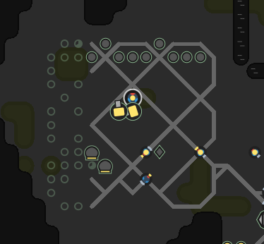
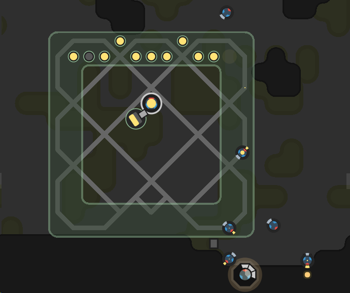
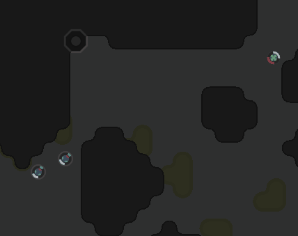

This is part 20 of my Screeps story, you can read the whole story [here](/articles/screeps).

## Moving to Bunkers

The first big hurdle with using bunkers is that my rooms already have layouts. I can’t just place the bunker flag and build it as the extensions/spawns/labs/storage and terminal already exist. In fact, in some rooms, they are in the way of where I want the bunker to spawn.

I started my first bunker in W51N77. It had the room to build it and wasn’t a full RCL7 room in terms of buildings.

Getting the bunker up and running was a case of letting it build up completely and then destroying a structure that should be in it. The bunker would then drop the site for the missing building and begin building it again.

As you can imagine with the tick rate on shard0 this took a long time.

I can’t transfer rooms to it until they reach RCL7 and can build a second spawn in the bunker before I destroy the old one. I let W51N77 get most way to being complete before I started in the other rooms.

The other rooms offered the challenge of creating the bunker over the existing objects. The process was much the same, place the bunker and let it build up then remove structures that are in the wrong place or outside the bunker.

## Moving Storage

Storage is going to be the hardest thing to move. The energy to do most of my moving comes from it. My AI has so much that only runs if storage exists so moving it is going to cause issues.

Firstly I need to empty it. But where to? The terminal is the only structure that can contain any great amount of resources but reminds me that I’m still thinking on a room by room basis.

So let’s think about this as an empire, not a room. That energy can go through a terminal to another room that has storage. All of it. I did sacrifice the stored energy in the first storage so that the first bunker would be up and running to receive the energy from the room that was undergoing the move.

Again it is time to think empire not room. There is no need to return that energy to its original room after storage is built. The idea is that the AI will notice a lack of energy in one room and will move some over but it need not be all of it.

## That was the plan

My AI done goofed.

It done goofed good.

The strain of moving to bunkers highlighted an issue with harvester spawning and things got worse from there.

I decided to take the rather radical approach of respawning to shard1.

The desire to build the bunker really hurt my low RCL performance. Roads and ramparts were taking valuable upgrade energy and generally getting in the way.

I then respawned again. This bad start plus the attacked by Riza was really hurting me and my code improvements weren’t helping the first room.

All the optimisations to low-level bunkering etc… came into play and made the journey to a functional bunker rather fast. My new room had one major advantage that should help it along. One of its sources is 1 away from the edge of the bunker, an extra rampart or two will keep it safe along with the whole bunker which means constant energy even when under attack.

This didn’t last long. I was attacked by Fritee and due to a bug in my auto safemoding code my spawn was destroyed. Another respawn.

I respawned a couple of rooms lower than my last one and began rebuilding. This time I safemoded manually after my first one ran out which let me get a bunker built.

This bunkers ramparts weren’t huge and it had no stored energy but its a start.

## The threat

Fritee contacted me on slack saying that these 2 sectors are theirs. I had to respawn out of it or I’d be made to. I did consider it but this was my first functional bunker and with every passing tick this bunker was getting stronger, with more and more stored energy.

The threat did prompt me to harden my defensive code which led to a few improvements. Mainly creeps that work outside the bunker aren’t spawned whilst I am under attack.

It’s now a matter of waiting. I know the attack is coming, every passing tick my bunker gets more and more ready for it and more RCL upgrades means more towers and a more efficient bunker.

I’m hoping that Fritee has missed their chance. I think this bunker is going to take some cracking and with my safe mode code working again it should save itself if it actually breaks.

## The bunkers internals

My bunkers are designed to be self-sufficient.

At RCL4 they get a storage and refill everything from storage. The distro creeps that had been refilling everything from the source containers now deliver to storage instead. All energy coming into the room ends up in storage.

At RCL5 the core link is built and a creep is sent so that it is in range 1 to both the link and storage. From here the bunker can receive energy from the harvesters and send energy to the upgraders very quickly. At RCL5 I can only build 1 more link so I make the decision as to who gets it based on distance to spawn.

At RCL6 another link goes out to either the upgraders or a harvester. The terminal gets built and much like the core link a creep gets sent out to move energy/resources in and out of the terminal. As this is happening inside the bunker once I get to higher levels in other rooms I can supply all the bunkers energy needs from other rooms instead of harvesting.

At RCL7 everything should have links now.

At RCL8 the bunker gets finished off and should sit as a fairly hard target as long as I need it to.

## Building Ramparts

Ramparts (and walls) are interesting to build. They only take 1 energy to build and then appear with 1 hit point. They need to be repaired from 1 up to the desired level. Ramparts have the added bonus of decaying which means you need to get energy into them as soon as possible to stop them disappearing.

To get my ramparts started the towers will repair any rampart that’s hits drop below 50k. This is enough to stop nasty surprises but not enough to defend against a real attack.

The main building is done by the repair creep. The repair creep aims to repair the rampart to 10k above average for the room or until it reaches the rooms limit. Without this, I was getting 500K energy in 1 rampart and nothing in the others which meant that an attacker could break through at the weaker points.

## Expansion

Rather surprisingly I was able to expand to other rooms and get another couple of bunkers up and running. This is a huge plus to my long-term survival. If I can get them to RCL6 then their terminals can send an under attack room energy and keep it alive even after a long siege.

It’s a slow game at the moment trying to build up a solid base for the future.

Fritee attacked my 3rd room. The rooms safe mode timer was rather high at the time of the attack and I hadn’t got the bunker built yet which of course lead to a room wipe.

Fritee then tagged the controller with a message saying this was his planned expansion room and left some creeps to guard the room. Fortunately, my AI won’t send creeps into a room where they would be killed like that so that leaves me with the big question, how do I take it back.

Fighting 3v3 in the room doesn’t seem like a good idea to me. Plus how do I fight off the replacements, it’s not going to produce a reliably safe room.

So how about putting 2 creeps along his line of re-enforcement? that way the room itself should remain safe whilst I defend the entrance to it. This worked well for a while due to a bug in Fritee’s code that meant his creeps won’t attack whilst moving to the target room. I racked up a fair few kills this way until the bug got fixed. Not wanting to spend all my energy fighting I removed the defend flag and gave up on my expansion room for now.

For now, I’m back to the waiting game. I’ve not got the energy in an RCL5 & RCL4 room to wage a proper fight for expansion so I will just have to hold up in my bunker and wait.

## Get Screeps

You can follow my progress on [my profile](https://screeps.com/a/#!/profile/Arcath). Once I reach RC4 I’m not sure how I am going to progress yet.

You can read more about Screeps on their [site](https://screeps.com/). I purchased it through steam giving me the permanent 10 CPU and the desktop client.

You can see my code as it was at the end of this post [here](https://github.com/Arcath/screeps-code/tree/a604bd5ba7dfafd32cbc7bd3071d0a7ed196f88e).
