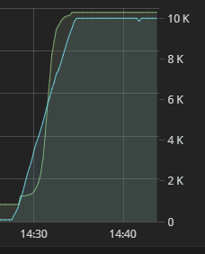

This is part 5 of my Screeps story, you can read the whole story [here](/articles/screeps).

## Respawn again

After talking in the last post about wanting to hunker down in my bunker and wait it out I’ve gone back on that and respawned into a new respawn area that opened up next to me. I was fed up with fighting Fritee for everything. If I had been able to claim the 3rd room it would still be 3 rooms vs 10 which I doubt I can win.

I was the second player to respawn into this area and began a rush to RCL3 in my main room. RCL3 is the earliest you can afford to build a claimer (1 CLAIM & 1 MOVE) creep.

## Room Path Finder

The room pathfinder I wrote was having some issues. Although it was finding a route it wasn’t the best. Something about the way A* pathfinding works seems to have issues when dealing with short paths like these. The scores never go much above 4 or 5 and that meant that exploring the wrong path for 2 rooms would result in a longer path than needed.

To get to the bottom of this I needed to test the room pathfinder properly, not just watching were creeps appeared. This meant setting up my usual mocha/chai test suite and providing a few functions from `Game.map`.

It took a bit of tweaking but it now selects the next room by finding all the rooms with the lowest score and then sorting them again based on distance to the target. This is now returning the paths I expect it to.

## OS Performance

My OS hasn’t had a chance to run many rooms properly before, it gave running my old RCL7 rooms ago but it fell over pretty badly. This time around it’s now running 5 rooms all of which are upgrading and building all the time averaging 25-30% CPU usage. This isn’t the insane level usage some of the 10CPU club get but it is way better than any of my old AIs.

It’s had some issues prior to RCL4 and the storage being built. Without storage, there is no energy stockpile and the general use container used by everything is last on the energy list. When a builder is trying to build the base of the bunker and upgraders are trying to push to up the RCL they spend most of their time idle waiting for energy to come to them.

Some of the performance losses are because of the claim speed, bigger rooms help smaller rooms, which means bigger rooms burn energy faster. This is a flaw in my design. I’m very focused at the higher levels, I wrote this AI for a mostly RCL7 empire that was on the cusp of RCL8 my focus was to get energy moving through terminals, react minerals in labs etc… not implementing better RCL1-3 code.

All this being said I am exceedingly happy with my OS. The modular nature of the processes and ability to simply pass some metadata and suspend is great.

Take the Courrier creeps I added to get energy from storage to general containers faster.

```ts
import {LifetimeProcess} from '../../os/process'

import {CollectProcess} from '../creepActions/collect'
import {DeliverProcess} from '../creepActions/deliver'

export class CourrierLifetimeProcess extends LifetimeProcess{
  type = 'courrierLifetime'

  run(){
    let creep = this.getCreep()

    if(!creep){ return }

    if(_.sum(creep.carry) === 0){
      this.fork(CollectProcess, 'collect-' + creep.name, this.priority - 1, {
        creep: creep.name,
        target: this.room().storage!.id,
        resource: RESOURCE_ENERGY
      })

      return
    }

    let targets = _.filter(this.roomData().generalContainers, function(container){
      return (_.sum(container.store) < container.storeCapacity)
    })

    let target = creep.pos.findClosestByRange(targets)

    if(target){
      this.fork(DeliverProcess, 'deliver-' + creep.name, this.priority - 1, {
        creep: creep.name,
        target: target.id,
        resource: RESOURCE_ENERGY
      })
    }
  }
}
```

That is all the lifetime process needs. In fact aside from a little bit of code in the energy management process to ensure a courier is spawned this is all the code I needed to add the creep type.

Simply, if the creep is empty create a collect process for this creep to get energy from storage and return. Once that collect process finishes the kernel will unsuspend this process which this time will pick a delivery target and then create a deliver process for that target. Again this process is suspended until the deliver process completes when it runs again the creep will be empty.

The CPU limit caused me a couple of little issues. Firstly I had misunderstood how the bucket worked. I thought that you could withdraw up to 500 CPU from your bucket giving you 500 + your CPU limit. It doesn’t, instead, your bucket can be used to fill up to 500 CPU each tick. This caused me to hit my CPU limit a couple of times but it was easily fixed.

Wanting to make my per tick CPU limit more dynamic and actually based on the level of my bucket I found a fantastic implementation in the Quorum bot.



As you can the CPU limit increases as the bucket level does. This means that I should always have something left in the bucket. In emergancies, I can do away with the limit and let the AI go nuts knowing that the normal limit code will have left something in the bucket for me.

## Market Sales

My first room reached RCL6 which means it has a terminal and extracts a mineral. Short term I need to build up a supply of credits as my last AI spent all of my 500K credits on boosts and left me broke. I dusted off the code from the last AI for sales which found the best buy price for my mineral where the energy cost to send it was low.

That method resulted in my AI selling all my mineral to a nearby room for 0.01 a unit. Not great. Don’t want my AI to sell cheap because it’s nearby.

So its time to look at the market order system.

Instead of finding buy orders for my mineral and selling it to them my AI now advertises that there are X units of a mineral in my terminal and you can buy them for Y credits. It doesn’t cost me any energy to make the transfer and I am in control of the price I sell it for.

On the subject of price. Setting the price for the sale has to be done by the AI at the time of creating the order so I can’t define a list of prices. If the value of my mineral is dropping I need to drop my price as well, if it’s booming I need my price to go up. My sale price is the average of the lowest 10 sales orders for the item. This puts my order in the cheapest 10 which is pretty good and will stop it being tricked into undercutting stupidly low orders.

If my mineral isn’t shifting then I discount it every 1000 units to 98% of its original price. This is protected from abuse by tracking when it last discounted. If it discounts at 1k and then someone buys 200 units it won’t discount again until it reaches 2k.

The order gets removed entirely if it reaches 0 remaining units which opens it up to resetting its price. This should mean that I’m covered for market changes. If the price goes up I will sell out my current stock and then re-list at the higher price. If the price drops I will build up a surplus and keep discounting.

## Stricter Typing

I’ve been using Typescript for a while now and my OS was written in typescript (not typed later) but I had a glaring hole in my typings that needed plugging.

The `addProcess` function takes 4 arguments. The Process class to add, the name of the process, the priority of the process and the metadata to pass to it. To get it working I had originally set Process class to `any` and the metadata to an object of `any` type. There was no guarding to make sure that I was passing all the required metadata for a given process type.

I’ve done some [work](https://github.com/screepers/typed-screeps/pull/14) [on](https://github.com/screepers/typed-screeps/pull/17) the typed-screeps 2.0.0 branch which lead me to an interesting feature of Typescript.

```ts
type ProcessTypes =
  "init" |
  "move"

type MetaData = {
  "init": {}
  "move": {
    creep: string
    pos: {
      x: number
      y: number
      roomName: string
    }
    range: number
    path?: string
    lastPos?: [number, number, string]
    stuck?: number
  }
}

addProcess<T extends ProcessTypes>(processType: T, name: string, priority: number, metaData: MetaData[T])
```

This means that `T` must be a `ProcessType` and when I supply a process type in the function the metadata is then typed as `MetaData[the supplied type]`. Which now enforces a type of the metadata I pass.

To get this working I’ve had to change the way I call addProcess. I use to import the process class where ever I needed it and then pass it to addProcess, this isn’t typable as I need it to be so I’ve created a constant for each process e.g. `AOS_MOVE_PROCESS` which the kernel looks up in its processTypes object, which it already had to re-inflate the process table each tick.

## The War

I’ve waffled on this post quite a lot already. Let’s just say that another player has been causing me some major problems which will be the subject of part 22.

## Get Screeps

You can follow my progress on [my profile](https://screeps.com/a/#!/profile/Arcath). Once I reach RC4 I’m not sure how I am going to progress yet.

You can read more about Screeps on their [site](https://screeps.com/). I purchased it through steam giving me the permanent 10 CPU and the desktop client.

You can see my code as it was at the end of this post [here](https://github.com/Arcath/screeps-code/tree/6b19b0bfe3ac3a7a043fe8c93eada5de62f4d1e7).
