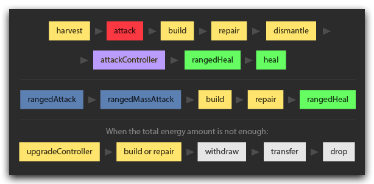
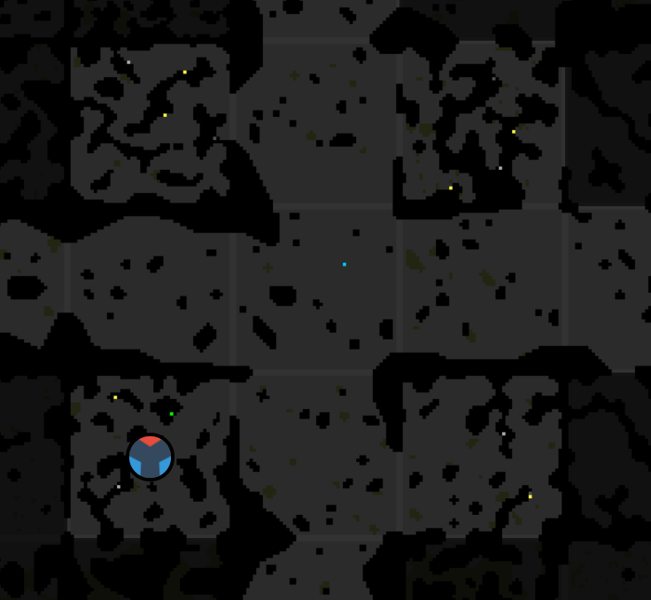

This is part 22 of my Screeps story, you can read the whole story [here](/articles/screeps).

## War

Rudykocur has been poking at me pretty hard the last few weeks and it’s not gone very well. My [new rangers](https://screeps.arcath.net/creep-designer/?share=14#0#0#8#7#6#0#0) can win a one on one fight with [his attackers](https://screeps.arcath.net/creep-designer/?share=16#0#9#3#2#2#0#0) no problem due to the way Screeps handles actions.

The need for his creeps to self-heal meant that they could not attack. A creep can heal and use a ranged attack in the same tick which is why he could still fire at my creeps.

My creeps only use ranged attack parts which means they don’t reduce their damage whilst healing.

My problems come when he sends boosted creeps. These creeps can smash mine 1v1 and out heal a tower. I have some improved room defence code that has not yet been put to the test, I’m not going to describe it here until it has so that Rudykocur can’t prepare for it.

His creeps also went straight for the controller blocking my ability to safe mode, as a result I now have ramparts around the room controller so that an attacker can’t get to range 1.

His AI sends bosted creeps when it sees a spawn in the room. This lead to some frustration as my creeps would fight him off and defend long enough to build a spawn only to have boosted creeps come and wipe it.

My empire is now spread out with 16 rooms on the X-axis between 2 of my rooms. I had to optimise my claimer design so that they could get to the target before the TTL ran out and put a linear distance cap on my room pathfinder so it didn’t eat all my CPU.

## shard2

I’d been debating claiming a room on shard0 for a while but none of the areas I could appear in felt friendly enough. When shard2 opened up I was ready to pounce and claimed one of the corner rooms next to the portal in shard2.

The portal is rather close to Rudykocur but I’m hoping he won’t come through. If I can get my RCL up fast enough I should be able to prevent him getting a foothold.

My initial move onto shard2 was done without the `interShardSegment`. I simply had a flag on the portal which translated to send a claimer to this position. Once it appeared on shard2 the normal claim flag in absence of rooms to spawn the claimer from found the only creep and started a claim process for it. I repeated the same for building the first spawn which was a rather involved process. I definitely want to get inter-shard messaging working but I really wanted to get my first room up and running.

Inter-shard messaging presents a problem. The `interShardSegment` is a single memory segment that all shards have read-write access to. The problem here is that the shards have different tick rates and there is no system for preventing writes before reads etc….

The system I built to send messages works like this:

  1. ShardX needs to write a message. It checks that the `interShardSegment` is empty and if it is it writes its message with a state of `STATE_WRITE`.
  2. ShardY may have a tick at this point and even if it is the recipient of the message it will ignore it for this tick.
  3. ShardX gets another tick and checks the message to ensure that the interShardSegment is as it left it. If it is it will change the state to `STATE_CONFIRMED`.
  4. Now ShardY will act on the message and when it is complete it will update its state to `STATE_READ`.
  5. ShardX sees that its message is now at `STATE_READ` and clears it.

This ensures that the `interShardSegment` does not change whilst one shard is using it. If two shards write in the same tick only the last one to write will be able to confirm its message. Having the sending shard remove the message means I can do callbacks where the shard acts on completion of the job on another.

As I have already claimed a room on shard2 I don’t need to handle sending creeps over yet. For now, I am just sending status pings so that all my shards know about the others.

## I like the way you move()

moveTo is not the best way to move your creeps. It generates a complete path but only stores the next few steps in memory causing a re-path in a few ticks. It avoids other creeps which can force creeps to take longer paths for no reason as the obstruction could have moved before they got there. This limited forward thinking comes into play when trying to move from one room to another where the direct path is blocked. I’ve had creeps walk into a wall and stay there because it went the wrong way entirely and got stuck down a dead end.

Replacing `moveTo` isn’t the easiest thing. I keep swapping to my new system whilst I can watch and back when I’m not.

The idea is to create a path using the PathFinder that uses a custom cost matrix which ignores creeps. The path is then turned into a string of directions that can be stored in memory. Each tick the creep simply moves in the direction at the beginning of the string. If it didn’t move it must be stuck, after 3 ticks of being stuck it will recalculate the path but this time include creeps in the cost matrix.

The functionality of moveTo is quite extensive and replacing it is going to take awhile. Early testing shows more CPU usage for the new process over the old one but I should be able to iron that out by caching paths. (e.g. harvesters moving from spawn to source etc…).

I’m still not 100% happy with my code and am running `moveTo` for now.

## Improving the Scheduler

I was talking to postcrafter on the Overlords slack channel about our OSes and he pointed out that my `getHighestProcess` function might not be the most efficient way of working.

Currently, I filter and sort the process table every time its called which now that I have monitored the CPU usage accounts for 30-40% of my CPU each tick.

To improve this I now cache the sorted list until a new process is added. This has dropped its usage from 25-35 CPU per tick to 1-2. My bucket is now full most of the time instead of wavering around 4-6k as my CPU limiter keeps it topped up.

## Bug Bash

I’ve has a few little bugs that are spamming my console output in the game. Now that I use source maps I’m wasting CPU translating stack traces which is something I’d like to avoid.

The solution is to fix the bugs which was rather easy. Most of them were issues with not having vision in a room so calls to `Game.getObjectById` would return null and not the source/controller.

## Get Screeps

You can follow my progress on [my profile](https://screeps.com/a/#!/profile/Arcath). Once I reach RC4 I’m not sure how I am going to progress yet.

You can read more about Screeps on their [site](https://screeps.com/). I purchased it through steam giving me the permanent 10 CPU and the desktop client.

You can see my code as it was at the end of this post [here](https://github.com/Arcath/screeps-code/tree/5371ff5f003f33aeb8c692a1529102ae2265fb5c).
