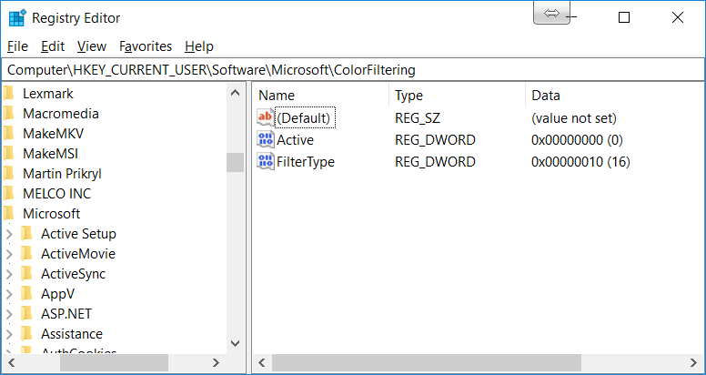
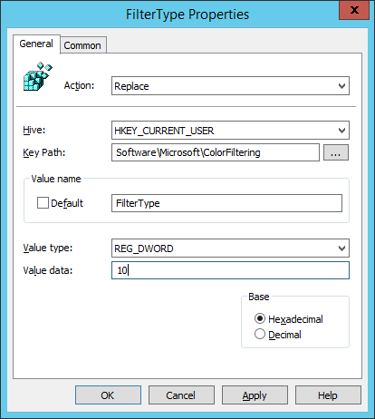

I came across an interesting problem today. A Windows 10 1709 machine was black and white and no one knew how it had happened.

Windows 10 has a colour filter system to help colour blind users that has the rather badly placed shortcut `Windows+Ctrl+C`. That’s right a shortcut that by default makes the screen black and white is 1 key away from the copy shortcut.

It can be turned off just as easily with `Windows+Ctrl+C` but that doesn’t help prevent the problem happening in the first place.

## Disable the Shortcut

A few google searches showed me that there used to be a [tick box](https://www.nextofwindows.com/windows-10-color-filters#Disable_the_shortcut_key_to_turn_on_the_color_filters) for this that had a [registry key](https://winaero.com/blog/enable-disable-color-filters-hotkey-windows-10/) alongside it. This appears to be gone in 1709.

Setting the registry keys to off would disable it on next sign in but not stop a user toggling it.

The solution I found was to set the _FilterType_ registry key to a number that didn’t match a filter. Now when a user enables colour filters nothing changes, it says you have a filter enabled but no filter is applied. A user going into settings to enable it and change the filter would be able to, but it would un-apply next sign in.

Open up _regedit_ and head to `HKEY_CURRENT_USER\Software\Microsoft\ColorFiltering` change the FilterType key to any number over 5 (I used 10).

## Disable the Shortcut with a GPO

Now that we have a registry key to fix the problem its a simple matter of using GPP registry settings to update the key for each user.

As this is a User registry key the policy needs to be applied to users.

In your, GPO open `User Configuration/Preferences/Windows Settings/Registry` and add a new item with these settings.

This has to be a _replace_ action as the key doesn’t exist until the first time it is used.

Hopefully, this helps you fix this problem on your network. Obviously, if you do want colour filters you can use item-level targeting to exclude colour blind users from this registry fix.
