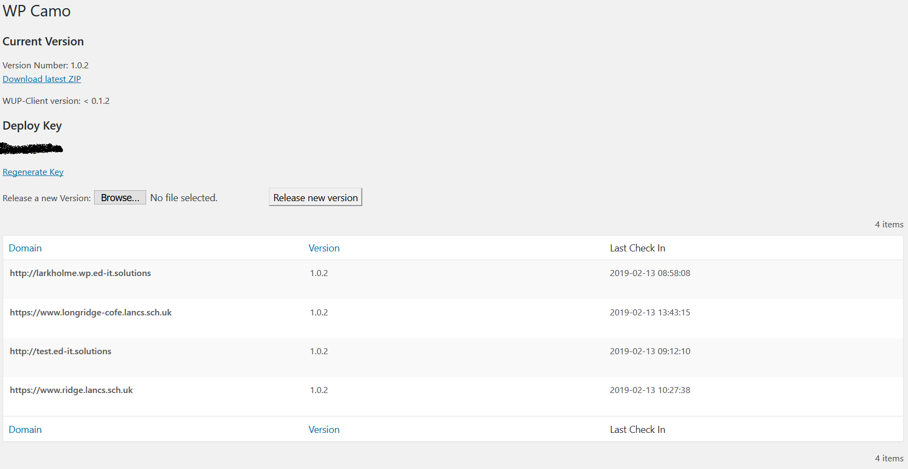

Over at Ed-IT Solutions we create [WordPress](https://www.wordpress.org) themes and plugins that we need to keep up-to-date on all our clients websites. We used to use a couple of packages together to get the desired results but they had a couple of issues.

 1. They were outdated and not actively maintained.
 2. Both are a _download the repo and put it here_ installs that are hard to maintain.
 3. There is no monitoring in the server component.

I decided a while ago that this needed changing, and that the best way to get everything I wanted was to make something myself.

The result of this is WP Update Provider and WUP-Client. We've been using some version of this for nearly a year now to great effect.

## WP Update Provider

WP Update Provider (WUP) is the first half of the solution I created.

WUP is a plugin that you install on a central WordPress site. For example I have it installed on our _management_ WordPress install which we use to monitor/update/backup the sites we host using MainWP.

WUPs main features that it has over our previous solution are:

 - Table showing all packages.
 - Package details screen listing all the sites using the package, when they last checked in and which version they are using.
 - Links to download the latest version of a package.
 - API endpoint for receiving updates from CI.

As WUP is a plugin its extremely easy to install and keep up-to-date.

## WUP-Client

The other half of the solution is a composer module that I require in each package. Using composer lets me easily install and update the client in each theme/plugin without having to manually shuffle files around.

WUP-Client provides a function which registers all the filters and hooks to inject updates from WUP into the normal WordPress updater. Using the normal WordPress update system gives our clients a seamless experiance, our updates appear alongside updates from the plugin directory, and can be installed at the same time.

It also has all the code required to build the zip file and publish it to WUP. I use this for an entirely automated deployment process.

## Examples

[WUP Itself](https://github.com/Ed-ITSolutions/wp-update-provider) is the best example of how to use WUP-Client for updates and deploying.

## Moving Forward

I have some ideas for the future of WUP but it will depened on our usage. It's running very stabley at the moment and I can't think of anything it needs to do its current job better.

I have put thought into a license key system for it so you can protect your downloads as currently you just need to know the urls and slug to download anything.

Let us know over on the repo if you have any ideas that would improve WUP and the way you use it.
