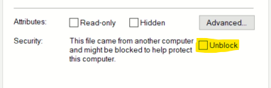
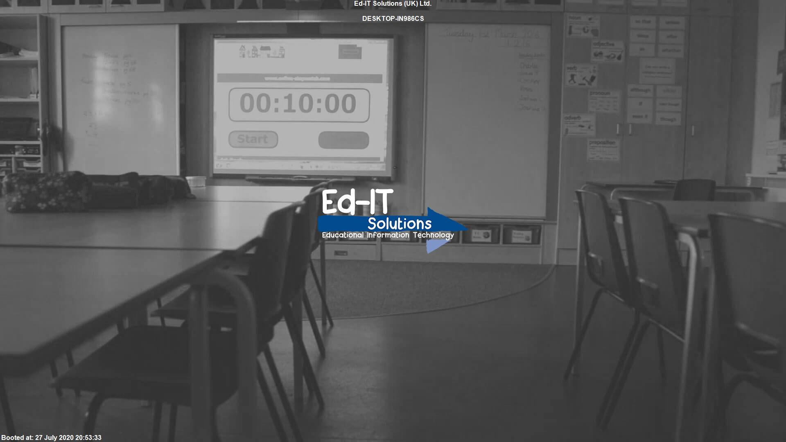
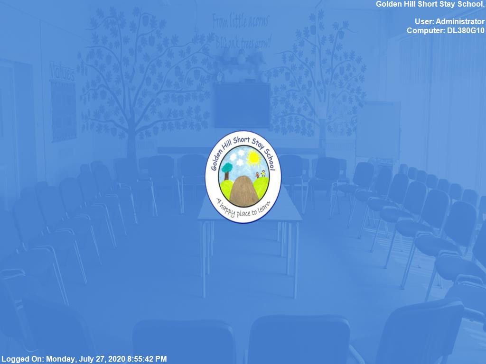

I've been spending a bit of time recently thinking about wallpapers and lock screens for domain computers. For a long time I've used a static image for the computer's lock screen and then [BGInfo](https://docs.microsoft.com/en-us/sysinternals/downloads/bginfo) for the user's wallpaper. The problem is that, at least in my experience, BGInfo seems to fail for everyone's first logon to a machine. This leaves users with the default Windows 10 wallpaper which isn't bad, but it isn't the branded photo they should be getting.

So to cut a long story short I decided it was time to find a new way of doing wallpapers, and ideally creating a lock screen image with the computer's hostname on it.

## PowerShell

PowerShell is what I wanted to solve this issue with. I knew it could modify images and figured it could be used for this. Logon and Startup scripts have been pretty reliable for me in the past so I wanted to bring that reliability to this problem.

As with all things I hopped on Google before I started and found [this post on EduGeek](http://www.edugeek.net/blogs/dj-1701/2342-boot-logon-wallpaper-generation-using-powershell.html) giving me exactly what I needed. Following on from that the author had created a [GitHub repository](https://github.com/DJ-1701/GenerateWallpaper) with their latest code in. With some minor tweaks to the code I got it to spit out an image which was great but it didn't work quite as well as I wanted.

The first issue I had with it was purely cosmetic, a transparent box background was not an option. As we had one image to work with it's easy to pick a suitably contrasting colour.

The second problem was that it needed you to edit the `.ps1` file to change the settings. Not an issue for me but within [Ed-IT Solutions](https://www.ed-itsolutions.com) I like to operate a _no code edits_ system where scripts always take no more than 2 or 3 options to do a job.

What I'm leading up to here is that I've created [my own script](https://github.com/Ed-ITSolutions/wallpaper-scripts). Full Credit to [DJ-1701](https://github.com/DJ-1701) for their original work, its safe to say I wouldn't have this script working as well as it does without the leg up they gave me.

The big difference is the way it accepts config. My script uses a `.ini` file like the one below to configure the output.

I also swapped out the system for getting the screen resolution to one that uses a WMI query. Might be less reliable than the original method but all my test machines haven't had an issue with it, and it works both at boot and during logon removing the need to dump the values into registry.

```ini
[files]
; Background image to use. @@ is replaced with the scripts execution point. ## is replaced with the temp directory
inputImage = "@@\wallpaper.jpg"
outputImage = "##\user.jpg"
; Apply the image as the current users wallpaper. 1 for yes, 0 for no
applyToUser = 1
[header]
; The text to display, use # to create a new line.
; Variables:
;  %user - The current username.
;  %computer - The Computers Hostname.
;  %time - The time at generation, time of logon or boot
text = Ed-IT Solutions (UK) Ltd.##User: %user#Computer: %computer
textSize = 12
textRed = 255
textGreen = 255
textBlue = 255
textAlpha = 255
boxRed = 0
boxGreen = 0
boxBlue = 0
boxAlpha = 0
; Allowed values left,center,right
alignment = right
[footer]
; Same as header.text
text = Logged On: %time
alignment = left
```

The above file would create an image and apply it to the current user's wallpaper. Setting `applyTouser` to `0` would turn this off and have it only save the output to a file.

There is an example [logon.ini](https://github.com/Ed-ITSolutions/wallpaper-scripts/blob/master/logon.ini) and [boot.ini](https://github.com/Ed-ITSolutions/wallpaper-scripts/blob/master/boot.ini) in the repository.

This gives a single script to run both lock screens and wallpapers as its simply down to the ini file used. To supply an ini file the script takes an option of `-ini <path>` where `<path>` is the path to the ini file.

## Group Policy

The scripts are only half of the battle, getting it out to every computer is just as important.

As with BGInfo I used GPP Files to copy `wallpaper.ps1`, `logon.ini`, `boot.ini` and `wallpaper.jpg` to the C drive of every computer. In my case I always have a folder in the root of C that matches the domain name, so `arcath.net` would become `C:\Arcath` which is I where I copied them to.

PowerShell needs some setup before it can run scripts without warnings. In a GPO I set _Computer Configuration / Policies / Administrative Templates / Windows PowerShell / Turn on Script Execution_ to _Allow local scripts and remote signed scripts_. This is where copying the scripts to each machine becomes nessasary as if you run them out of `NETLOGON` they would need to be signed.

> If you download the script directly from GitHub you might find that Windows flags it as a remote script even if its copied to each computer. You can fix this by going into properties of the script on the server and ticking _Unblock_



Once all the files are deployed its then a simple matter to use a GPO to add a Start-up and Logon _PowerShell_ script. I found that trying to use `$PSScriptRoot` doesn't work as expected in start-up and logon which resulting in errors. So whilst there is an option to use it in the file paths I don't and instead specify the full path to the wallpaper. `##` to use the temp directory works fine which I use in the output of users wallpapers.

With all that I'm now getting reliable images generated every logon and startup.

## Examples

Some examples of the output.

A Lock Screen:



A users wallpaper:

