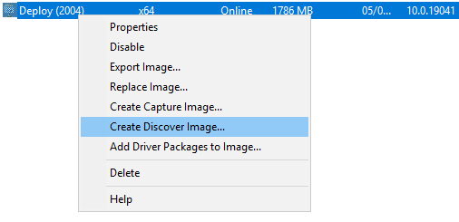
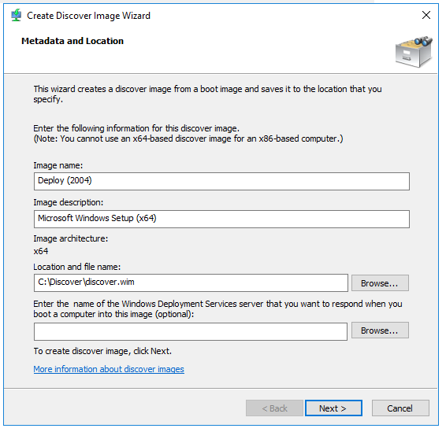
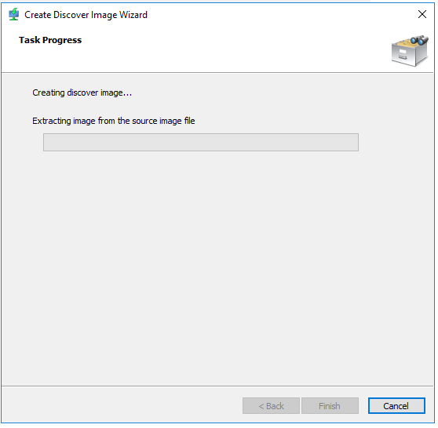
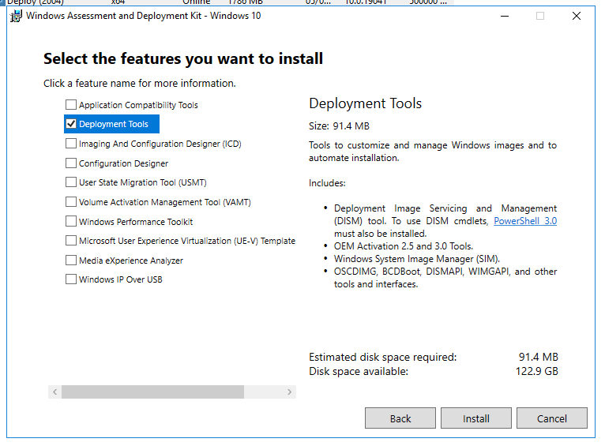
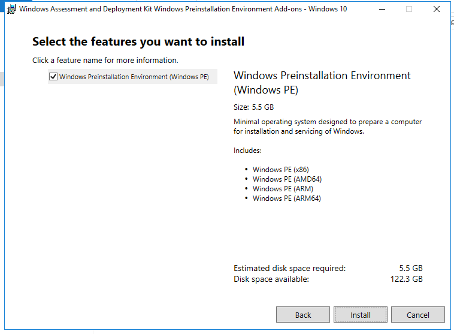
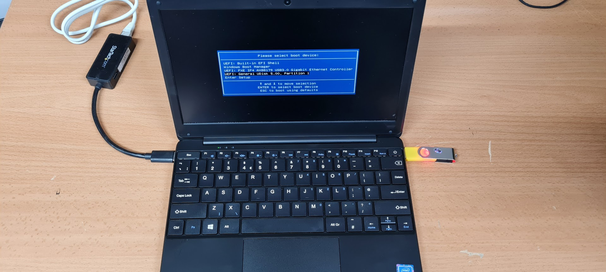

The DfE (Department for Education) has decided that the best laptop for pupils to use for remote learning is a [GeoBook 1e](https://geo-computers.com/geobook-1e/) and I know what you're thinking a Celeron and 64GB SSD! Kids today are spoiled!

Joking aside this device has one big issue for us, no network port, which really interrupts the normal setup process.

So the question becomes how do you use WDS to image a GeoBook 1e or any device without a network port? I'm sure the first instinct for a lot of people would be to throw a USB network card into the laptop and give it a try. This doesn't normally work as they don't have PXE ROMs on them. 

This is where a WDS Discover Image comes into play. A Discover Image works by getting the device to boot to a USB drive or CD and then use any network card to connect to WDS.

## Generating the Discover Image

The first step is to create a Discover image on your WDS server. Hop into the WDS management console and go to your boot images, then right-click on your latest deployment image and click _Create Discover Image..._



This brings up a wizard to create the Discover Image, which needs a couple of bits of information from you.

Firstly where to save it, which I set to `C:\Discover\discover.wim` and then optionally the address of the WDS server. If you don't specify an address the Discover image will do it's best to find your WDS server when it boots.

> *Update*
> Further testing has shown that if you don't specify an address WDS auto-detection will only work if WDS and DHCP are not on the same server.



Once you click next your image will be created and exported to the supplied path.



Whilst this exports you can move on to creating the WinPE (Preinstallation Environment) Disk

## Creating the WinPE Disk

To make the Discover Image bootable we need to bundle it inside a Windows Preinstall Environment.

To do this you need the _Deployment Service Tools_ and _WinPE Extension_ from [the ADK](https://docs.microsoft.com/en-us/windows-hardware/get-started/adk-install),  which at the time of writing was the first two links on that page.

When installing the ADK you only need to select _Deployment Tools_ from the list of available components.



Once that is installed you need the ADK's WinPE extensions.



With those tools installed it is just a case of waiting for the export of the image from earlier to finish.

Once your ready fire up the _Deployment and Imaging Tools Environment_ command promt from in the _Windows Kits_ folder in the start menu.

The first command creates a WinPE folder for you to work with.

```
copype amd64 C:\winpe
```

`amd64` can be replaced with other architectures if needed, it is the one required for the Geobook.

Next you need to copy your newly minted Discover Image over to the winpe environment.

```
copy /y C:\Discover\discover.wim C:\winpe\media\sources\boot.wim
```

This will overwrite the existing _boot.wim_ with your discover image.

Finally, you need to move the pe environment onto a bootable medium.

```
makewinpemedia /ufd /f C:\winpe d:
```

Where `/ufd` means USB disk, `/f` means format and `d:` is the drive letter of the disk. This will format the disk, make it bootable and copy the WinPE files over to it.

Thats it! Your USB stick is now usable.

## Using It

With your USB stick in one USB port and a USB network adapter in the other it's time to boot the laptop. In a bizarre turn of fate, my [Startech USB network Adapter](https://amzn.to/3hJKTIu) did actually offer to network boot which took the wind out my sails a bit but lets keep moving.

> On a GeoBook 1e you can get the boot menu by using the `f7` key.



Once it boots the WDS installer should find the WDS server on your network automatically (or will just connect to it if you manually supplied the address). From here it's pretty normal. WDS will use its normal answer files and give you all the images you have on your server.

This process does skip the name & approval step of WDS so be aware that the laptop will take what ever name your auto-naming gives it in WDS.

## How does it work?

A Discover Image gets around the lack of a PXE ROM by allowing you to boot to alternative media. When a computer boots to network and pulls in the setup files from WDS it is a very similar process to the BIOS passing over to an OS on disk after POSTing. The PXE ROM handles downloading the setup files and then boots them, this is why a computer can network boot and then complain that it doesn't have network drivers.

The Discover Image only needs to contain the drivers for the USB Network card for it to be able to connect.