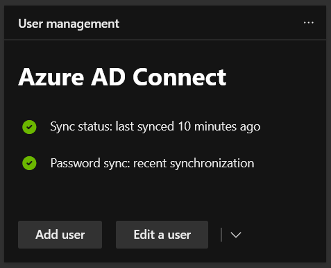

I came into one of my schools to find this message in Office365.

_Strange_.

Jumped onto the server and tried to open the _Syncronization Service_ and no,
_Service ADSync was not found_.

Opening services showed that there was no service with the ID _ADSync_. A quick
`sc start ADSync` agreeed, that service did not exist.

I ran through quite a few things that had no effect and was begining to fear the
initial suggestion from ADSync of "rebuild the server" was going to have to be
the solution, which would mean not fixing it for a long time.

## Logon as a Service

I came across
[this discussion](https://community.spiceworks.com/topic/2227261-azure-ad-connect-synchronization-service-is-missing)
about the issue and this all too helpful reply.

> I figured out the solution.
>
> The service was failing to start because the service account wasn't granted
> the Logon as a Service right.
>
> Added the account to the GPO and it was running again.
>
> Thank you for the help!

 _There is always a
[relevant XKCD](https://xkcd.com/979/)_

It did point me in the right direction.

ADSync creates a user in AD that it uses to sync with Azure, this account is the
account the service runs as and as the above answer suggested you need to give
this account permission to "logon as a service".

The user ADSync creates is named `AAD_{SOMEID}` and will be in the default user
location.

Microsoft have an article on
[how to give a user logon as a service](https://docs.microsoft.com/en-us/system-center/scsm/enable-service-log-on-sm?view=sc-sm-2019)
which uses the local security policy on the server.

After adding the user and restarting the server everything is syncing again!

I hope this helps anyone stuck in the same position.
